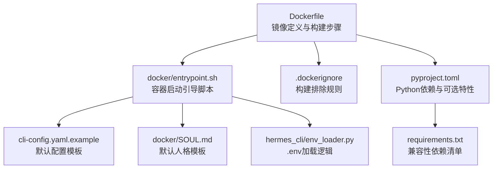
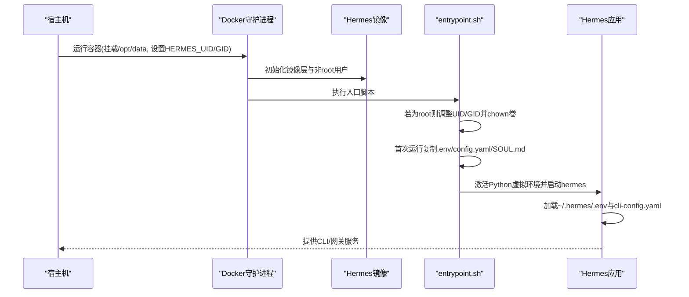
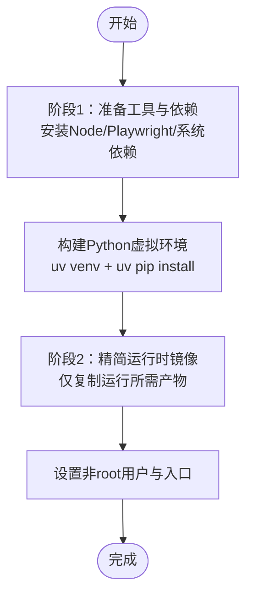
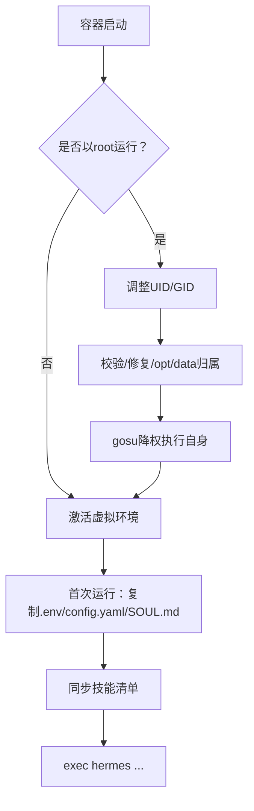
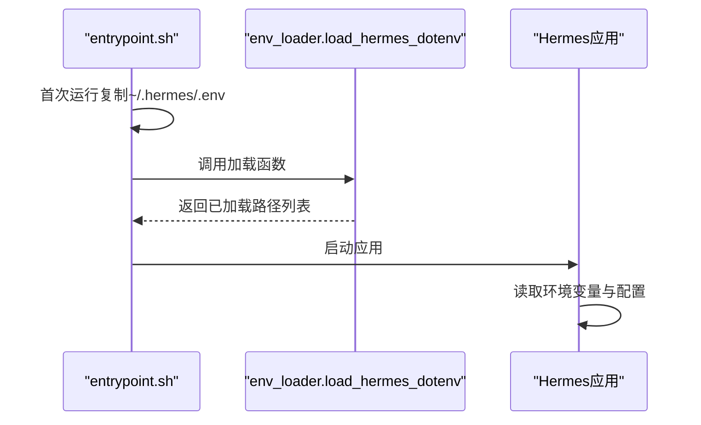
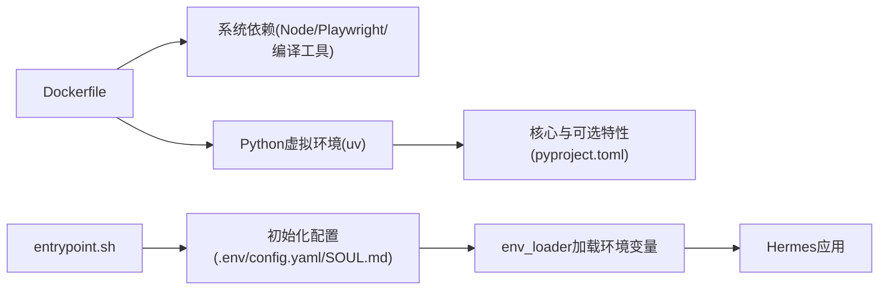

# 容器化部署

<cite>
**本文引用的文件**
- [Dockerfile](file://Dockerfile)
- [.dockerignore](file://.dockerignore)
- [docker/entrypoint.sh](file://docker/entrypoint.sh)
- [docker/SOUL.md](file://docker/SOUL.md)
- [cli-config.yaml.example](file://cli-config.yaml.example)
- [requirements.txt](file://requirements.txt)
- [pyproject.toml](file://pyproject.toml)
- [hermes_cli/env_loader.py](file://hermes_cli/env_loader.py)
- [README.md](file://README.md)
</cite>

## 目录
1. [简介](#简介)
2. [项目结构](#项目结构)
3. [核心组件](#核心组件)
4. [架构总览](#架构总览)
5. [详细组件分析](#详细组件分析)
6. [依赖关系分析](#依赖关系分析)
7. [性能与资源优化](#性能与资源优化)
8. [故障排查指南](#故障排查指南)
9. [结论](#结论)
10. [附录](#附录)

## 简介
本指南面向DevOps团队，提供Hermes Agent的容器化部署专业方案。内容覆盖Docker镜像构建（含多阶段思路与安全加固）、容器运行参数与卷挂载、环境变量与配置、生产级容器编排建议（Docker Compose/Kubernetes）、健康检查与资源限制、以及网络安全与存储管理最佳实践。目标是帮助团队在不同环境中稳定、安全、可运维地交付Hermes Agent。

## 项目结构
Hermes Agent的容器化能力由以下关键文件支撑：
- 镜像构建：Dockerfile、.dockerignore
- 启动入口：docker/entrypoint.sh
- 默认配置模板：cli-config.yaml.example、docker/SOUL.md
- 依赖清单：pyproject.toml、requirements.txt
- 环境变量加载：hermes_cli/env_loader.py
- 项目说明：README.md

**图表来源**
- [Dockerfile:1-47](file://Dockerfile#L1-L47)
- [.dockerignore:1-16](file://.dockerignore#L1-L16)
- [docker/entrypoint.sh:1-65](file://docker/entrypoint.sh#L1-L65)
- [cli-config.yaml.example:1-800](file://cli-config.yaml.example#L1-L800)
- [docker/SOUL.md:1-15](file://docker/SOUL.md#L1-L15)
- [pyproject.toml:1-129](file://pyproject.toml#L1-L129)
- [requirements.txt:1-37](file://requirements.txt#L1-L37)
- [hermes_cli/env_loader.py:1-46](file://hermes_cli/env_loader.py#L1-L46)

**章节来源**
- [Dockerfile:1-47](file://Dockerfile#L1-L47)
- [.dockerignore:1-16](file://.dockerignore#L1-L16)
- [docker/entrypoint.sh:1-65](file://docker/entrypoint.sh#L1-L65)
- [cli-config.yaml.example:1-800](file://cli-config.yaml.example#L1-L800)
- [docker/SOUL.md:1-15](file://docker/SOUL.md#L1-L15)
- [pyproject.toml:1-129](file://pyproject.toml#L1-L129)
- [requirements.txt:1-37](file://requirements.txt#L1-L37)
- [hermes_cli/env_loader.py:1-46](file://hermes_cli/env_loader.py#L1-L46)
- [README.md:1-179](file://README.md#L1-L179)

## 核心组件
- 镜像层与用户模型
  - 使用非root用户运行，支持通过HERMES_UID/HERMES_GID在宿主机侧映射UID/GID，避免权限问题。
  - 设置PYTHONUNBUFFERED=1以确保日志实时输出；PLAYWRIGHT_BROWSERS_PATH指向/opt/data外的目录，保证浏览器缓存持久化。
- 启动引导脚本
  - 在root下执行时，根据HERMES_UID/HERMES_GID调整hermes用户ID；修正/修复卷挂载目录所有权；随后以gosu降权执行。
  - 首次运行时将.env、cli-config.yaml.example与SOUL.md复制到/ opt/data（即HERMES_HOME），并同步技能清单。
- 依赖安装
  - 构建阶段安装Node/Playwright与Python虚拟环境，使用uv进行快速安装，减少缓存与体积。
- 卷与环境
  - 暴露/opt/data为卷，作为用户数据、配置、缓存与会话的持久化根目录。
  - 支持通过环境变量覆盖模型、平台令牌等敏感信息，优先从~/.hermes/.env读取。

**章节来源**
- [Dockerfile:5-47](file://Dockerfile#L5-L47)
- [docker/entrypoint.sh:8-65](file://docker/entrypoint.sh#L8-L65)
- [pyproject.toml:39-110](file://pyproject.toml#L39-L110)
- [requirements.txt:1-37](file://requirements.txt#L1-L37)
- [hermes_cli/env_loader.py:18-46](file://hermes_cli/env_loader.py#L18-L46)

## 架构总览
下图展示容器启动到应用运行的关键流程，以及与卷、环境变量的关系。

**图表来源**
- [docker/entrypoint.sh:11-64](file://docker/entrypoint.sh#L11-L64)
- [Dockerfile:18-47](file://Dockerfile#L18-L47)
- [hermes_cli/env_loader.py:18-46](file://hermes_cli/env_loader.py#L18-L46)

## 详细组件分析

### 组件A：Dockerfile与多阶段构建策略
- 基础镜像与工具链
  - 使用带uv与gosu的官方基础镜像，便于后续在多阶段中复用工具。
  - Debian 13.4作为运行时基础，安装编译、Node/npm、Python、rgrep、ffmpeg、gcc等系统依赖。
- 多阶段思路
  - 当前Dockerfile为单阶段构建，但已具备多阶段的“工具复用”基础（uv/gosu来自专用阶段）。建议采用两阶段：
    - 第一阶段：安装Node/Playwright、构建Python虚拟环境、准备可执行二进制。
    - 第二阶段：仅拷贝必要运行时产物与uv/gosu，最小化运行时镜像。
- 安全加固
  - 非root用户运行；通过HERMES_UID/HERMES_GID映射宿主用户，避免root与0:0权限。
  - 构建后清理APT缓存，减少攻击面。
  - 显式设置PLAYWRIGHT_BROWSERS_PATH，避免与卷叠加导致缓存丢失。

**图表来源**
- [Dockerfile:1-47](file://Dockerfile#L1-L47)

**章节来源**
- [Dockerfile:1-47](file://Dockerfile#L1-L47)

### 组件B：启动入口脚本（entrypoint.sh）
- 权限降级与卷修复
  - 若以root启动，尝试将hermes用户UID/GID映射到宿主机指定值，并修复/opt/data归属，再以gosu降权执行。
- 首次运行初始化
  - 将.env、cli-config.yaml.example、SOUL.md复制到/ opt/data（若不存在）。
  - 同步技能清单（通过skills_sync.py）。
- 运行应用
  - 激活虚拟环境后执行hermes命令，透传容器参数。

**图表来源**
- [docker/entrypoint.sh:11-64](file://docker/entrypoint.sh#L11-L64)

**章节来源**
- [docker/entrypoint.sh:1-65](file://docker/entrypoint.sh#L1-L65)

### 组件C：配置与环境变量加载
- 配置文件
  - cli-config.yaml.example提供模型、终端后端、工具集、记忆、会话重置策略等全面配置项。
- 环境变量加载
  - hermes_cli/env_loader.py按顺序加载~/.hermes/.env与项目级.env，后者仅在无用户.env时回退填充缺失值。
- 敏感信息路由
  - 测试用例显示以_API_KEY或_TOKEN结尾的键名会被写入.env，避免泄露至配置文件。

**图表来源**
- [docker/entrypoint.sh:44-62](file://docker/entrypoint.sh#L44-L62)
- [hermes_cli/env_loader.py:18-46](file://hermes_cli/env_loader.py#L18-L46)

**章节来源**
- [cli-config.yaml.example:1-800](file://cli-config.yaml.example#L1-L800)
- [hermes_cli/env_loader.py:1-46](file://hermes_cli/env_loader.py#L1-L46)
- [docker/entrypoint.sh:44-62](file://docker/entrypoint.sh#L44-L62)

### 组件D：依赖与可选特性
- 可选特性
  - pyproject.toml定义了messaging、cron、slack、matrix、voice、honcho、mcp、acp、mistral等可选特性，all汇总为完整功能集合。
- 兼容性清单
  - requirements.txt用于便捷安装，实际以pyproject.toml为主。

**章节来源**
- [pyproject.toml:39-110](file://pyproject.toml#L39-L110)
- [requirements.txt:1-37](file://requirements.txt#L1-L37)

## 依赖关系分析
- 构建期依赖
  - Node/npm、Python、编译工具链、Playwright（chromium shell）在构建阶段安装。
- 运行期依赖
  - uv虚拟环境中的Python包、可选特性（如messaging、voice、honcho等）按需启用。
- 配置与环境
  - 应用通过hermes_cli/env_loader.py统一加载~/.hermes/.env与项目.env，优先级明确。

**图表来源**
- [Dockerfile:12-39](file://Dockerfile#L12-L39)
- [pyproject.toml:39-110](file://pyproject.toml#L39-L110)
- [docker/entrypoint.sh:44-62](file://docker/entrypoint.sh#L44-L62)
- [hermes_cli/env_loader.py:18-46](file://hermes_cli/env_loader.py#L18-L46)

**章节来源**
- [Dockerfile:12-39](file://Dockerfile#L12-L39)
- [pyproject.toml:39-110](file://pyproject.toml#L39-L110)
- [docker/entrypoint.sh:44-62](file://docker/entrypoint.sh#L44-L62)
- [hermes_cli/env_loader.py:18-46](file://hermes_cli/env_loader.py#L18-L46)

## 性能与资源优化
- 构建优化
  - 复用uv与gosu工具（多阶段）；合并apt安装与清理，减少层数与镜像大小。
  - 使用--no-cache-dir安装Python依赖，避免缓存膨胀。
- 运行优化
  - PYTHONUNBUFFERED=1确保日志实时输出，利于容器日志聚合。
  - 将Playwright浏览器缓存置于/opt/data之外，避免被卷覆盖导致重复下载。
- 资源限制建议
  - 在编排层设置CPU/内存限制，结合应用内部的超时与轮询参数（如terminal.timeout、gateway_timeout）协同控制资源占用。
- 存储与I/O
  - 将大文件与缓存（如Playwright、模型缓存）尽量放在/opt/data内，便于持久化与备份。

[本节为通用指导，无需具体文件引用]

## 故障排查指南
- 权限问题
  - 症状：容器内无法写入/opt/data或生成的文件属主为root。
  - 排查：确认是否以root启动；检查HERMES_UID/HERMES_GID是否正确映射；查看entrypoint.sh的UID/GID调整与chown逻辑。
- 配置未生效
  - 症状：修改.env或cli-config.yaml后未生效。
  - 排查：确认.env与cli-config.yaml是否位于~/.hermes；检查hermes_cli/env_loader.py的加载顺序与覆盖行为。
- 浏览器/Playwright异常
  - 症状：首次运行缓慢或失败。
  - 排查：确认PLAYWRIGHT_BROWSERS_PATH设置；检查/opt/data卷挂载是否正确；验证网络连通性。
- 日志与调试
  - 使用容器日志查看启动流程；必要时临时提升日志级别或开启verbose模式（见cli-config.yaml.example）。

**章节来源**
- [docker/entrypoint.sh:11-64](file://docker/entrypoint.sh#L11-L64)
- [hermes_cli/env_loader.py:18-46](file://hermes_cli/env_loader.py#L18-L46)
- [cli-config.yaml.example:491-492](file://cli-config.yaml.example#L491-L492)

## 结论
Hermes Agent的容器化方案以非root运行、明确的卷与环境变量策略为核心，配合可选特性与严格的依赖管理，可在多种环境中稳定运行。建议采用多阶段构建进一步缩小镜像体积，并在生产编排中落实健康检查、资源限制与网络隔离，以实现更高的安全性与可维护性。

[本节为总结，无需具体文件引用]

## 附录

### A. 容器运行参数与卷挂载
- 卷挂载
  - /opt/data：持久化根目录，包含配置、缓存、会话、日志、技能、皮肤、计划、工作区与子进程home目录。
- 环境变量
  - HERMES_UID/HERMES_GID：映射容器内hermes用户到宿主机用户。
  - HERMES_HOME：覆盖默认HOME路径（默认/opt/data）。
  - PYTHONUNBUFFERED：强制Python输出不缓冲。
  - PLAYWRIGHT_BROWSERS_PATH：Playwright浏览器缓存路径（建议置于/opt/data外）。
  - 其他敏感信息：通过~/.hermes/.env注入（如各平台令牌、API密钥等）。

**章节来源**
- [Dockerfile:5-10](file://Dockerfile#L5-L10)
- [Dockerfile:44-47](file://Dockerfile#L44-L47)
- [docker/entrypoint.sh:5-6](file://docker/entrypoint.sh#L5-L6)
- [docker/entrypoint.sh:11-30](file://docker/entrypoint.sh#L11-L30)
- [docker/entrypoint.sh:42-62](file://docker/entrypoint.sh#L42-L62)
- [hermes_cli/env_loader.py:18-46](file://hermes_cli/env_loader.py#L18-L46)

### B. 生产环境容器编排建议
- Docker Compose
  - 使用volumes映射/opt/data；设置restart策略（如unless-stopped）；为敏感环境变量使用secrets或外部密钥管理。
  - 为Playwright/浏览器缓存单独挂载卷，避免与应用数据混淆。
- Kubernetes
  - 使用Deployment/StatefulSet，持久化PVC绑定/opt/data；设置Pod安全策略（non-root、只读根文件系统）。
  - 使用ConfigMap管理非敏感配置，Secret管理敏感信息；通过InitContainers实现首次运行的文件复制与权限修复（可替代entrypoint.sh的部分逻辑）。
  - 设置liveness/readiness探针（见下节），并配置资源requests/limits。

[本节为通用指导，无需具体文件引用]

### C. 健康检查与资源限制
- 健康检查
  - 建议在编排层添加liveness/readiness探针：对CLI模式可通过简单命令探测；对网关模式可探测监听端口或HTTP健康端点。
- 资源限制
  - CPU/内存：结合业务负载设置requests/limits；避免与其他服务争抢资源。
  - 文件描述符与ulimit：根据并发工具调用需求适当放宽。
- 超时与重启
  - 在cli-config.yaml.example中设置terminal.timeout、gateway_timeout等参数，避免长时间阻塞占用资源。

**章节来源**
- [cli-config.yaml.example:134-141](file://cli-config.yaml.example#L134-L141)
- [cli-config.yaml.example:475-489](file://cli-config.yaml.example#L475-L489)

### D. 安全加固与网络配置
- 安全加固
  - 非root运行；最小权限原则；禁用不必要的系统工具；定期更新基础镜像与依赖。
  - 对外暴露端口仅开放必要服务；使用网络策略限制访问。
- 网络配置
  - 代理与出站网络：在容器网络中配置HTTP_PROXY/HTTPS_PROXY；限制DNS与上游API访问范围。
- 存储管理
  - 分离热数据（会话、缓存）与冷数据（日志、备份）；定期清理与归档；对敏感数据加密存储。

[本节为通用指导，无需具体文件引用]