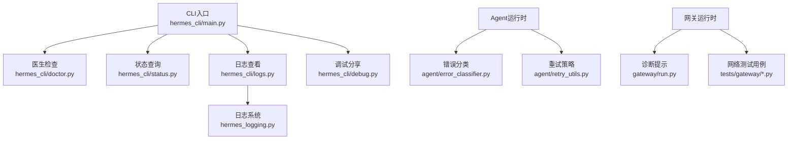
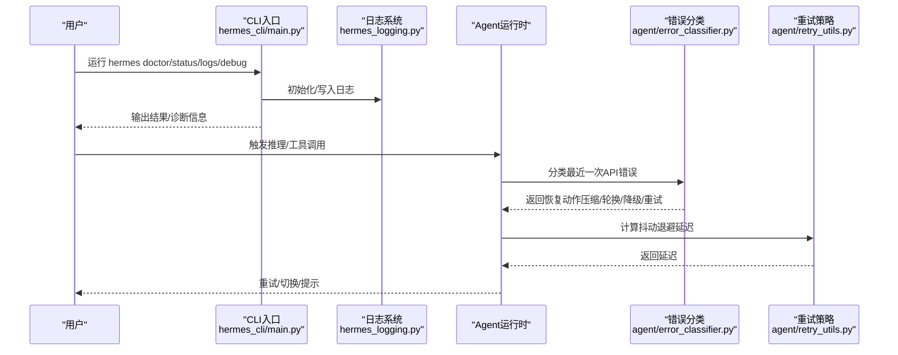
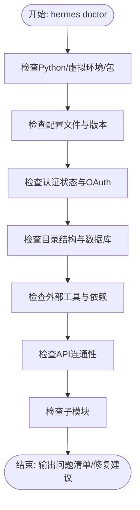
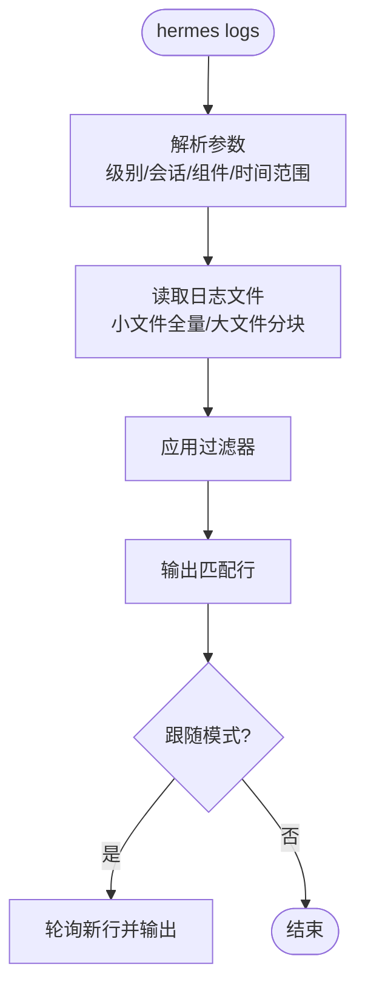
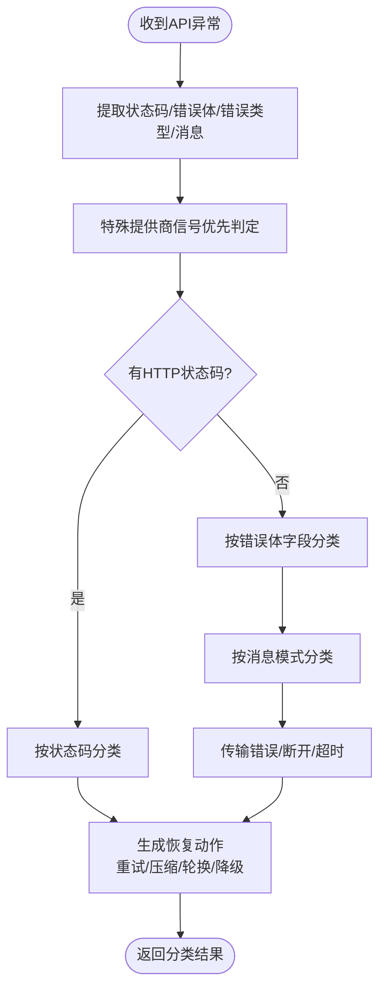
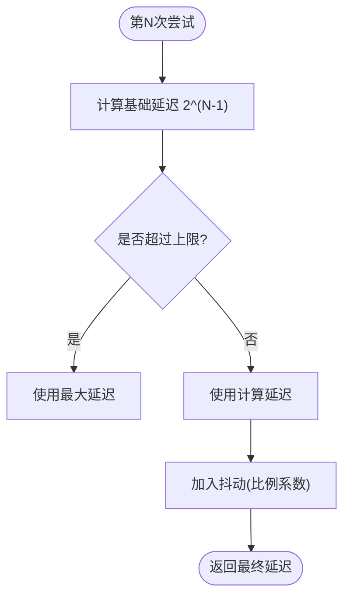
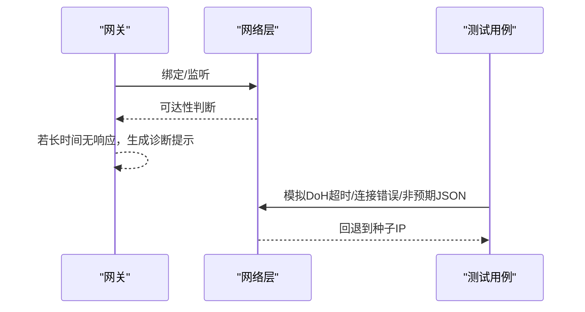
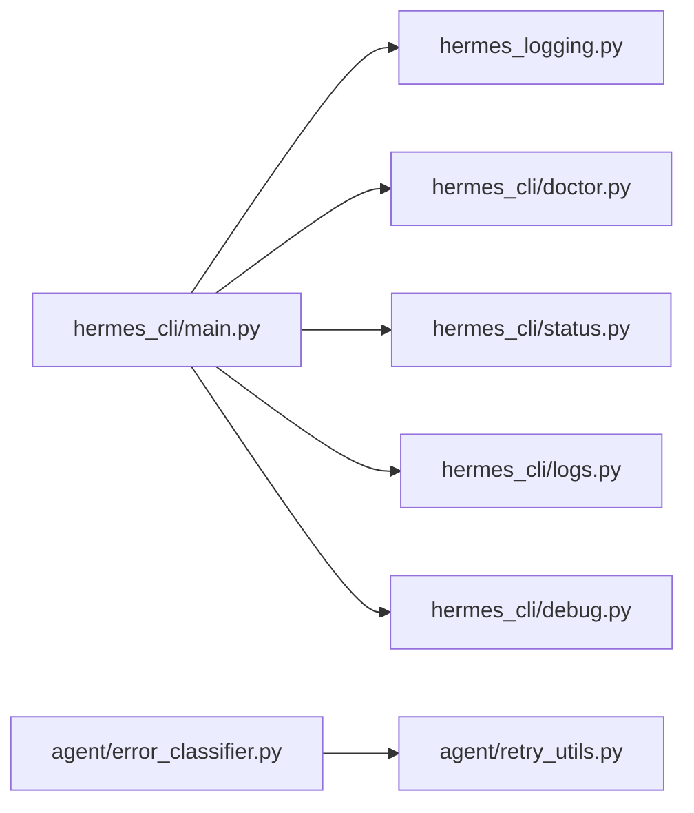

# 故障排除

<cite>
**本文引用的文件**   
- [hermes_cli/doctor.py](file://hermes_cli/doctor.py)
- [hermes_cli/logs.py](file://hermes_cli/logs.py)
- [hermes_cli/debug.py](file://hermes_cli/debug.py)
- [hermes_logging.py](file://hermes_logging.py)
- [agent/error_classifier.py](file://agent/error_classifier.py)
- [agent/retry_utils.py](file://agent/retry_utils.py)
- [hermes_cli/status.py](file://hermes_cli/status.py)
- [hermes_cli/main.py](file://hermes_cli/main.py)
- [hermes_cli/dump.py](file://hermes_cli/dump.py)
- [gateway/run.py](file://gateway/run.py)
- [tests/gateway/test_api_server_bind_guard.py](file://tests/gateway/test_api_server_bind_guard.py)
- [tests/gateway/test_telegram_network.py](file://tests/gateway/test_telegram_network.py)
</cite>

## 目录
1. [简介](#简介)
2. [项目结构](#项目结构)
3. [核心组件](#核心组件)
4. [架构总览](#架构总览)
5. [详细组件分析](#详细组件分析)
6. [依赖分析](#依赖分析)
7. [性能考虑](#性能考虑)
8. [故障排除指南](#故障排除指南)
9. [结论](#结论)
10. [附录](#附录)

## 简介
本指南面向技术支持与系统管理员，提供Hermes Agent的系统化故障排除方法与调试技巧。内容覆盖网络连接、工具执行失败、内存与性能问题的诊断流程；包含日志分析方法、错误追踪技术与定位策略，并给出紧急情况下的应急响应与快速修复方案。

## 项目结构
Hermes Agent围绕CLI命令、集中式日志、错误分类与重试机制构建。关键模块包括：
- CLI入口与子命令：启动、状态、医生检查、日志查看、调试分享等
- 日志系统：统一的RotatingFileHandler与会话上下文注入
- 错误分类与恢复：基于HTTP状态码、消息模式与传输错误的分类管线
- 重试策略：抖动退避，避免并发风暴
- 网关与平台适配：网络可达性、DNS回退、端口占用等

图表来源
- [hermes_cli/main.py:1-120](file://hermes_cli/main.py#L1-L120)
- [hermes_cli/doctor.py:162-800](file://hermes_cli/doctor.py#L162-L800)
- [hermes_cli/status.py:85-476](file://hermes_cli/status.py#L85-L476)
- [hermes_cli/logs.py:1-391](file://hermes_cli/logs.py#L1-L391)
- [hermes_cli/debug.py:1-337](file://hermes_cli/debug.py#L1-L337)
- [hermes_logging.py:1-395](file://hermes_logging.py#L1-L395)
- [agent/error_classifier.py:1-810](file://agent/error_classifier.py#L1-L810)
- [agent/retry_utils.py:1-58](file://agent/retry_utils.py#L1-L58)
- [gateway/run.py:8406-8435](file://gateway/run.py#L8406-L8435)
- [tests/gateway/test_api_server_bind_guard.py:37-72](file://tests/gateway/test_api_server_bind_guard.py#L37-L72)
- [tests/gateway/test_telegram_network.py:533-644](file://tests/gateway/test_telegram_network.py#L533-L644)

章节来源
- [hermes_cli/main.py:1-120](file://hermes_cli/main.py#L1-L120)

## 核心组件
- 医生检查（hermes doctor）
  - 检查Python版本、虚拟环境、必要包、配置文件、认证状态、目录结构、外部工具、API连通性、子模块等
  - 支持自动修复建议与问题清单
- 状态查询（hermes status）
  - 展示环境、模型/提供商、API密钥、OAuth状态、终端后端、平台配置、网关服务、计划任务、会话数等
- 日志系统（hermes logs）
  - 支持按级别、会话、组件、时间范围过滤，支持实时跟随
- 调试分享（hermes debug share）
  - 自动收集系统转储与日志尾部，上传到Paste服务或本地输出
- 错误分类与恢复（agent/error_classifier）
  - 结构化错误分类（鉴权、配额、限流、服务器错误、超时、上下文溢出、负载过大、模型不存在、格式错误、特定提供商信号等）
  - 提供恢复动作提示（重试、压缩上下文、轮换凭证、降级/切换提供商）
- 重试策略（agent/retry_utils）
  - 基于抖动的退避算法，降低并发重试风暴风险

章节来源
- [hermes_cli/doctor.py:162-800](file://hermes_cli/doctor.py#L162-L800)
- [hermes_cli/status.py:85-476](file://hermes_cli/status.py#L85-L476)
- [hermes_cli/logs.py:138-391](file://hermes_cli/logs.py#L138-L391)
- [hermes_cli/debug.py:206-337](file://hermes_cli/debug.py#L206-L337)
- [agent/error_classifier.py:23-395](file://agent/error_classifier.py#L23-L395)
- [agent/retry_utils.py:19-58](file://agent/retry_utils.py#L19-L58)

## 架构总览
Hermes Agent通过CLI统一入口调用各子系统。日志系统贯穿CLI与网关，提供一致的过滤与会话标记能力。Agent在调用外部API时使用错误分类与重试策略，结合抖动退避避免雪崩效应。网关侧提供诊断提示与网络回退逻辑，测试用例覆盖网络可达性与DNS回退路径。

图表来源
- [hermes_cli/main.py:146-165](file://hermes_cli/main.py#L146-L165)
- [hermes_logging.py:161-266](file://hermes_logging.py#L161-L266)
- [agent/error_classifier.py:222-395](file://agent/error_classifier.py#L222-L395)
- [agent/retry_utils.py:19-58](file://agent/retry_utils.py#L19-L58)

## 详细组件分析

### 医生检查（hermes doctor）工作流
- 环境与依赖检查：Python版本、虚拟环境、必需/可选包
- 配置与认证：~/.hermes/.env、config.yaml、配置版本迁移、过期键检测、OAuth登录状态
- 目录结构：~/.hermes/下各子目录、SQLite会话数据库、WAL大小检查
- 外部工具：git、ripgrep、Docker/SSH/Daytona、Node.js与浏览器自动化工具、npm审计
- API连通性：OpenRouter、Anthropic、多家API Key提供商
- 子模块：tinker-atropos

图表来源
- [hermes_cli/doctor.py:162-800](file://hermes_cli/doctor.py#L162-L800)

章节来源
- [hermes_cli/doctor.py:162-800](file://hermes_cli/doctor.py#L162-L800)

### 日志系统与过滤（hermes logs）
- 日志文件：agent.log（主活动）、errors.log（仅警告及以上）、gateway.log（网关组件）
- 过滤能力：级别、会话ID、组件前缀、相对时间范围
- 实时跟踪：支持跟随模式
- 文件读取优化：大文件从末尾分块读取，保证性能

图表来源
- [hermes_cli/logs.py:138-391](file://hermes_cli/logs.py#L138-L391)
- [hermes_logging.py:146-154](file://hermes_logging.py#L146-L154)

章节来源
- [hermes_cli/logs.py:138-391](file://hermes_cli/logs.py#L138-L391)
- [hermes_logging.py:146-154](file://hermes_logging.py#L146-L154)

### 错误分类与恢复（agent/error_classifier）
- 分类维度：HTTP状态码、错误体字段、消息模式、传输错误、服务器断开、上下文长度
- 典型场景：
  - 401/403：鉴权失败，触发凭证轮换与降级
  - 402：区分账单耗尽与周期配额，前者不可重试，后者按规则处理
  - 429/速率限制：指数退避+抖动，必要时轮换凭证/降级
  - 503/529：服务过载，等待后重试
  - 413/负载过大：压缩请求或降级
  - 上下文溢出：压缩上下文
  - 传输超时/连接错误：重建客户端后重试
  - 特定提供商信号：如Anthropic思维块签名无效、长上下文额外用量门限

图表来源
- [agent/error_classifier.py:222-395](file://agent/error_classifier.py#L222-L395)

章节来源
- [agent/error_classifier.py:23-395](file://agent/error_classifier.py#L23-L395)

### 重试策略（agent/retry_utils）
- 抖动退避：以2的幂次增长延迟，叠加随机抖动，避免并发重试同步
- 最大延迟保护：防止无限增长
- 线程安全计数器：确保抖动种子唯一性

图表来源
- [agent/retry_utils.py:19-58](file://agent/retry_utils.py#L19-L58)

章节来源
- [agent/retry_utils.py:19-58](file://agent/retry_utils.py#L19-L58)

### 网关诊断与网络回退（gateway/run.py 与测试）
- 诊断提示：当网关长时间无响应时，给出可能原因与调整建议（如增大agent.gateway_timeout）
- 网络可达性：测试用例验证IPv4/IPv6通配符、私有地址、localhost解析等
- DNS回退：DoH超时/连接错误/非预期JSON时回退至种子IP列表

图表来源
- [gateway/run.py:8406-8435](file://gateway/run.py#L8406-L8435)
- [tests/gateway/test_api_server_bind_guard.py:37-72](file://tests/gateway/test_api_server_bind_guard.py#L37-L72)
- [tests/gateway/test_telegram_network.py:533-644](file://tests/gateway/test_telegram_network.py#L533-L644)

章节来源
- [gateway/run.py:8406-8435](file://gateway/run.py#L8406-L8435)
- [tests/gateway/test_api_server_bind_guard.py:37-72](file://tests/gateway/test_api_server_bind_guard.py#L37-L72)
- [tests/gateway/test_telegram_network.py:533-644](file://tests/gateway/test_telegram_network.py#L533-L644)

## 依赖分析
- CLI初始化阶段即设置集中式日志，确保所有子命令（chat、gateway、cron、setup等）均写入agent.log与errors.log
- 日志系统对第三方噪声日志进行抑制，按组件路由到不同文件
- 医生检查与状态查询依赖环境变量与配置文件，确保诊断准确性
- 网关侧网络测试覆盖多种边界条件，保障在受限网络环境下的可用性

图表来源
- [hermes_cli/main.py:146-165](file://hermes_cli/main.py#L146-L165)
- [hermes_logging.py:161-266](file://hermes_logging.py#L161-L266)
- [hermes_cli/doctor.py:162-800](file://hermes_cli/doctor.py#L162-L800)
- [hermes_cli/status.py:85-476](file://hermes_cli/status.py#L85-L476)
- [hermes_cli/logs.py:1-391](file://hermes_cli/logs.py#L1-L391)
- [hermes_cli/debug.py:1-337](file://hermes_cli/debug.py#L1-L337)
- [agent/error_classifier.py:1-810](file://agent/error_classifier.py#L1-L810)
- [agent/retry_utils.py:1-58](file://agent/retry_utils.py#L1-L58)

章节来源
- [hermes_cli/main.py:146-165](file://hermes_cli/main.py#L146-L165)
- [hermes_logging.py:161-266](file://hermes_logging.py#L161-L266)

## 性能考虑
- 日志滚动与裁剪：避免磁盘膨胀，减少I/O压力
- 大文件读取优化：从末尾分块读取，提高tail/follow性能
- 重试抖动：降低并发重试风暴概率，提升整体稳定性
- 第三方日志抑制：减少噪音，聚焦关键信息

## 故障排除指南

### 通用诊断流程
- 使用“hermes doctor”进行系统性检查，收集问题清单与修复建议
- 使用“hermes status”确认环境、模型/提供商、API密钥、OAuth状态、终端后端、平台配置、网关状态、计划任务与会话数
- 使用“hermes logs”按级别/会话/组件/时间范围筛选日志，必要时开启跟随模式
- 使用“hermes debug share”生成调试报告并上传，便于远程协助

章节来源
- [hermes_cli/doctor.py:162-800](file://hermes_cli/doctor.py#L162-L800)
- [hermes_cli/status.py:85-476](file://hermes_cli/status.py#L85-L476)
- [hermes_cli/logs.py:138-391](file://hermes_cli/logs.py#L138-L391)
- [hermes_cli/debug.py:247-337](file://hermes_cli/debug.py#L247-L337)

### 网络连接问题
- 症状
  - API调用超时或断开
  - 平台消息无法送达或延迟高
- 诊断步骤
  - 使用“hermes doctor”检查OpenRouter/Anthropic等API连通性
  - 使用“hermes status”深检模式检查端口占用与可达性
  - 查看网关侧诊断提示，必要时增大agent.gateway_timeout
  - 运行网络测试用例，验证IPv4/IPv6通配符、私有地址与localhost解析
  - 检查DoH回退逻辑：若DoH超时/连接错误/非预期JSON，应回退到种子IP
- 快速修复
  - 更改网络配置（强制IPv4/IPv6偏好）
  - 临时关闭防火墙或放行端口
  - 切换到备用DNS或代理

章节来源
- [hermes_cli/doctor.py:660-777](file://hermes_cli/doctor.py#L660-L777)
- [hermes_cli/status.py:438-470](file://hermes_cli/status.py#L438-L470)
- [gateway/run.py:8406-8435](file://gateway/run.py#L8406-L8435)
- [tests/gateway/test_api_server_bind_guard.py:37-72](file://tests/gateway/test_api_server_bind_guard.py#L37-L72)
- [tests/gateway/test_telegram_network.py:533-644](file://tests/gateway/test_telegram_network.py#L533-L644)

### 工具执行失败
- 症状
  - 终端工具执行被拒绝或报错
  - 危险命令审批阻塞
- 诊断步骤
  - 使用“hermes logs”查看工具执行日志与会话上下文
  - 检查危险命令模式匹配与审批流程
  - 确认容器/SSH/Docker后端可用性与权限
- 快速修复
  - 在当前会话中批准危险命令（谨慎操作）
  - 为模式添加永久允许项（需评估风险）
  - 切换到本地后端或修复容器/SSH配置

章节来源
- [hermes_cli/logs.py:138-391](file://hermes_cli/logs.py#L138-L391)
- [tests/gateway/test_telegram_network.py:533-644](file://tests/gateway/test_telegram_network.py#L533-L644)

### 内存不足与性能问题
- 症状
  - 推理缓慢、频繁超时
  - 上下文溢出错误
  - CUDA内存峰值过高
- 诊断步骤
  - 使用“hermes logs”关注上下文长度、消息数量与超时事件
  - 查看错误分类结果中的上下文溢出与负载过大提示
  - 检查重试策略是否导致持续高压
- 快速修复
  - 启用/调整上下文压缩阈值
  - 降低会话上下文规模或清理历史消息
  - 减少并发请求或增加退避延迟
  - 优化模型选择与路由策略

章节来源
- [agent/error_classifier.py:44-46](file://agent/error_classifier.py#L44-L46)
- [agent/error_classifier.py:146-164](file://agent/error_classifier.py#L146-L164)
- [agent/retry_utils.py:19-58](file://agent/retry_utils.py#L19-L58)

### 常见错误类型与恢复策略
- 鉴权失败（401/403）
  - 行为：不可直接重试，需轮换凭证或降级
  - 操作：检查API密钥/OAuth状态，重新登录或更换密钥
- 账单耗尽（402）
  - 行为：不可重试，除非充值或切换账户
  - 操作：确认配额状态，充值或使用备用账户
- 速率限制（429/配额）
  - 行为：指数退避+抖动，必要时轮换凭证/降级
  - 操作：降低请求频率或切换提供商
- 服务器错误（500/502/503/529）
  - 行为：可重试，等待后重试
  - 操作：稍后重试或切换模型/提供商
- 超时/连接错误
  - 行为：重建客户端后重试
  - 操作：检查网络、DNS与代理
- 上下文溢出（400/413/消息模式）
  - 行为：压缩上下文
  - 操作：精简历史消息或启用压缩
- 负载过大（413）
  - 行为：压缩负载或降级
  - 操作：拆分请求或降低输入规模

章节来源
- [agent/error_classifier.py:25-59](file://agent/error_classifier.py#L25-L59)
- [agent/error_classifier.py:340-504](file://agent/error_classifier.py#L340-L504)
- [agent/error_classifier.py:507-534](file://agent/error_classifier.py#L507-L534)
- [agent/error_classifier.py:536-609](file://agent/error_classifier.py#L536-L609)
- [agent/error_classifier.py:611-739](file://agent/error_classifier.py#L611-L739)

### 日志分析方法与错误追踪
- 使用“hermes logs”按组件过滤（gateway、tools、cli、cron等）
- 使用会话ID关联多源日志，定位具体对话链路
- 关注错误级别（WARNING+）快速定位问题
- 对深层调用栈问题，向上追溯数据来源与调用点

章节来源
- [hermes_cli/logs.py:138-391](file://hermes_cli/logs.py#L138-L391)
- [hermes_logging.py:146-154](file://hermes_logging.py#L146-L154)

### 应急响应与快速修复
- 紧急降级
  - 切换到备用提供商或本地模型
  - 临时禁用高负载工具集
- 快速扩容
  - 增大agent.gateway_timeout缓解等待
  - 临时放宽速率限制策略
- 诊断共享
  - 使用“hermes debug share”生成并上传调试报告，附带系统转储与日志尾部

章节来源
- [gateway/run.py:8406-8435](file://gateway/run.py#L8406-L8435)
- [hermes_cli/debug.py:247-337](file://hermes_cli/debug.py#L247-L337)
- [hermes_cli/dump.py:212-345](file://hermes_cli/dump.py#L212-L345)

## 结论
通过系统化的医生检查、状态查询、日志过滤与错误分类/重试机制，Hermes Agent能够快速定位并缓解大多数运行时问题。配合网关诊断与网络回退测试，可在复杂网络环境下保持稳定运行。建议在生产环境中定期执行“hermes doctor”，并建立标准化的日志与调试流程，以缩短故障恢复时间。

## 附录
- 常用命令速查
  - hermes doctor [--fix]
  - hermes status [--deep]
  - hermes logs [-f] [--level/--session/--component/--since]
  - hermes debug share [--lines N] [--expire N] [--local]
- 关键日志文件
  - agent.log：主活动日志
  - errors.log：警告及以上
  - gateway.log：网关组件专用