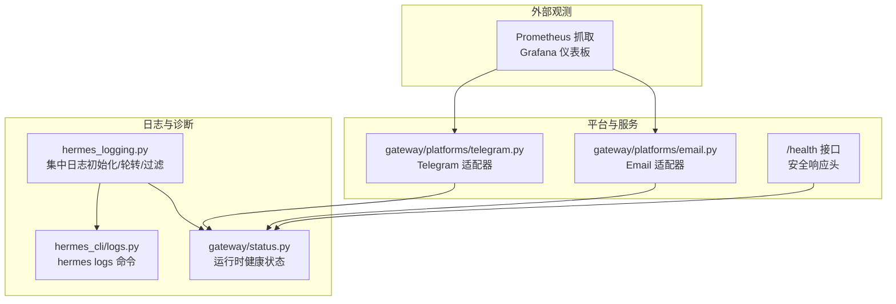
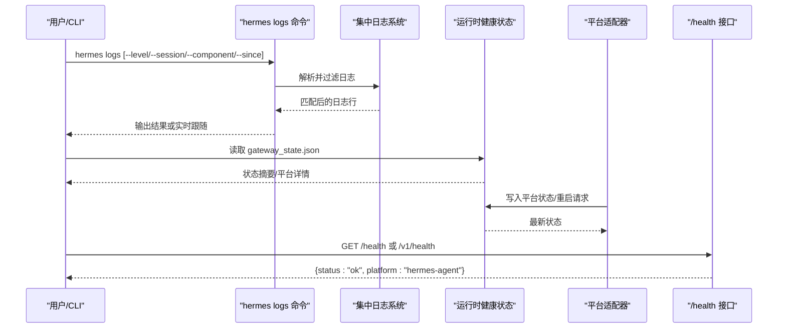
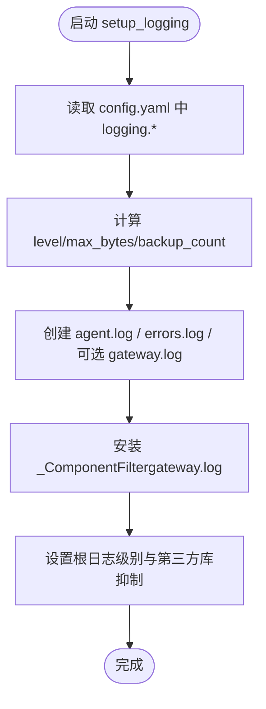
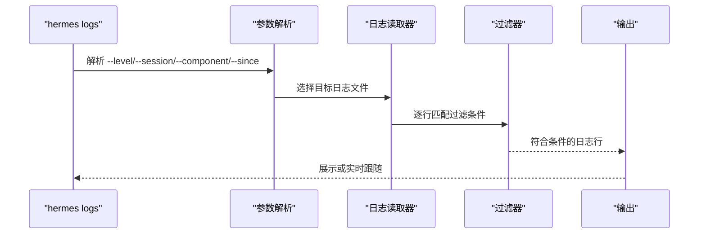
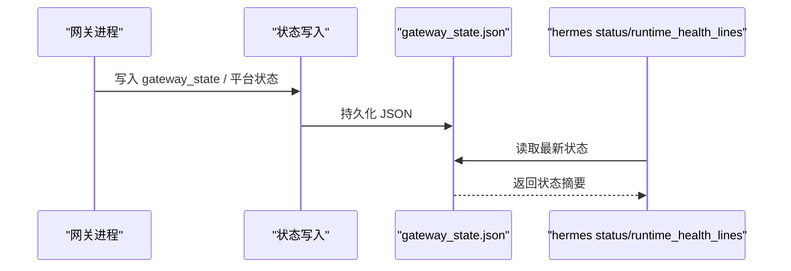
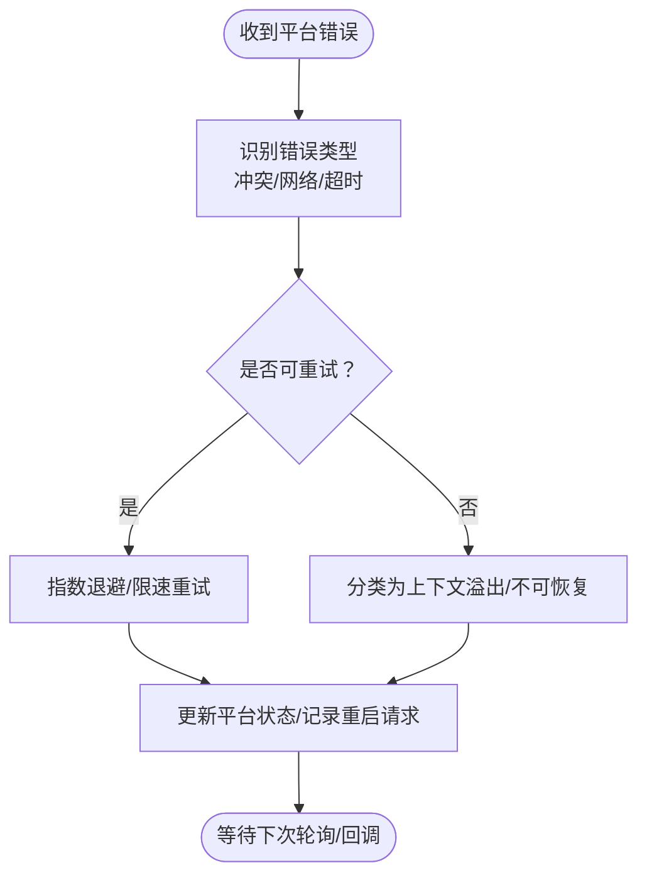
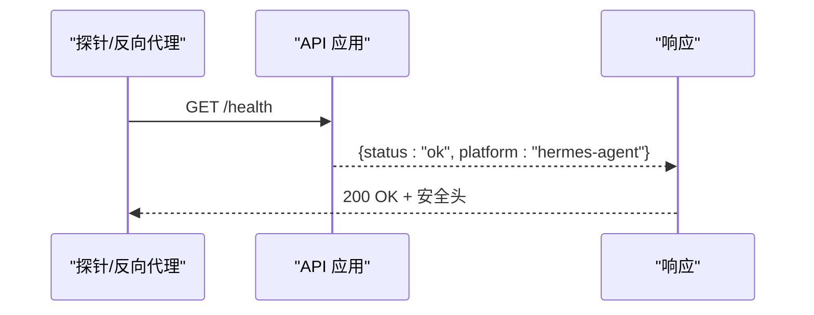
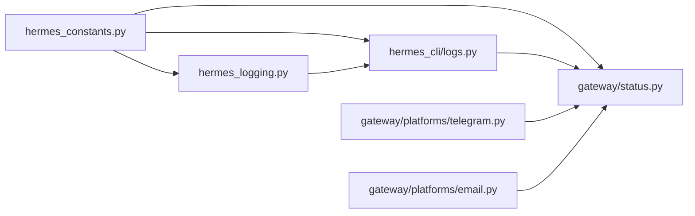

# 系统监控

<cite>
**本文引用的文件**
- [hermes_logging.py](file://hermes_logging.py)
- [logs.py](file://hermes_cli/logs.py)
- [status.py](file://gateway/status.py)
- [main.py](file://hermes_cli/main.py)
- [hermes_constants.py](file://hermes_constants.py)
- [error_classifier.py](file://agent/error_classifier.py)
- [credential_pool.py](file://agent/credential_pool.py)
- [email.py](file://gateway/platforms/email.py)
- [telegram.py](file://gateway/platforms/telegram.py)
- [test_hermes_logging.py](file://tests/test_hermes_logging.py)
- [test_api_server.py](file://tests/gateway/test_api_server.py)
- [test_gateway_runtime_health.py](file://tests/hermes_cli/test_gateway_runtime_health.py)
- [server-deployment.md](file://skills/mlops/inference/vllm/references/server-deployment.md)
</cite>

## 目录
1. [简介](#简介)
2. [项目结构](#项目结构)
3. [核心组件](#核心组件)
4. [架构总览](#架构总览)
5. [详细组件分析](#详细组件分析)
6. [依赖分析](#依赖分析)
7. [性能考虑](#性能考虑)
8. [故障排查指南](#故障排查指南)
9. [结论](#结论)
10. [附录](#附录)

## 简介
本指南面向运维与开发团队，围绕 Hermes Agent 的系统监控体系提供端到端建设方案。内容覆盖日志系统配置（级别、轮转、过滤）、性能指标采集与可视化、系统健康检查、告警与异常检测、自动恢复机制以及监控数据的收集与存储建议。文档以仓库现有实现为依据，结合测试用例与平台适配器源码，给出可操作的配置与实践路径。

## 项目结构
Hermes Agent 的监控能力由以下模块协同构成：
- 日志子系统：集中初始化、格式化、轮转与过滤，支持会话上下文注入与组件分离输出
- CLI 日志查看工具：提供尾随、过滤、时间范围与组件筛选等能力
- 运行时健康状态：持久化运行态信息，供状态查询与诊断
- 平台适配器：各消息平台的连接性、错误类型与重试语义
- 健康检查接口：对外暴露 /health 与安全响应头
- 性能指标与可视化：结合外部 Prometheus/Grafana 的 vLLM 指标示例

**图表来源**
- [hermes_logging.py:161-265](file://hermes_logging.py#L161-L265)
- [logs.py:138-247](file://hermes_cli/logs.py#L138-L247)
- [status.py:220-265](file://gateway/status.py#L220-L265)
- [telegram.py:114-200](file://gateway/platforms/telegram.py#L114-L200)
- [email.py:1-16](file://gateway/platforms/email.py#L1-L16)
- [server-deployment.md:239-256](file://skills/mlops/inference/vllm/references/server-deployment.md#L239-L256)

**章节来源**
- [hermes_logging.py:1-395](file://hermes_logging.py#L1-L395)
- [logs.py:1-391](file://hermes_cli/logs.py#L1-L391)
- [status.py:1-431](file://gateway/status.py#L1-L431)
- [hermes_constants.py:1-301](file://hermes_constants.py#L1-L301)

## 核心组件
- 集中日志系统
  - 提供 setup_logging 与 setup_verbose_logging，统一创建 agent.log、errors.log、gateway.log，并设置默认轮转参数与级别抑制
  - 支持从 config.yaml 读取 logging.level、logging.max_size_mb、logging.backup_count
  - 通过会话记录工厂注入 session_tag，便于关联多线程/多会话日志
  - 在托管模式下确保日志文件组写权限一致
- CLI 日志查看
  - hermes logs 支持 tail/follow、级别过滤、会话过滤、组件过滤、相对时间范围
  - 内置对 agent.log、errors.log、gateway.log 的解析与展示
- 运行时健康状态
  - gateway_state.json 记录 gateway_state、exit_reason、active_agents、平台状态与更新时间
  - 提供 PID 文件检测、进程存在性校验与清理
- 平台适配器
  - Telegram/Email 等适配器内置错误类型识别、网络错误重连策略与限制处理
- 健康检查接口
  - /health 返回状态与平台标识，附加安全响应头

**章节来源**
- [hermes_logging.py:161-265](file://hermes_logging.py#L161-L265)
- [logs.py:138-247](file://hermes_cli/logs.py#L138-L247)
- [status.py:220-265](file://gateway/status.py#L220-L265)
- [telegram.py:114-200](file://gateway/platforms/telegram.py#L114-L200)
- [email.py:1-16](file://gateway/platforms/email.py#L1-L16)
- [test_api_server.py:247-273](file://tests/gateway/test_api_server.py#L247-L273)

## 架构总览
下图展示监控相关模块之间的交互关系与数据流：

**图表来源**
- [logs.py:138-247](file://hermes_cli/logs.py#L138-L247)
- [hermes_logging.py:161-265](file://hermes_logging.py#L161-L265)
- [status.py:220-265](file://gateway/status.py#L220-L265)
- [telegram.py:114-200](file://gateway/platforms/telegram.py#L114-L200)
- [test_api_server.py:247-273](file://tests/gateway/test_api_server.py#L247-L273)

## 详细组件分析

### 日志系统与轮转策略
- 初始化与组件分离
  - setup_logging 创建 agent.log（INFO+）、errors.log（WARNING+）与可选 gateway.log（INFO+），并通过 _ComponentFilter 将 gateway.* 记录路由至 gateway.log
  - 默认根日志级别不低于文件处理器级别，确保记录可达
- 轮转参数与配置来源
  - 默认最大大小与备份数可通过参数传入；若未指定则回退到 config.yaml 中的 logging.max_size_mb 与 logging.backup_count
  - _ManagedRotatingFileHandler 在托管模式下确保新建/轮转后文件具备组写权限
- 会话上下文与过滤
  - set_session_context/clear_session_context 注入 session_tag，便于按会话聚合与关联
  - hermes logs 支持按级别、会话、组件前缀与相对时间过滤
- 测试验证点
  - 自定义级别/大小/备份数生效
  - 多次调用幂等且不重复添加同路径处理器
  - 托管模式下初始打开与轮转后文件权限正确

**图表来源**
- [hermes_logging.py:161-265](file://hermes_logging.py#L161-L265)

**章节来源**
- [hermes_logging.py:161-265](file://hermes_logging.py#L161-L265)
- [hermes_logging.py:336-394](file://hermes_logging.py#L336-L394)
- [test_hermes_logging.py:104-134](file://tests/test_hermes_logging.py#L104-L134)
- [test_hermes_logging.py:548-701](file://tests/test_hermes_logging.py#L548-L701)

### CLI 日志查看与过滤
- 功能特性
  - 支持 tail/follow、--level、--session、--component、--since 等参数
  - 对 agent.log、errors.log、gateway.log 的解析与展示
  - 大文件高效读取与增量跟随
- 组件映射
  - hermes_cli/main.py 注册 logs 子命令与参数
  - hermes_cli/logs.py 实现解析、过滤与输出逻辑

**图表来源**
- [main.py:5907-5915](file://hermes_cli/main.py#L5907-L5915)
- [logs.py:138-247](file://hermes_cli/logs.py#L138-L247)

**章节来源**
- [logs.py:138-247](file://hermes_cli/logs.py#L138-L247)
- [main.py:5907-5915](file://hermes_cli/main.py#L5907-L5915)

### 运行时健康状态与平台诊断
- 状态文件
  - gateway_state.json 记录 gateway_state、exit_reason、restart_requested、active_agents、平台状态与更新时间
  - 通过 write_runtime_status/read_runtime_status 持久化与读取
- PID 文件与进程校验
  - get_running_pid/is_gateway_running 基于 PID 文件与进程存在性校验，清理陈旧 PID
- CLI 健康摘要
  - _runtime_health_lines 汇总致命平台与启动原因，辅助快速定位问题

**图表来源**
- [status.py:220-265](file://gateway/status.py#L220-L265)
- [status.py:391-431](file://gateway/status.py#L391-L431)
- [hermes_cli/gateway.py:1964-1978](file://hermes_cli/gateway.py#L1964-L1978)

**章节来源**
- [status.py:220-265](file://gateway/status.py#L220-L265)
- [status.py:391-431](file://gateway/status.py#L391-L431)
- [test_gateway_runtime_health.py:1-22](file://tests/hermes_cli/test_gateway_runtime_health.py#L1-L22)

### 平台适配器的异常检测与自动恢复
- Telegram 适配器
  - 错误类型识别：冲突、网络错误、超时等，触发重连或降级
  - 文本/媒体批处理缓冲，避免客户端侧拆分导致的多次触发
- Email 适配器
  - 自动化邮件识别与忽略，降低噪音
  - IMAP/SMTP 连接参数与轮询间隔配置
- 异常分类与重试
  - agent/error_classifier.py 对断连、传输错误进行语义化分类，优先考虑上下文溢出场景
  - agent/credential_pool.py 规范化错误上下文，提取重试时间戳与延迟

**图表来源**
- [telegram.py:172-200](file://gateway/platforms/telegram.py#L172-L200)
- [error_classifier.py:361-392](file://agent/error_classifier.py#L361-L392)
- [credential_pool.py:243-267](file://agent/credential_pool.py#L243-L267)

**章节来源**
- [telegram.py:114-200](file://gateway/platforms/telegram.py#L114-L200)
- [email.py:1-16](file://gateway/platforms/email.py#L1-L16)
- [error_classifier.py:361-392](file://agent/error_classifier.py#L361-L392)
- [credential_pool.py:243-267](file://agent/credential_pool.py#L243-L267)

### 健康检查接口与安全响应头
- /health 与 /v1/health
  - 返回状态为 ok，平台标识为 hermes-agent
  - 设置安全响应头（如 X-Content-Type-Options、Referrer-Policy）
- 用途
  - 容器探针、反向代理健康检查、自动化巡检

**图表来源**
- [test_api_server.py:247-273](file://tests/gateway/test_api_server.py#L247-L273)

**章节来源**
- [test_api_server.py:247-273](file://tests/gateway/test_api_server.py#L247-L273)

### 性能指标监控与可视化
- vLLM 指标参考
  - Prometheus 抓取配置与 Grafana 关键指标（请求速率、TTFT 分位、GPU 缓存使用率、活跃请求数）
- 建议
  - 在部署 vLLM 推理服务时启用 metrics_path，并在 Grafana 中创建仪表板
  - 结合系统层面的 CPU、内存、网络 I/O、磁盘空间监控（见“性能考虑”）

**章节来源**
- [server-deployment.md:239-256](file://skills/mlops/inference/vllm/references/server-deployment.md#L239-L256)

## 依赖分析
- 模块耦合
  - hermes_logging.py 与 hermes_constants.py 通过 get_hermes_home/get_config_path 获取路径与配置
  - hermes_cli/logs.py 依赖 hermes_logging.COMPONENT_PREFIXES 进行组件过滤
  - gateway/status.py 与 hermes_constants.py 共享 HERMES_HOME 与状态文件路径
- 外部依赖
  - 平台适配器依赖对应 SDK（如 Telegram、Email）
  - Prometheus/Grafana 作为外部观测系统

**图表来源**
- [hermes_constants.py:226-247](file://hermes_constants.py#L226-L247)
- [hermes_logging.py:33-38](file://hermes_logging.py#L33-L38)
- [logs.py:194-200](file://hermes_cli/logs.py#L194-L200)
- [status.py:22-40](file://gateway/status.py#L22-L40)

**章节来源**
- [hermes_constants.py:226-247](file://hermes_constants.py#L226-L247)
- [hermes_logging.py:33-38](file://hermes_logging.py#L33-L38)
- [logs.py:194-200](file://hermes_cli/logs.py#L194-L200)
- [status.py:22-40](file://gateway/status.py#L22-L40)

## 性能考虑
- 日志轮转与磁盘占用
  - 使用 RotatingFileHandler 控制单文件大小与备份数量，避免磁盘爆满
  - 在托管模式下确保组写权限，便于共享访问
- 日志级别与噪声控制
  - 默认抑制第三方库噪声，仅在 verbose 模式下开启 DEBUG
- 平台适配器的限流与批处理
  - Telegram 的文本/媒体批处理与网络错误重连，减少抖动与重复触发
- 系统资源监控建议
  - CPU/内存/网络 I/O/磁盘空间：结合系统监控工具（如 Prometheus Node Exporter）与 Grafana 可视化
  - 将日志目录所在分区纳入磁盘空间告警阈值

[本节为通用指导，无需特定文件引用]

## 故障排查指南
- 快速定位
  - 使用 hermes logs --level WARNING --since 1h 查看最近告警
  - 使用 hermes logs --component gateway --level ERROR 定位网关异常
  - 使用 hermes status 查看运行时健康状态与致命平台
- 常见问题
  - Telegram 冲突/网络错误：检查机器人实例是否唯一运行，网络是否稳定
  - Email 自动化邮件噪音：确认 ALLOWED_USERS 与自动化头部识别
- 自动恢复
  - 平台适配器内部对网络错误进行重试与限速
  - 网关状态文件记录 restart_requested，可用于外部重启策略

**章节来源**
- [logs.py:138-247](file://hermes_cli/logs.py#L138-L247)
- [status.py:220-265](file://gateway/status.py#L220-L265)
- [telegram.py:172-200](file://gateway/platforms/telegram.py#L172-L200)
- [email.py:67-86](file://gateway/platforms/email.py#L67-L86)
- [test_gateway_runtime_health.py:1-22](file://tests/hermes_cli/test_gateway_runtime_health.py#L1-L22)

## 结论
Hermes Agent 已具备完善的日志体系、运行时健康状态与平台适配器异常处理能力。结合 CLI 日志查看与 /health 接口，可快速完成日常运维与故障排查。建议在生产环境中启用 Prometheus/Grafana 观测 vLLM 等关键服务，并将日志轮转与磁盘空间纳入统一告警策略，形成闭环监控与自动恢复体系。

[本节为总结，无需特定文件引用]

## 附录
- 关键配置项与默认值
  - 日志级别：默认 INFO，可通过 logging.level 或 --level 覆盖
  - 单文件大小：默认 5MB，可通过 logging.max_size_mb 或参数覆盖
  - 备份数量：默认 3，可通过 logging.backup_count 或参数覆盖
  - verbose 模式：DEBUG 级别控制台输出，抑制第三方噪声
- 常用命令
  - hermes logs：查看与跟随日志
  - hermes status：查看运行时健康状态
  - /health：健康检查接口

**章节来源**
- [hermes_logging.py:161-265](file://hermes_logging.py#L161-L265)
- [logs.py:138-247](file://hermes_cli/logs.py#L138-L247)
- [test_api_server.py:247-273](file://tests/gateway/test_api_server.py#L247-L273)