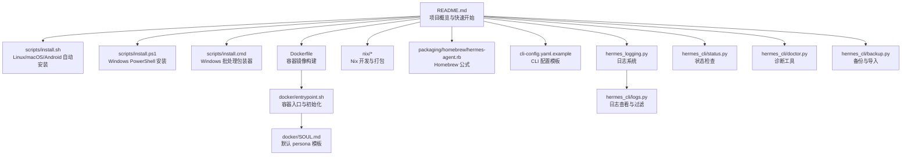
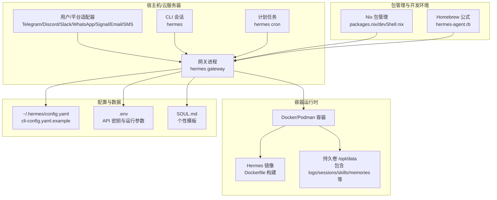
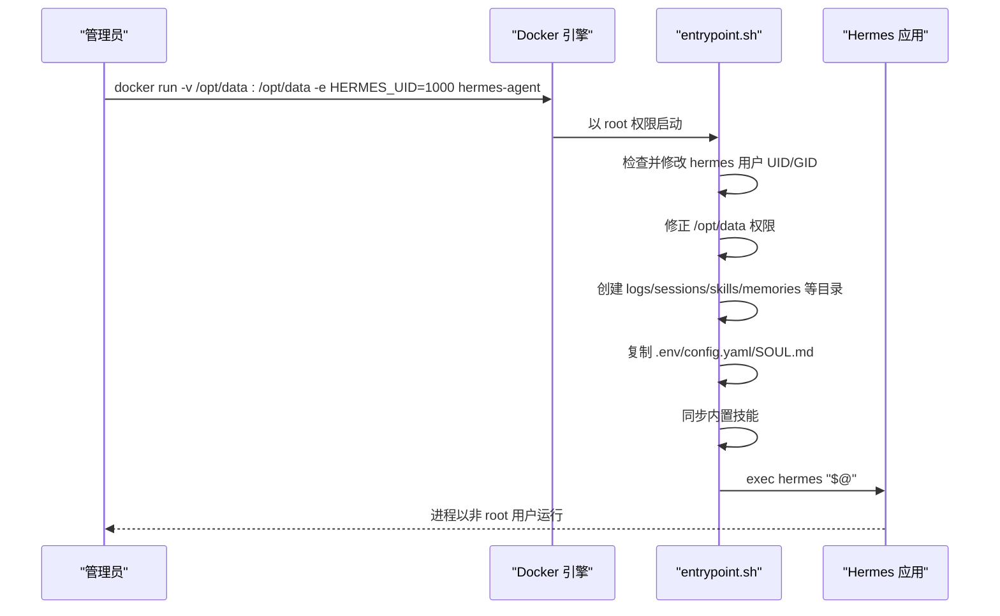
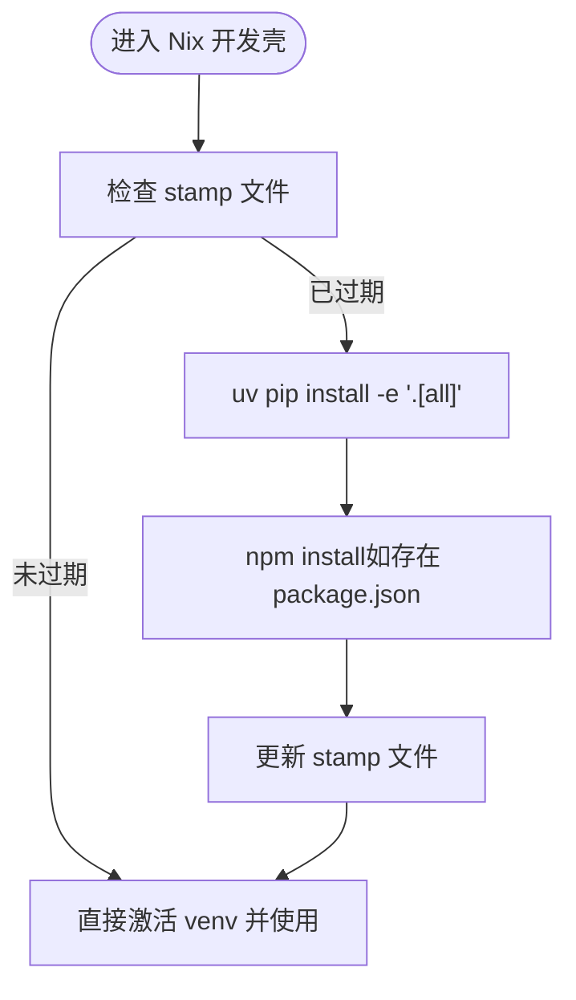
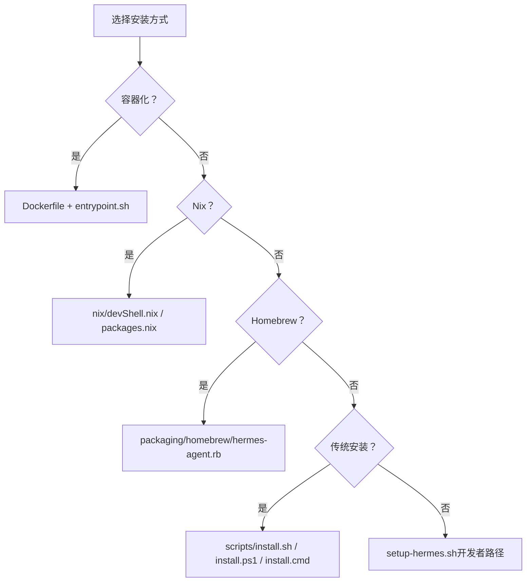
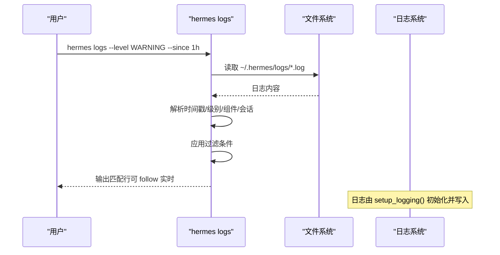
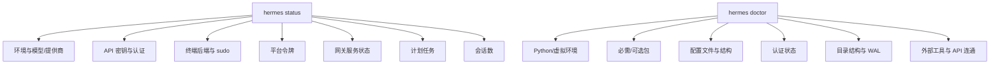
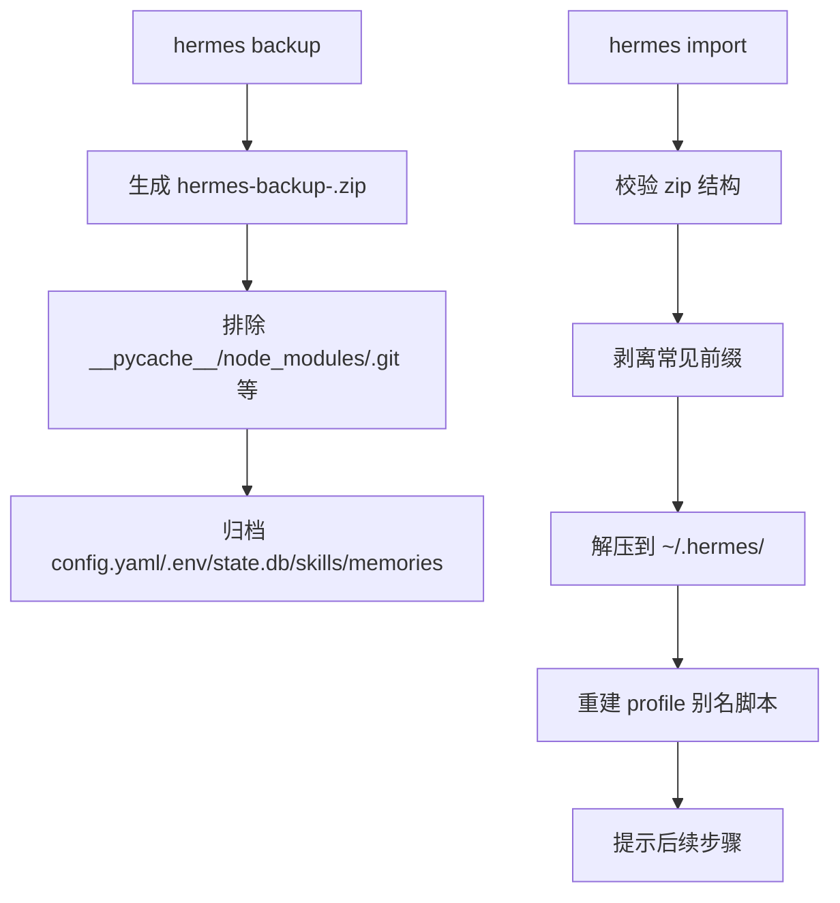
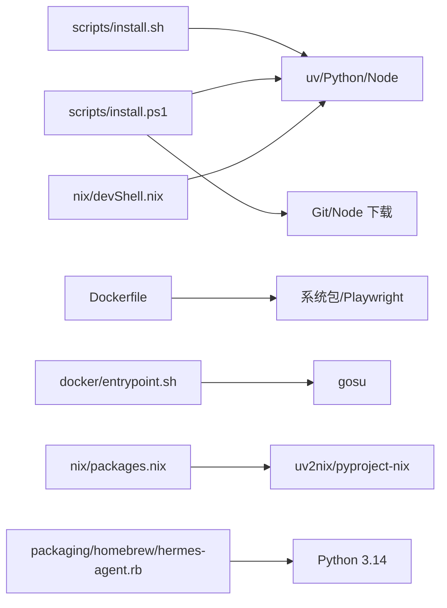

# 部署与运维

<cite>
**本文引用的文件**
- [README.md](file://README.md)
- [Dockerfile](file://Dockerfile)
- [docker/entrypoint.sh](file://docker/entrypoint.sh)
- [docker/SOUL.md](file://docker/SOUL.md)
- [setup-hermes.sh](file://setup-hermes.sh)
- [scripts/install.sh](file://scripts/install.sh)
- [scripts/install.ps1](file://scripts/install.ps1)
- [scripts/install.cmd](file://scripts/install.cmd)
- [nix/packages.nix](file://nix/packages.nix)
- [nix/devShell.nix](file://nix/devShell.nix)
- [nix/configMergeScript.nix](file://nix/configMergeScript.nix)
- [packaging/homebrew/hermes-agent.rb](file://packaging/homebrew/hermes-agent.rb)
- [cli-config.yaml.example](file://cli-config.yaml.example)
- [hermes_logging.py](file://hermes_logging.py)
- [hermes_cli/logs.py](file://hermes_cli/logs.py)
- [hermes_cli/status.py](file://hermes_cli/status.py)
- [hermes_cli/doctor.py](file://hermes_cli/doctor.py)
- [hermes_cli/backup.py](file://hermes_cli/backup.py)
</cite>

## 目录
1. [简介](#简介)
2. [项目结构](#项目结构)
3. [核心组件](#核心组件)
4. [架构总览](#架构总览)
5. [详细组件分析](#详细组件分析)
6. [依赖关系分析](#依赖关系分析)
7. [性能考虑](#性能考虑)
8. [故障排除指南](#故障排除指南)
9. [结论](#结论)
10. [附录](#附录)

## 简介
本指南面向生产环境的 Hermes Agent 部署与运维，覆盖以下主题：
- 生产环境部署策略：容器化（Docker）、Nix 包管理、Homebrew、传统安装（Linux/macOS/Windows）的优缺点与适用场景
- 监控与日志：集中式日志、日志轮转、敏感信息脱敏、日志过滤与实时跟踪
- 运维流程：健康检查、状态查看、诊断工具、备份与导入、升级与迁移
- 备份恢复与灾难恢复：可移植的配置与数据目录、增量与全量备份策略
- 高可用与扩容：多实例部署、会话与状态隔离、平台网关服务管理
- 性能监控与容量规划：上下文压缩、令牌预算、资源限制与调优
- 故障排除：常见问题定位、应急响应与快速修复

## 项目结构
Hermes Agent 提供多种安装与运行方式，核心目录与脚本如下：
- 容器化：Dockerfile、入口脚本、示例 persona 文件
- 安装脚本：Linux/macOS/Android 自动安装脚本、Windows PowerShell/批处理安装脚本
- 包管理：Nix 开发与打包、Homebrew 公式
- 配置：CLI 配置模板、日志模块、运维 CLI 工具（状态、诊断、日志、备份）

**图表来源**
- [README.md:1-179](file://README.md#L1-L179)
- [Dockerfile:1-47](file://Dockerfile#L1-L47)
- [docker/entrypoint.sh:1-65](file://docker/entrypoint.sh#L1-L65)
- [docker/SOUL.md:1-15](file://docker/SOUL.md#L1-L15)
- [scripts/install.sh:1-800](file://scripts/install.sh#L1-L800)
- [scripts/install.ps1:1-920](file://scripts/install.ps1#L1-L920)
- [scripts/install.cmd:1-29](file://scripts/install.cmd#L1-L29)
- [nix/packages.nix:1-55](file://nix/packages.nix#L1-L55)
- [nix/devShell.nix:1-52](file://nix/devShell.nix#L1-L52)
- [nix/configMergeScript.nix:1-34](file://nix/configMergeScript.nix#L1-L34)
- [packaging/homebrew/hermes-agent.rb:1-49](file://packaging/homebrew/hermes-agent.rb#L1-L49)
- [cli-config.yaml.example:1-886](file://cli-config.yaml.example#L1-L886)
- [hermes_logging.py:1-395](file://hermes_logging.py#L1-L395)
- [hermes_cli/logs.py:1-391](file://hermes_cli/logs.py#L1-L391)
- [hermes_cli/status.py:1-476](file://hermes_cli/status.py#L1-L476)
- [hermes_cli/doctor.py:1-1022](file://hermes_cli/doctor.py#L1-L1022)
- [hermes_cli/backup.py:1-400](file://hermes_cli/backup.py#L1-L400)

**章节来源**
- [README.md:1-179](file://README.md#L1-L179)

## 核心组件
- 容器化运行时：基于 Debian 13 的最小镜像，非 root 用户运行，预装 Node.js、ripgrep、ffmpeg、Playwright 浏览器等依赖；通过环境变量控制 UID/GID 映射与数据卷挂载
- 安装与初始化：自动检测平台（Linux/macOS/Android/Windows），安装 uv/Python/Node，创建虚拟环境，同步技能，生成配置与 persona 文件
- 日志系统：统一的 RotatingFileHandler，按级别输出到 agent.log、errors.log、gateway.log，并对敏感信息进行脱敏
- 运维 CLI：状态检查（API 密钥、终端后端、平台令牌、网关服务、计划任务、会话）、诊断工具（网络连通性、外部工具、配置校验、SQLite WAL）、日志查看（tail/follow、级别/组件/时间过滤）、备份与导入

**章节来源**
- [Dockerfile:1-47](file://Dockerfile#L1-L47)
- [docker/entrypoint.sh:1-65](file://docker/entrypoint.sh#L1-L65)
- [scripts/install.sh:1-800](file://scripts/install.sh#L1-L800)
- [scripts/install.ps1:1-920](file://scripts/install.ps1#L1-L920)
- [hermes_logging.py:1-395](file://hermes_logging.py#L1-L395)
- [hermes_cli/logs.py:1-391](file://hermes_cli/logs.py#L1-L391)
- [hermes_cli/status.py:1-476](file://hermes_cli/status.py#L1-L476)
- [hermes_cli/doctor.py:1-1022](file://hermes_cli/doctor.py#L1-L1022)
- [hermes_cli/backup.py:1-400](file://hermes_cli/backup.py#L1-L400)

## 架构总览
下图展示生产环境的典型部署形态与组件交互：

**图表来源**
- [Dockerfile:1-47](file://Dockerfile#L1-L47)
- [docker/entrypoint.sh:1-65](file://docker/entrypoint.sh#L1-L65)
- [nix/packages.nix:1-55](file://nix/packages.nix#L1-L55)
- [nix/devShell.nix:1-52](file://nix/devShell.nix#L1-L52)
- [packaging/homebrew/hermes-agent.rb:1-49](file://packaging/homebrew/hermes-agent.rb#L1-L49)
- [cli-config.yaml.example:1-886](file://cli-config.yaml.example#L1-L886)

## 详细组件分析

### 容器化部署（Docker）
- 基础镜像与依赖：Debian 13，安装 build-essential、nodejs、npm、python3、ripgrep、ffmpeg、gcc、libffi-dev、procps 等；Playwright 浏览器安装至 /opt/hermes/.playwright
- 非 root 运行：创建 hermes 用户（UID 可通过 HERMES_UID 覆盖），使用 gosu 在启动时降权；数据目录 /opt/data 作为卷挂载
- 启动流程：入口脚本在首次运行时创建必要的子目录、复制 .env/config.yaml/SOUL.md，同步内置技能，然后执行 hermes
- 环境变量：PYTHONUNBUFFERED=1、PLAYWRIGHT_BROWSERS_PATH、HERMES_HOME=/opt/data、VOLUME ["/opt/data"]

**图表来源**
- [Dockerfile:1-47](file://Dockerfile#L1-L47)
- [docker/entrypoint.sh:1-65](file://docker/entrypoint.sh#L1-L65)

**章节来源**
- [Dockerfile:1-47](file://Dockerfile#L1-L47)
- [docker/entrypoint.sh:1-65](file://docker/entrypoint.sh#L1-L65)
- [docker/SOUL.md:1-15](file://docker/SOUL.md#L1-L15)

### Nix 包管理与开发环境
- 打包：通过 packages.nix 将 Python 虚拟环境与 Node/ripgrep/ffmpeg 等运行时依赖打包为可执行程序，设置 HERMES_BUNDLED_SKILLS 环境变量指向内置技能目录
- 开发壳：devShell.nix 提供 Python 3.11、uv、Node.js、ripgrep、git、openssh、ffmpeg 等开发依赖，支持 stamp 文件优化，避免重复安装
- 配置合并：configMergeScript.nix 将 Nix 层配置深度合并到现有 config.yaml，保留用户自定义项

**图表来源**
- [nix/devShell.nix:1-52](file://nix/devShell.nix#L1-L52)
- [nix/packages.nix:1-55](file://nix/packages.nix#L1-L55)
- [nix/configMergeScript.nix:1-34](file://nix/configMergeScript.nix#L1-L34)

**章节来源**
- [nix/packages.nix:1-55](file://nix/packages.nix#L1-L55)
- [nix/devShell.nix:1-52](file://nix/devShell.nix#L1-L52)
- [nix/configMergeScript.nix:1-34](file://nix/configMergeScript.nix#L1-L34)

### Homebrew 安装（macOS）
- 公式：通过 Homebrew 安装 Python 3.14 虚拟环境，pip 安装项目与资源，写入环境变量指向内置技能目录
- 优势：跨平台一致的安装体验，便于系统集成与升级

**章节来源**
- [packaging/homebrew/hermes-agent.rb:1-49](file://packaging/homebrew/hermes-agent.rb#L1-L49)

### 传统安装（Linux/macOS/Android/Windows）
- Linux/macOS/Android：scripts/install.sh 自动检测平台，安装 uv/Python/Node，创建 venv，安装依赖，复制 .env/config.yaml/SOUL.md，同步技能
- Windows：scripts/install.ps1 支持 PowerShell 安装，自动下载 Node.js 二进制，设置 PATH 与 HERMES_HOME，创建配置目录与文件；提供 install.cmd 包装器
- setup-hermes.sh：面向手动克隆仓库的开发者，创建 venv、安装依赖、同步技能、软链接 hermes 到用户 bin 目录

**图表来源**
- [scripts/install.sh:1-800](file://scripts/install.sh#L1-L800)
- [scripts/install.ps1:1-920](file://scripts/install.ps1#L1-L920)
- [scripts/install.cmd:1-29](file://scripts/install.cmd#L1-L29)
- [Dockerfile:1-47](file://Dockerfile#L1-L47)
- [docker/entrypoint.sh:1-65](file://docker/entrypoint.sh#L1-L65)
- [nix/devShell.nix:1-52](file://nix/devShell.nix#L1-L52)
- [nix/packages.nix:1-55](file://nix/packages.nix#L1-L55)
- [packaging/homebrew/hermes-agent.rb:1-49](file://packaging/homebrew/hermes-agent.rb#L1-L49)
- [setup-hermes.sh:1-400](file://setup-hermes.sh#L1-L400)

**章节来源**
- [scripts/install.sh:1-800](file://scripts/install.sh#L1-L800)
- [scripts/install.ps1:1-920](file://scripts/install.ps1#L1-L920)
- [scripts/install.cmd:1-29](file://scripts/install.cmd#L1-L29)
- [setup-hermes.sh:1-400](file://setup-hermes.sh#L1-L400)

### 配置与 persona 管理
- 配置文件：config.yaml（CLI 行为、模型与推理、终端后端、安全扫描、浏览器、上下文压缩、辅助模型、记忆、会话重置策略、流式传输、技能、代理行为、工具集、MCP、语音识别、显示等）
- 环境变量：.env（API 密钥、自定义端点、平台令牌等）
- persona：SOUL.md（全局个性模板，每次消息加载最新内容）

**章节来源**
- [cli-config.yaml.example:1-886](file://cli-config.yaml.example#L1-L886)
- [docker/SOUL.md:1-15](file://docker/SOUL.md#L1-L15)

### 日志系统与监控
- 日志文件：agent.log（主活动日志）、errors.log（警告及以上）、gateway.log（仅网关组件）
- 轮转与脱敏：RotatingFileHandler + RedactingFormatter，抑制第三方噪声日志
- 会话上下文：线程本地存储注入 session_id，便于关联同一对话
- CLI 查看：hermes logs 支持 tail/follow、级别过滤、组件过滤、相对时间范围、会话筛选

**图表来源**
- [hermes_logging.py:1-395](file://hermes_logging.py#L1-L395)
- [hermes_cli/logs.py:1-391](file://hermes_cli/logs.py#L1-L391)

**章节来源**
- [hermes_logging.py:1-395](file://hermes_logging.py#L1-L395)
- [hermes_cli/logs.py:1-391](file://hermes_cli/logs.py#L1-L391)

### 运维流程与健康检查
- 状态检查：hermes status 展示环境、模型与提供商、API 密钥、认证状态、终端后端、平台令牌、网关服务、计划任务、会话数；支持深检查（如 OpenRouter 连通性、端口占用）
- 诊断工具：hermes doctor 检查 Python 版本/虚拟环境、必需/可选包、配置文件、认证状态、目录结构、外部工具（git/ripgrep/docker/ssh/daytona/node/agent-browser）、API 连通性、SQLite WAL、系统服务留驻（systemd linger）

**图表来源**
- [hermes_cli/status.py:1-476](file://hermes_cli/status.py#L1-L476)
- [hermes_cli/doctor.py:1-1022](file://hermes_cli/doctor.py#L1-L1022)

**章节来源**
- [hermes_cli/status.py:1-476](file://hermes_cli/status.py#L1-L476)
- [hermes_cli/doctor.py:1-1022](file://hermes_cli/doctor.py#L1-L1022)

### 备份恢复与灾难恢复
- 备份：hermes backup 创建压缩归档，排除缓存、git、代码库、临时文件；包含 config.yaml、.env、state.db、技能、记忆、会话等
- 导入：hermes import 校验 zip 结构，自动剥离常见前缀，安全解压到目标目录，重建 profile 别名脚本；提示后续操作（如为 profile 重新安装网关服务）
- 灾难恢复：建议定期全量备份 + 增量（技能/记忆变更）；在新环境使用 install.sh/install.ps1 或容器部署后导入备份

**图表来源**
- [hermes_cli/backup.py:1-400](file://hermes_cli/backup.py#L1-L400)

**章节来源**
- [hermes_cli/backup.py:1-400](file://hermes_cli/backup.py#L1-L400)

## 依赖关系分析
- 安装脚本与平台生态：install.sh 依赖 uv/Python/Node；install.ps1 依赖 uv/Python/Node（Windows），并处理 Git/Node 下载与 PATH 设置
- 容器镜像：Dockerfile 依赖基础镜像与系统包，entrypoint.sh 依赖 gosu 与 Python 虚拟环境
- Nix：packages.nix 依赖 uv2nix/pyproject-nix 构建 Python 环境，devShell.nix 依赖 Python/uv/Node/ripgrep/git/openssh/ffmpeg
- Homebrew：公式依赖 Python 3.14 与虚拟环境封装

**图表来源**
- [scripts/install.sh:1-800](file://scripts/install.sh#L1-L800)
- [scripts/install.ps1:1-920](file://scripts/install.ps1#L1-L920)
- [Dockerfile:1-47](file://Dockerfile#L1-L47)
- [docker/entrypoint.sh:1-65](file://docker/entrypoint.sh#L1-L65)
- [nix/packages.nix:1-55](file://nix/packages.nix#L1-L55)
- [nix/devShell.nix:1-52](file://nix/devShell.nix#L1-L52)
- [packaging/homebrew/hermes-agent.rb:1-49](file://packaging/homebrew/hermes-agent.rb#L1-L49)

**章节来源**
- [scripts/install.sh:1-800](file://scripts/install.sh#L1-L800)
- [scripts/install.ps1:1-920](file://scripts/install.ps1#L1-L920)
- [Dockerfile:1-47](file://Dockerfile#L1-L47)
- [docker/entrypoint.sh:1-65](file://docker/entrypoint.sh#L1-L65)
- [nix/packages.nix:1-55](file://nix/packages.nix#L1-L55)
- [nix/devShell.nix:1-52](file://nix/devShell.nix#L1-L52)
- [packaging/homebrew/hermes-agent.rb:1-49](file://packaging/homebrew/hermes-agent.rb#L1-L49)

## 性能考虑
- 上下文压缩：当接近模型上下文窗口阈值时，自动压缩中间回合，保留最近若干条消息与摘要，减少令牌消耗
- 令牌预算与输出上限：通过 model.context_length 与 max_tokens 控制输入/输出预算，避免超限错误
- 终端后端与资源限制：容器后端支持 CPU/内存/磁盘/持久化配置，合理分配资源以平衡成本与性能
- 日志轮转与脱敏：避免日志过大影响 IO，同时保护敏感信息
- 外部工具：ripgrep 提升文件搜索性能；Node.js 用于浏览器自动化工具链

**章节来源**
- [cli-config.yaml.example:270-320](file://cli-config.yaml.example#L270-L320)
- [hermes_logging.py:1-395](file://hermes_logging.py#L1-L395)

## 故障排除指南
- 常见问题
  - API 密钥缺失或无效：使用 hermes doctor 检查 .env 中的密钥；针对特定提供商（OpenRouter、Anthropic、Z.AI/GLM、Kimi、MiniMax、Hugging Face、DashScope、AI Gateway、KiloCode、OpenCode）进行健康检查
  - 外部工具缺失：ripgrep（文件搜索回退）、Docker/SSH/Daytona/Node.js/agent-browser；doctor 提供安装建议
  - 目录与权限：~/.hermes 子目录缺失或权限不足；doctor 可自动创建或提示修复
  - 网关服务：systemd linger 未启用导致服务在注销后停止；doctor 指出并给出启用方法
  - SQLite WAL：过大可能表示未定期 checkpoint；doctor 可提示并执行 checkpoint
- 快速修复
  - 使用 hermes doctor --fix 自动修复可自动化的项目（如创建 .env、迁移 config.yaml、创建目录、checkpoint WAL）
  - 使用 hermes logs --level WARNING --since 1h 快速定位近期错误
  - 使用 hermes status 检查网关服务、计划任务、会话数与平台令牌状态

**章节来源**
- [hermes_cli/doctor.py:1-1022](file://hermes_cli/doctor.py#L1-L1022)
- [hermes_cli/logs.py:1-391](file://hermes_cli/logs.py#L1-L391)
- [hermes_cli/status.py:1-476](file://hermes_cli/status.py#L1-L476)

## 结论
Hermes Agent 提供了从单机到容器化、从 Nix 到 Homebrew 的多样化部署方式，配合完善的日志、状态、诊断与备份工具，能够满足生产环境的稳定性与可维护性需求。建议在生产中采用容器化部署与定期备份策略，结合上下文压缩与资源限制优化成本与性能，并通过 hermes doctor 与 hermes logs 建立日常巡检与问题定位流程。

## 附录
- 升级与迁移
  - 使用 install.sh/install.ps1 的 --branch/--dir 参数指定分支与安装目录；Windows 提供 install.cmd 包装器
  - 迁移 OpenClaw 数据：hermes claw migrate 支持 dry-run、预设与覆盖选项
- 高可用与扩容
  - 多实例：每个实例使用独立 HERMES_HOME 或容器卷，避免共享状态冲突
  - 网关服务：Linux 使用 systemd（user）或 Docker 前台运行；macOS 使用 launchd；Android 使用 Termux 手动进程
  - 计划任务：hermes cron list 查看任务，结合平台投递机制实现自动化

**章节来源**
- [scripts/install.sh:1-800](file://scripts/install.sh#L1-L800)
- [scripts/install.ps1:1-920](file://scripts/install.ps1#L1-L920)
- [scripts/install.cmd:1-29](file://scripts/install.cmd#L1-L29)
- [README.md:110-136](file://README.md#L110-L136)
- [hermes_cli/status.py:327-396](file://hermes_cli/status.py#L327-L396)