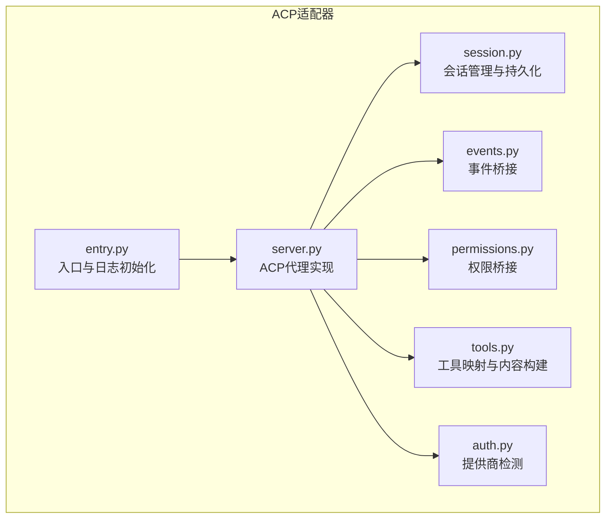
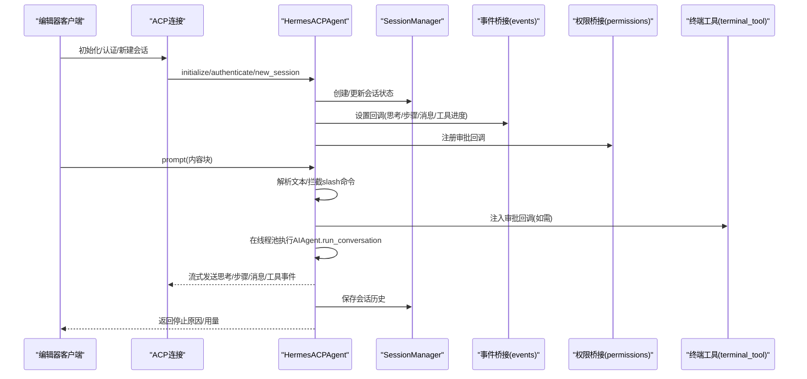
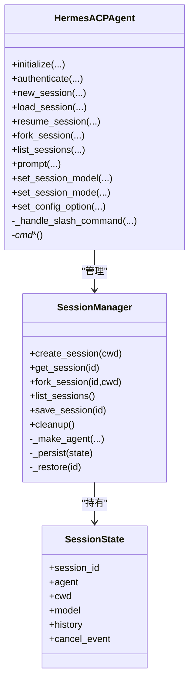
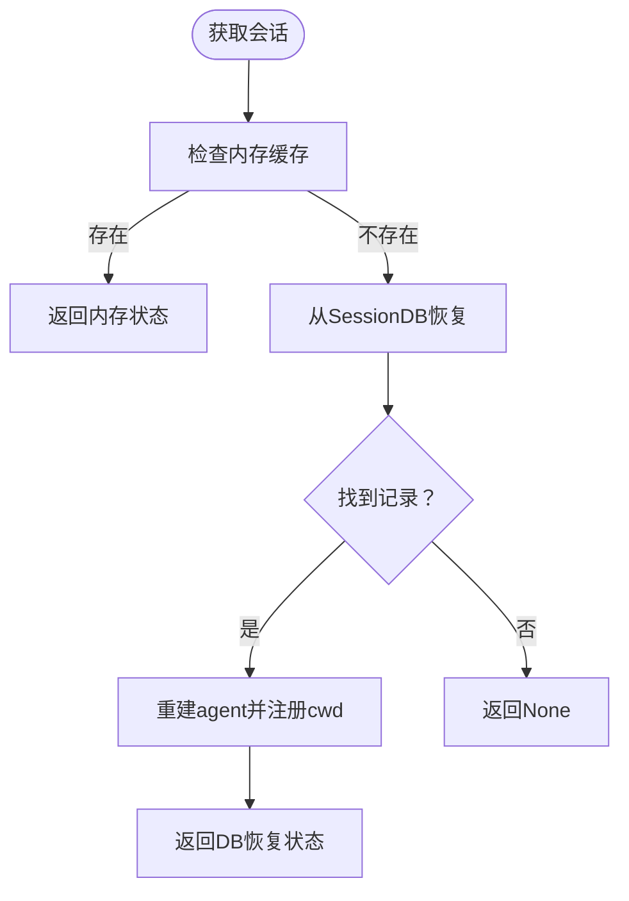
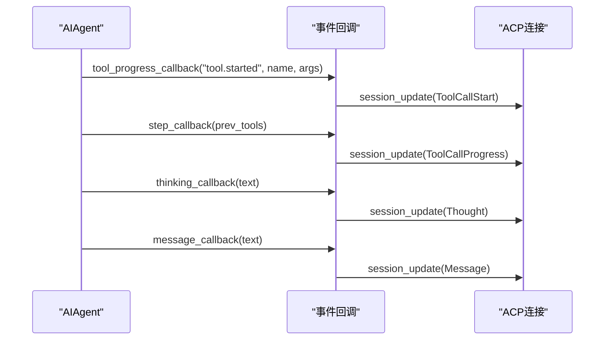
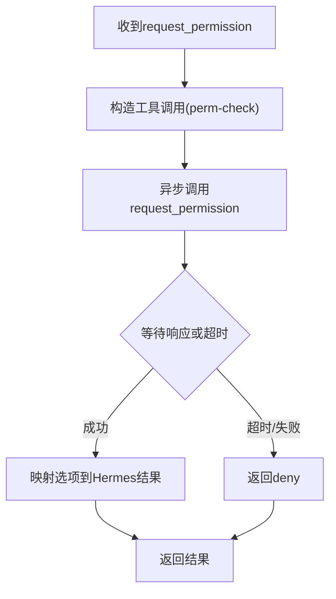
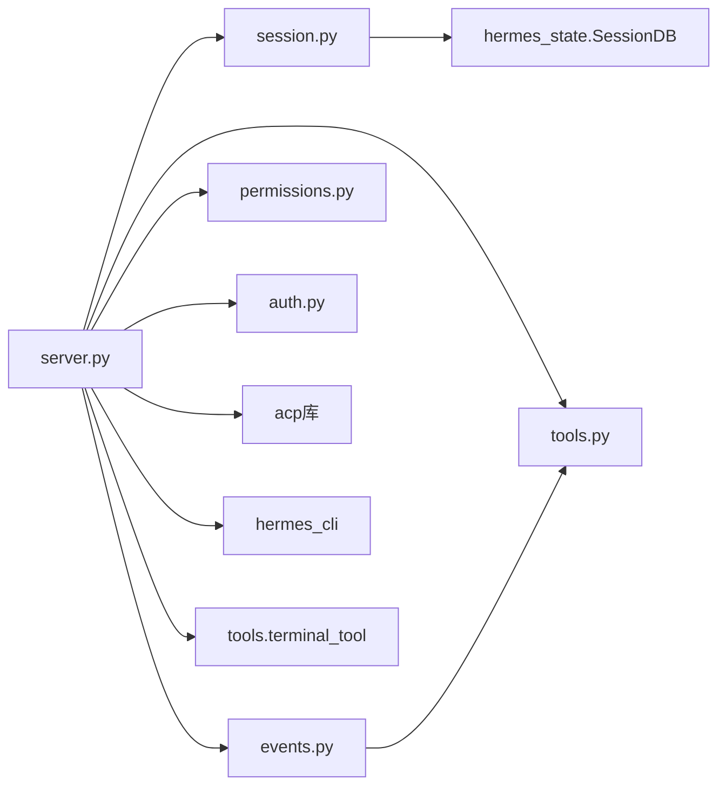

# ACP协议集成

<cite>
**本文档引用的文件**
- [acp_adapter/__init__.py](file://acp_adapter/__init__.py)
- [acp_adapter/entry.py](file://acp_adapter/entry.py)
- [acp_adapter/server.py](file://acp_adapter/server.py)
- [acp_adapter/session.py](file://acp_adapter/session.py)
- [acp_adapter/auth.py](file://acp_adapter/auth.py)
- [acp_adapter/events.py](file://acp_adapter/events.py)
- [acp_adapter/permissions.py](file://acp_adapter/permissions.py)
- [acp_adapter/tools.py](file://acp_adapter/tools.py)
- [acp_registry/agent.json](file://acp_registry/agent.json)
- [docs/acp-setup.md](file://docs/acp-setup.md)
- [tests/acp/test_server.py](file://tests/acp/test_server.py)
- [tests/acp/test_session.py](file://tests/acp/test_session.py)
- [tests/acp/test_permissions.py](file://tests/acp/test_permissions.py)
</cite>

## 目录
1. [简介](#简介)
2. [项目结构](#项目结构)
3. [核心组件](#核心组件)
4. [架构总览](#架构总览)
5. [详细组件分析](#详细组件分析)
6. [依赖关系分析](#依赖关系分析)
7. [性能考虑](#性能考虑)
8. [故障排除指南](#故障排除指南)
9. [结论](#结论)
10. [附录](#附录)

## 简介
本文件面向需要在编辑器中集成Hermes Agent并通过Agent Client Protocol（ACP）进行交互的开发者。文档系统性阐述了ACP协议的技术规范、Hermes在ACP下的实现架构、与编辑器的集成步骤、核心功能（会话管理、命令处理、事件流、工具表面更新）、服务器启动与调试方法，并给出内容块类型、权限控制与安全机制说明，以及可扩展与自定义实现的专业指导。

## 项目结构
ACP适配器位于acp_adapter目录，围绕Hermes AIAgent构建，提供标准ACP接口以供编辑器客户端调用。关键模块职责如下：
- entry：ACP适配器入口，负责加载环境变量、设置日志输出到stderr、启动ACP服务循环
- server：实现acp.Agent，暴露initialize/authenticate/new_session/load_session/resume_session/prompt等ACP方法
- session：会话管理与持久化，支持内存+数据库双层存储，确保断线重连后历史恢复
- events：将Hermes内部事件桥接为ACP事件（思考、步骤、消息、工具进度）
- permissions：将ACP权限请求映射为Hermes审批回调
- tools：工具调用的类型映射与内容构建
- auth：检测当前运行时提供商，用于认证能力声明
- acp_registry/agent.json：注册表描述，声明hermes命令行作为ACP服务器

图表来源
- [acp_adapter/entry.py:1-86](file://acp_adapter/entry.py#L1-L86)
- [acp_adapter/server.py:1-729](file://acp_adapter/server.py#L1-L729)
- [acp_adapter/session.py:1-476](file://acp_adapter/session.py#L1-L476)
- [acp_adapter/events.py:1-176](file://acp_adapter/events.py#L1-L176)
- [acp_adapter/permissions.py:1-78](file://acp_adapter/permissions.py#L1-L78)
- [acp_adapter/tools.py:1-215](file://acp_adapter/tools.py#L1-L215)
- [acp_adapter/auth.py:1-25](file://acp_adapter/auth.py#L1-L25)

章节来源
- [acp_adapter/__init__.py:1-2](file://acp_adapter/__init__.py#L1-L2)
- [acp_adapter/entry.py:1-86](file://acp_adapter/entry.py#L1-L86)
- [acp_adapter/server.py:1-729](file://acp_adapter/server.py#L1-L729)
- [acp_adapter/session.py:1-476](file://acp_adapter/session.py#L1-L476)
- [acp_adapter/events.py:1-176](file://acp_adapter/events.py#L1-L176)
- [acp_adapter/permissions.py:1-78](file://acp_adapter/permissions.py#L1-L78)
- [acp_adapter/tools.py:1-215](file://acp_adapter/tools.py#L1-L215)
- [acp_adapter/auth.py:1-25](file://acp_adapter/auth.py#L1-L25)
- [acp_registry/agent.json:1-13](file://acp_registry/agent.json#L1-L13)

## 核心组件
- ACP代理实现（HermesACPAgent）
  - 实现initialize/authenticate/new_session/load_session/resume_session/fork_session/list_sessions/prompt/set_session_model/set_session_mode/set_config_option等ACP协议方法
  - 内置slash命令集（help/model/tools/context/reset/compact/version），无需LLM参与即可本地处理
- 会话管理（SessionManager）
  - 线程安全的会话容器，内存+数据库双层持久化，支持fork、列表、清理、工作目录绑定
- 事件桥接（events）
  - 将Hermes内部“思考”、“步骤完成”、“消息文本”、“工具调用开始/进度”等事件转换为ACP会话更新
- 权限桥接（permissions）
  - 将ACP request_permission映射为Hermes审批回调，支持一次性允许/总是允许/拒绝
- 工具映射（tools）
  - hermes工具名到ACP ToolKind映射，构建工具调用标题与位置信息
- 认证辅助（auth）
  - 检测当前运行时提供商，决定是否声明支持认证方法
- 注册表（agent.json）
  - 声明hermes命令行作为ACP服务器，便于编辑器自动发现

章节来源
- [acp_adapter/server.py:93-729](file://acp_adapter/server.py#L93-L729)
- [acp_adapter/session.py:70-476](file://acp_adapter/session.py#L70-L476)
- [acp_adapter/events.py:1-176](file://acp_adapter/events.py#L1-L176)
- [acp_adapter/permissions.py:1-78](file://acp_adapter/permissions.py#L1-L78)
- [acp_adapter/tools.py:1-215](file://acp_adapter/tools.py#L1-L215)
- [acp_adapter/auth.py:1-25](file://acp_adapter/auth.py#L1-L25)
- [acp_registry/agent.json:1-13](file://acp_registry/agent.json#L1-L13)

## 架构总览
下图展示从编辑器客户端到Hermes ACP代理、再到Hermes AIAgent的完整调用链路，以及事件回流与会话持久化的路径。

图表来源
- [acp_adapter/server.py:217-467](file://acp_adapter/server.py#L217-L467)
- [acp_adapter/session.py:94-248](file://acp_adapter/session.py#L94-L248)
- [acp_adapter/events.py:47-175](file://acp_adapter/events.py#L47-L175)
- [acp_adapter/permissions.py:26-77](file://acp_adapter/permissions.py#L26-L77)

## 详细组件分析

### ACP代理实现（HermesACPAgent）
- 生命周期与能力
  - initialize返回协议版本、代理信息与能力声明（支持load_session、fork/list/resume会话）
  - authenticate根据当前运行时提供商声明可用认证方法
- 会话管理
  - new_session/load_session/resume_session/fork_session/list_sessions
  - 会话状态包含session_id、agent实例、cwd、model、history、cancel_event
- 核心对话
  - prompt解析内容块文本，拦截slash命令；否则交由AIAgent执行
  - 支持取消（cancel），通过事件标志中断AIAgent
  - 返回stop_reason与Usage统计
- 模型与模式
  - set_session_model：切换会话模型并重建agent
  - set_session_mode：持久化编辑器请求的模式
  - set_config_option：接受配置项更新（暂存于会话）
- slash命令
  - 内置帮助、模型查询/切换、工具列表、上下文统计、清空历史、压缩上下文、版本号

图表来源
- [acp_adapter/server.py:93-729](file://acp_adapter/server.py#L93-L729)
- [acp_adapter/session.py:70-476](file://acp_adapter/session.py#L70-L476)

章节来源
- [acp_adapter/server.py:93-729](file://acp_adapter/server.py#L93-L729)
- [acp_adapter/session.py:58-112](file://acp_adapter/session.py#L58-L112)

### 会话管理与持久化
- 内存态：使用字典与锁保护，快速访问
- 数据库存态：通过SessionDB持久化会话元数据与消息，支持跨进程/重启恢复
- 关键操作
  - create_session：生成唯一ID，注册任务cwd，写入DB
  - get_session：优先内存，缺失则从DB恢复
  - fork_session：深拷贝历史，生成新ID
  - list_sessions：合并内存与DB结果
  - save_session：替换消息并更新元数据
  - cleanup/remove/delete：清理与删除

图表来源
- [acp_adapter/session.py:114-125](file://acp_adapter/session.py#L114-L125)
- [acp_adapter/session.py:333-405](file://acp_adapter/session.py#L333-L405)

章节来源
- [acp_adapter/session.py:70-476](file://acp_adapter/session.py#L70-L476)

### 事件桥接（思考/步骤/消息/工具）
- 回调工厂
  - make_tool_progress_cb：工具started事件触发ToolCallStart，维护同名工具的调用ID队列
  - make_thinking_cb：发送思考文本更新
  - make_step_cb：工具完成后按队列匹配并发送ToolCallProgress
  - make_message_cb：发送增量消息文本
- 跨线程通信
  - 使用asyncio.run_coroutine_threadsafe将更新投递到ACP连接所在事件循环

图表来源
- [acp_adapter/events.py:47-175](file://acp_adapter/events.py#L47-L175)

章节来源
- [acp_adapter/events.py:1-176](file://acp_adapter/events.py#L1-L176)

### 权限桥接（审批）
- 将ACP request_permission映射为Hermes审批回调
- 支持选项：一次性允许、总是允许、拒绝
- 超时处理：默认超时后自动拒绝

图表来源
- [acp_adapter/permissions.py:26-77](file://acp_adapter/permissions.py#L26-L77)

章节来源
- [acp_adapter/permissions.py:1-78](file://acp_adapter/permissions.py#L1-L78)

### 工具映射与内容构建
- hermes工具名到ACP ToolKind映射（读取/编辑/搜索/执行/抓取/思考）
- 工具调用标题与位置提取
- 工具开始/完成事件的内容构建（含diff、文本、补丁等）

章节来源
- [acp_adapter/tools.py:1-215](file://acp_adapter/tools.py#L1-L215)

### 认证辅助
- detect_provider：检测当前运行时提供商与密钥，决定是否声明认证方法
- has_provider：判断是否存在有效提供商

章节来源
- [acp_adapter/auth.py:1-25](file://acp_adapter/auth.py#L1-L25)

### 注册表与入口
- agent.json：声明hermes命令行作为ACP服务器
- entry.py：加载环境、设置日志到stderr、启动ACP服务循环

章节来源
- [acp_registry/agent.json:1-13](file://acp_registry/agent.json#L1-L13)
- [acp_adapter/entry.py:1-86](file://acp_adapter/entry.py#L1-L86)

## 依赖关系分析
- 组件耦合
  - HermesACPAgent强依赖SessionManager（会话生命周期）、events/permissions（事件与权限）、tools（工具映射）
  - SessionManager依赖SessionDB进行持久化，间接依赖AIAgent工厂
- 外部依赖
  - acp库：提供协议版本、Schema、Client/Agent接口
  - hermes_cli：版本号、运行时提供商解析
  - tools.terminal_tool：审批回调注入
- 可能的循环依赖
  - 当前模块间为单向依赖（server→session→db，server→events→tools，server→permissions），未见循环

图表来源
- [acp_adapter/server.py:52-60](file://acp_adapter/server.py#L52-L60)
- [acp_adapter/session.py:265-267](file://acp_adapter/session.py#L265-L267)
- [acp_adapter/events.py:16-22](file://acp_adapter/events.py#L16-L22)
- [acp_adapter/permissions.py:49-57](file://acp_adapter/permissions.py#L49-L57)

章节来源
- [acp_adapter/server.py:1-60](file://acp_adapter/server.py#L1-L60)
- [acp_adapter/session.py:251-271](file://acp_adapter/session.py#L251-L271)
- [acp_adapter/events.py:10-22](file://acp_adapter/events.py#L10-L22)
- [acp_adapter/permissions.py:26-57](file://acp_adapter/permissions.py#L26-L57)

## 性能考虑
- 线程池并发
  - 使用ThreadPoolExecutor运行同步AIAgent，避免阻塞事件循环
- 事件流式传输
  - 通过回调将思考、步骤、消息、工具进度逐步推送，降低首包延迟
- 会话持久化
  - prompt完成后保存历史，减少重复计算；fork深拷贝历史，避免共享状态竞争
- 日志与I/O
  - stdout保留给ACP协议帧，日志输出到stderr，避免I/O干扰协议吞吐

章节来源
- [acp_adapter/server.py:69-70](file://acp_adapter/server.py#L69-L70)
- [acp_adapter/entry.py:23-41](file://acp_adapter/entry.py#L23-L41)
- [acp_adapter/server.py:440-450](file://acp_adapter/server.py#L440-L450)

## 故障排除指南
- 编辑器无法发现Agent
  - 检查acp_registry路径与agent.json存在性
  - 确认hermes命令在PATH中
  - 重启编辑器应用
- 启动即报错
  - 运行hermes doctor诊断配置
  - 使用hermes status检查API密钥状态
  - 直接运行hermes acp查看stderr日志
- “模块未找到”
  - 安装ACP额外依赖：pip install -e ".[acp]"
- 响应缓慢
  - 检查网络与提供商状态
  - 切换模型/提供商或调整速率限制
- 终端命令被拒绝
  - 检查ACP客户端设置中的自动/手动批准策略
- 启用详细日志
  - HERMES_LOG_LEVEL=DEBUG hermes acp

章节来源
- [docs/acp-setup.md:174-229](file://docs/acp-setup.md#L174-L229)

## 结论
Hermes通过ACP适配器实现了与编辑器的深度集成，具备完善的会话管理、事件流、权限控制与工具映射能力。借助注册表与标准入口，编辑器可无缝发现并连接Hermes Agent。对于开发者而言，可在现有框架上扩展工具集、定制权限策略与事件呈现，满足多样化编辑器工作流。

## 附录

### ACP协议核心功能清单
- 会话管理：新建/加载/恢复/分叉/列出
- 命令处理：内置slash命令与模型/工具/上下文/版本等查询
- 事件流：思考文本、步骤完成、消息文本、工具调用开始/进度
- 工具表面更新：动态注册MCP服务器并刷新工具集合
- 权限控制：基于request_permission的审批桥接
- 模型与模式：会话级模型切换与模式持久化

章节来源
- [acp_adapter/server.py:266-729](file://acp_adapter/server.py#L266-L729)
- [acp_adapter/events.py:47-175](file://acp_adapter/events.py#L47-L175)
- [acp_adapter/permissions.py:26-77](file://acp_adapter/permissions.py#L26-L77)
- [acp_adapter/tools.py:20-55](file://acp_adapter/tools.py#L20-L55)

### 内容块类型与工具映射
- 文本/图像/音频/资源/嵌入资源内容块解析为纯文本
- 工具映射覆盖文件操作、终端执行、Web抓取、浏览器操作、代理内部与思维类工具

章节来源
- [acp_adapter/server.py:73-91](file://acp_adapter/server.py#L73-L91)
- [acp_adapter/tools.py:20-55](file://acp_adapter/tools.py#L20-L55)

### 安全与权限机制
- 认证能力声明：仅当检测到有效提供商与密钥时才报告支持认证
- 审批桥接：request_permission映射为Hermes审批回调，支持一次性/总是允许与拒绝
- 超时保护：默认超时后自动拒绝，避免阻塞

章节来源
- [acp_adapter/server.py:259-262](file://acp_adapter/server.py#L259-L262)
- [acp_adapter/auth.py:8-24](file://acp_adapter/auth.py#L8-L24)
- [acp_adapter/permissions.py:26-77](file://acp_adapter/permissions.py#L26-L77)

### 编辑器集成步骤（VS Code/Zed/JetBrains）
- VS Code
  - 安装ACP Client扩展
  - 配置settings.json中的acpClient.agents指向acp_registry目录
  - 重启VS Code后在聊天面板选择Hermes Agent
- Zed
  - 在settings.json中添加agent_servers配置，指定hermes命令与参数
- JetBrains系列
  - 安装ACP插件，在设置中添加Agent并指向acp_registry目录

章节来源
- [docs/acp-setup.md:24-114](file://docs/acp-setup.md#L24-L114)

### ACP服务器启动与调试
- 启动方式
  - python -m acp_adapter.entry 或 hermes acp 或 hermes-acp
- 日志
  - 所有日志输出至stderr，stdout保留ACP协议帧
- 调试技巧
  - 设置HERMES_LOG_LEVEL=DEBUG
  - 直接运行hermes acp观察错误堆栈
  - 使用hermes doctor与hermes status定位配置问题

章节来源
- [acp_adapter/entry.py:58-86](file://acp_adapter/entry.py#L58-L86)
- [docs/acp-setup.md:209-220](file://docs/acp-setup.md#L209-L220)

### 单元测试要点（参考）
- server：initialize能力声明、authenticate行为、会话操作与命令更新调度
- session：创建/获取/分叉/列表/清理/持久化
- permissions：审批映射与超时处理

章节来源
- [tests/acp/test_server.py:1-200](file://tests/acp/test_server.py#L1-L200)
- [tests/acp/test_session.py:1-200](file://tests/acp/test_session.py#L1-L200)
- [tests/acp/test_permissions.py:1-75](file://tests/acp/test_permissions.py#L1-L75)