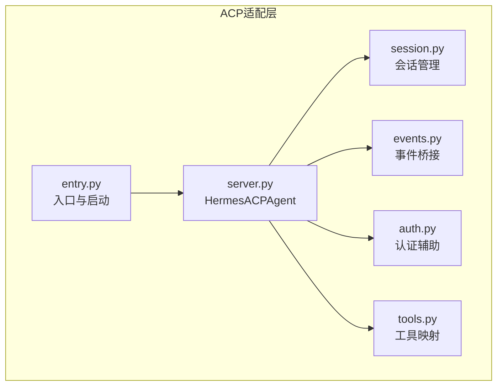
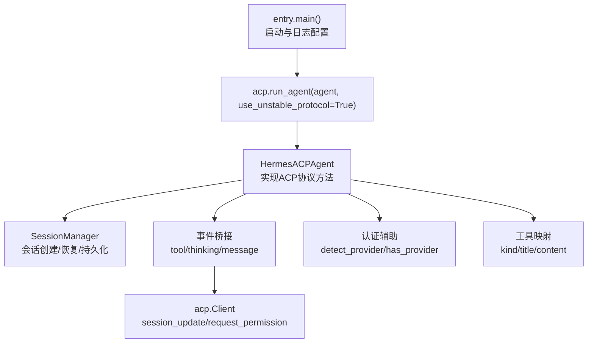
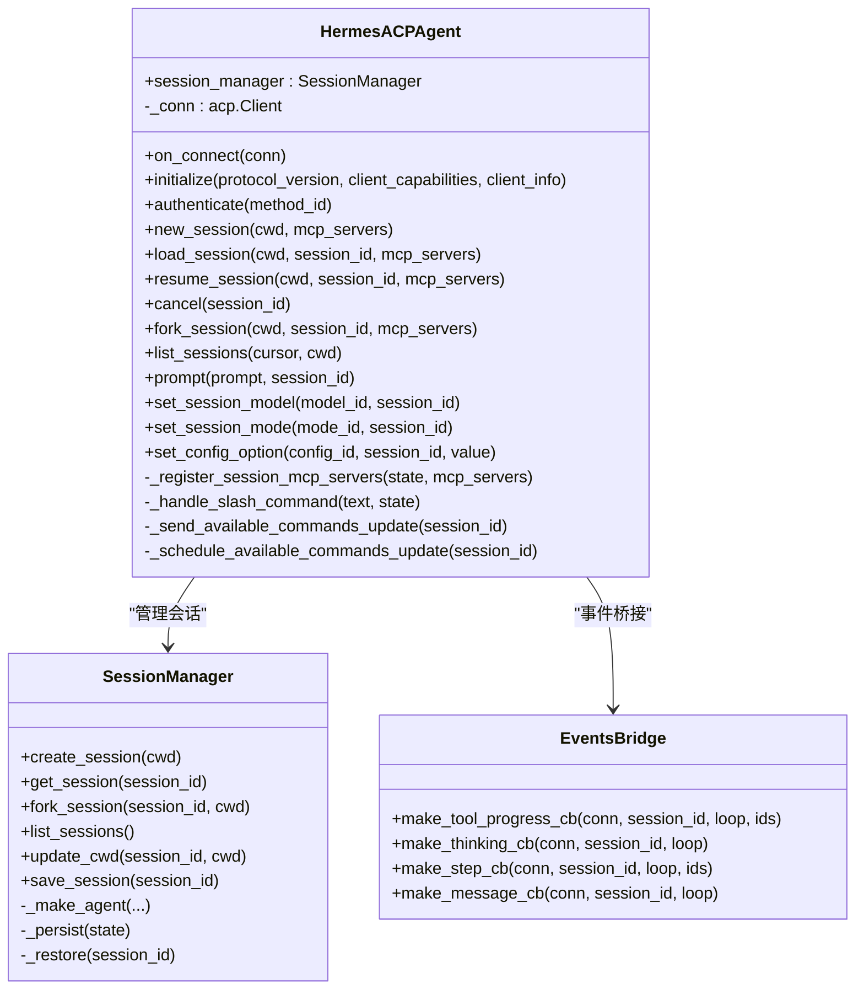
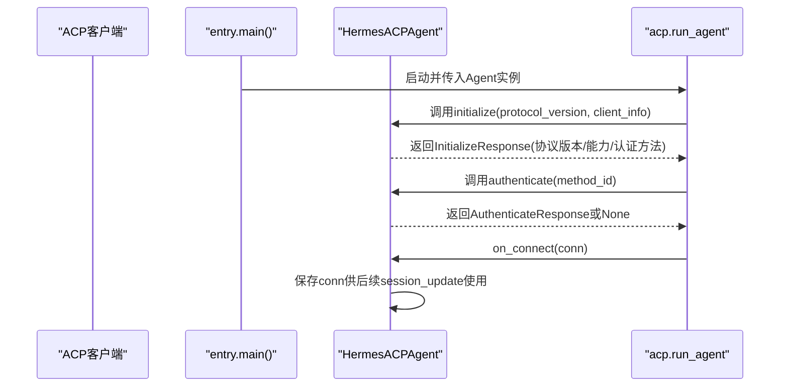
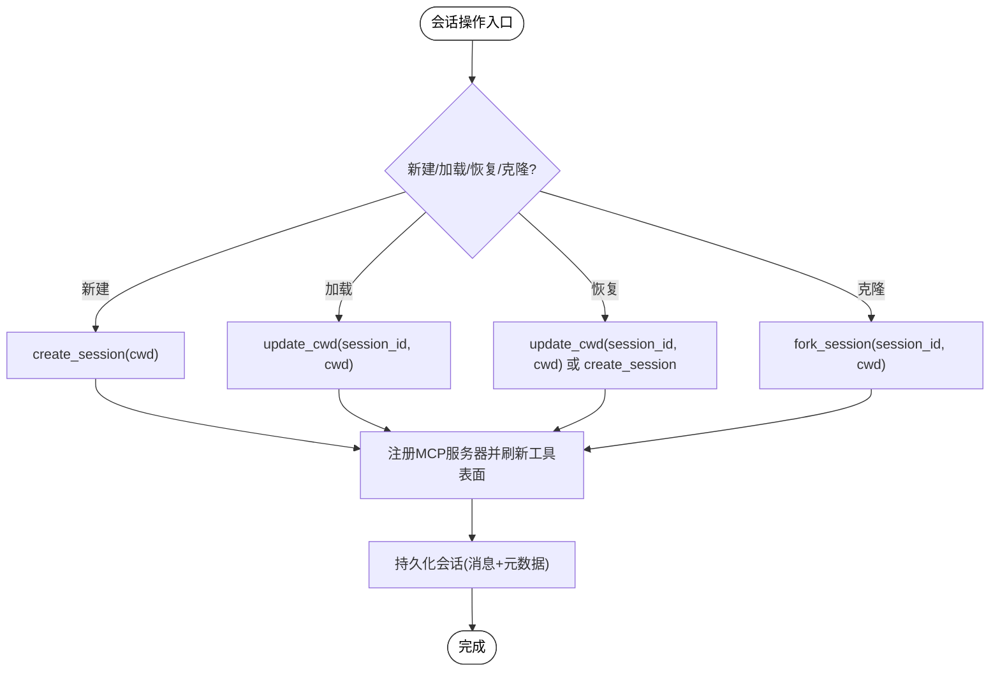
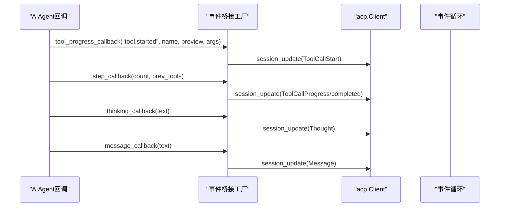
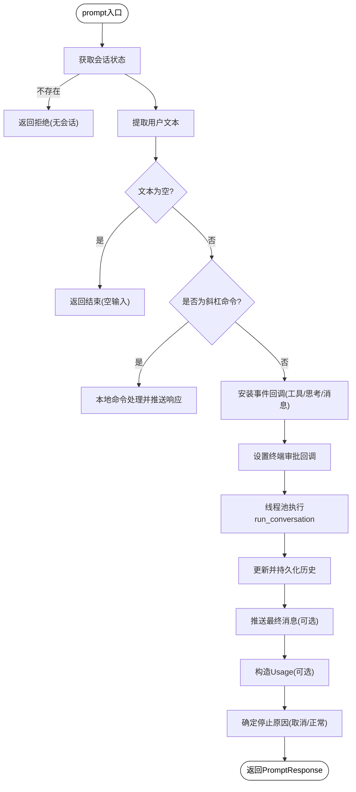
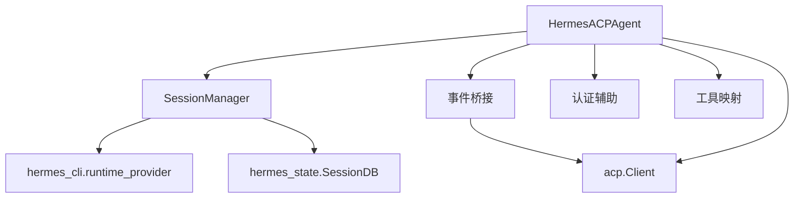

# ACP服务器实现

<cite>
**本文档引用的文件**
- [acp_adapter/server.py](file://acp_adapter/server.py)
- [acp_adapter/entry.py](file://acp_adapter/entry.py)
- [acp_adapter/session.py](file://acp_adapter/session.py)
- [acp_adapter/events.py](file://acp_adapter/events.py)
- [acp_adapter/auth.py](file://acp_adapter/auth.py)
- [acp_adapter/tools.py](file://acp_adapter/tools.py)
- [tests/acp/test_server.py](file://tests/acp/test_server.py)
- [tests/acp/test_entry.py](file://tests/acp/test_entry.py)
- [website/docs/developer-guide/acp-internals.md](file://website/docs/developer-guide/acp-internals.md)
</cite>

## 目录
1. [简介](#简介)
2. [项目结构](#项目结构)
3. [核心组件](#核心组件)
4. [架构总览](#架构总览)
5. [详细组件分析](#详细组件分析)
6. [依赖关系分析](#依赖关系分析)
7. [性能考虑](#性能考虑)
8. [故障排除指南](#故障排除指南)
9. [结论](#结论)
10. [附录](#附录)

## 简介
本文件为ACP（Agent Communication Protocol）服务器实现的详细技术文档，重点围绕HermesACPAgent类展开，系统阐述其连接生命周期管理、会话状态管理、事件处理机制与关键方法实现逻辑。文档同时覆盖与acp库的集成方式、服务器初始化流程、协议版本协商与客户端能力检测、线程池执行器的使用、异步任务调度与错误处理策略，并提供启动配置、连接参数设置与性能优化建议，辅以实际代码示例路径与调试技巧，帮助开发者理解并扩展ACP服务器功能。

## 项目结构
ACP服务器相关代码主要位于acp_adapter目录，配合会话管理、事件桥接、认证与工具映射模块协同工作；入口脚本负责环境加载、日志配置与启动运行。

**图表来源**
- [acp_adapter/entry.py:58-86](file://acp_adapter/entry.py#L58-L86)
- [acp_adapter/server.py:93-142](file://acp_adapter/server.py#L93-L142)
- [acp_adapter/session.py:70-91](file://acp_adapter/session.py#L70-L91)
- [acp_adapter/events.py:1-25](file://acp_adapter/events.py#L1-L25)
- [acp_adapter/auth.py:1-25](file://acp_adapter/auth.py#L1-L25)
- [acp_adapter/tools.py:1-20](file://acp_adapter/tools.py#L1-L20)

**章节来源**
- [acp_adapter/entry.py:1-86](file://acp_adapter/entry.py#L1-L86)
- [acp_adapter/server.py:1-142](file://acp_adapter/server.py#L1-L142)
- [acp_adapter/session.py:1-91](file://acp_adapter/session.py#L1-L91)
- [acp_adapter/events.py:1-25](file://acp_adapter/events.py#L1-L25)
- [acp_adapter/auth.py:1-25](file://acp_adapter/auth.py#L1-L25)
- [acp_adapter/tools.py:1-20](file://acp_adapter/tools.py#L1-L20)

## 核心组件
- HermesACPAgent：实现acp.Agent接口，负责ACP协议生命周期、会话管理、提示处理、命令分发与事件桥接。
- SessionManager：线程安全的会话管理器，负责会话创建、恢复、持久化与清理。
- 事件桥接模块：将AIAgent回调转换为ACP会话更新，支持工具调用进度、思考内容与消息流式传输。
- 认证辅助：检测当前Hermes运行时提供商，决定是否提供认证方法。
- 工具映射：将Hermes工具名称映射到ACP工具类型，并构建工具调用标题与内容。

**章节来源**
- [acp_adapter/server.py:93-142](file://acp_adapter/server.py#L93-L142)
- [acp_adapter/session.py:70-91](file://acp_adapter/session.py#L70-L91)
- [acp_adapter/events.py:1-25](file://acp_adapter/events.py#L1-L25)
- [acp_adapter/auth.py:1-25](file://acp_adapter/auth.py#L1-L25)
- [acp_adapter/tools.py:1-20](file://acp_adapter/tools.py#L1-L20)

## 架构总览
下图展示从入口启动到ACP代理运行、会话管理与事件桥接的整体架构。

**图表来源**
- [acp_adapter/entry.py:58-86](file://acp_adapter/entry.py#L58-L86)
- [acp_adapter/server.py:145-148](file://acp_adapter/server.py#L145-L148)
- [acp_adapter/session.py:94-112](file://acp_adapter/session.py#L94-L112)
- [acp_adapter/events.py:27-41](file://acp_adapter/events.py#L27-L41)
- [acp_adapter/auth.py:8-24](file://acp_adapter/auth.py#L8-L24)
- [acp_adapter/tools.py:53-60](file://acp_adapter/tools.py#L53-L60)

## 详细组件分析

### HermesACPAgent类
HermesACPAgent继承自acp.Agent，实现ACP协议所需的关键方法，并通过SessionManager管理会话状态，通过事件桥接模块向客户端推送实时更新。

**图表来源**
- [acp_adapter/server.py:93-142](file://acp_adapter/server.py#L93-L142)
- [acp_adapter/session.py:70-91](file://acp_adapter/session.py#L70-L91)
- [acp_adapter/events.py:47-175](file://acp_adapter/events.py#L47-L175)

**章节来源**
- [acp_adapter/server.py:93-142](file://acp_adapter/server.py#L93-L142)
- [acp_adapter/session.py:70-91](file://acp_adapter/session.py#L70-L91)
- [acp_adapter/events.py:47-175](file://acp_adapter/events.py#L47-L175)

### 连接生命周期管理
- on_connect：保存客户端连接句柄，用于后续会话更新与权限请求。
- 初始化阶段：initialize方法解析协议版本、检测运行时提供商并返回代理信息与能力声明。
- 认证阶段：authenticate根据是否存在可用提供商返回认证响应或None。

**图表来源**
- [acp_adapter/entry.py:74-81](file://acp_adapter/entry.py#L74-L81)
- [acp_adapter/server.py:217-257](file://acp_adapter/server.py#L217-L257)
- [acp_adapter/server.py:259-262](file://acp_adapter/server.py#L259-L262)
- [acp_adapter/server.py:145-148](file://acp_adapter/server.py#L145-L148)

**章节来源**
- [acp_adapter/server.py:145-148](file://acp_adapter/server.py#L145-L148)
- [acp_adapter/server.py:217-257](file://acp_adapter/server.py#L217-L257)
- [acp_adapter/server.py:259-262](file://acp_adapter/server.py#L259-L262)
- [tests/acp/test_entry.py:8-20](file://tests/acp/test_entry.py#L8-L20)

### 会话状态管理
- 创建/加载/恢复/克隆：new_session/load_session/resume_session/fork_session负责会话生命周期操作，并在必要时注册MCP服务器与刷新工具表面。
- 持久化：SessionManager将会话元数据与消息历史持久化至共享数据库，确保重启后可恢复。
- 工作目录绑定：通过工具环境覆盖将任务ID与编辑器工作目录绑定，保证工具执行上下文一致。

**图表来源**
- [acp_adapter/server.py:266-335](file://acp_adapter/server.py#L266-L335)
- [acp_adapter/server.py:150-213](file://acp_adapter/server.py#L150-L213)
- [acp_adapter/session.py:94-112](file://acp_adapter/session.py#L94-L112)
- [acp_adapter/session.py:208-216](file://acp_adapter/session.py#L208-L216)
- [acp_adapter/session.py:136-163](file://acp_adapter/session.py#L136-L163)
- [acp_adapter/session.py:238-247](file://acp_adapter/session.py#L238-L247)

**章节来源**
- [acp_adapter/server.py:266-335](file://acp_adapter/server.py#L266-L335)
- [acp_adapter/server.py:150-213](file://acp_adapter/server.py#L150-L213)
- [acp_adapter/session.py:94-112](file://acp_adapter/session.py#L94-L112)
- [acp_adapter/session.py:208-216](file://acp_adapter/session.py#L208-L216)
- [acp_adapter/session.py:136-163](file://acp_adapter/session.py#L136-L163)
- [acp_adapter/session.py:238-247](file://acp_adapter/session.py#L238-L247)

### 事件处理机制
- 工具进度：监听工具开始事件，生成唯一工具调用ID并发送ToolCallStart更新。
- 思考内容：将模型内部思考文本转换为ACP思考更新。
- 步骤回调：当工具完成时，匹配对应工具调用ID并发送ToolCallProgress完成更新。
- 消息流：将模型输出文本作为增量消息推送。

**图表来源**
- [acp_adapter/events.py:47-90](file://acp_adapter/events.py#L47-L90)
- [acp_adapter/events.py:117-155](file://acp_adapter/events.py#L117-L155)
- [acp_adapter/events.py:162-175](file://acp_adapter/events.py#L162-L175)
- [acp_adapter/events.py:97-110](file://acp_adapter/events.py#L97-L110)

**章节来源**
- [acp_adapter/events.py:47-90](file://acp_adapter/events.py#L47-L90)
- [acp_adapter/events.py:117-155](file://acp_adapter/events.py#L117-L155)
- [acp_adapter/events.py:162-175](file://acp_adapter/events.py#L162-L175)
- [acp_adapter/events.py:97-110](file://acp_adapter/events.py#L97-L110)

### 关键方法实现逻辑

#### initialize
- 协议版本协商：若未指定则使用acp.PROTOCOL_VERSION。
- 客户端能力：当前实现返回固定能力集（支持会话加载、fork/list/resume）。
- 认证方法：若检测到运行时提供商，则提供基于该提供商的认证方法。

**章节来源**
- [acp_adapter/server.py:217-257](file://acp_adapter/server.py#L217-L257)
- [tests/acp/test_server.py:51-86](file://tests/acp/test_server.py#L51-L86)

#### authenticate
- 若存在可用提供商，返回认证响应；否则返回None。

**章节来源**
- [acp_adapter/server.py:259-262](file://acp_adapter/server.py#L259-L262)
- [tests/acp/test_server.py:94-111](file://tests/acp/test_server.py#L94-L111)

#### prompt
- 文本提取：从多类型内容块中抽取纯文本。
- 命令拦截：以“/”开头的命令由本地处理，不进入LLM。
- 异步执行：通过线程池执行AIAgent.run_conversation，避免阻塞事件循环。
- 事件桥接：安装工具进度、思考、步骤与消息回调，将结果推送到客户端。
- 历史持久化：更新后的消息历史写回数据库。
- 使用统计：根据返回字段构造Usage对象。
- 取消信号：检查取消事件以确定停止原因。

**图表来源**
- [acp_adapter/server.py:352-467](file://acp_adapter/server.py#L352-L467)
- [acp_adapter/server.py:421-439](file://acp_adapter/server.py#L421-L439)
- [acp_adapter/events.py:27-41](file://acp_adapter/events.py#L27-L41)

**章节来源**
- [acp_adapter/server.py:352-467](file://acp_adapter/server.py#L352-L467)
- [acp_adapter/server.py:421-439](file://acp_adapter/server.py#L421-L439)
- [acp_adapter/events.py:27-41](file://acp_adapter/events.py#L27-L41)

#### 与acp库的集成方式
- 入口启动：entry.main通过acp.run_agent启动Agent，启用不稳定协议标志位。
- 生命周期钩子：on_connect保存连接句柄；initialize/authenticate返回标准响应对象。
- 事件推送：通过conn.session_update推送ToolCallStart/Progress/Message/Thought与可用命令更新。

**章节来源**
- [acp_adapter/entry.py:74-81](file://acp_adapter/entry.py#L74-L81)
- [acp_adapter/server.py:145-148](file://acp_adapter/server.py#L145-L148)
- [acp_adapter/server.py:217-257](file://acp_adapter/server.py#L217-L257)
- [acp_adapter/server.py:259-262](file://acp_adapter/server.py#L259-L262)
- [acp_adapter/server.py:487-514](file://acp_adapter/server.py#L487-L514)

### 线程池执行器、异步任务调度与错误处理
- 线程池：全局ThreadPoolExecutor用于在工作线程中执行AIAgent.run_conversation，避免阻塞主事件循环。
- 异步调度：事件桥接通过run_coroutine_threadsafe将会话更新投递到事件循环。
- 错误处理：线程池执行异常与事件发送异常均被捕获并记录日志，保证服务稳定性。

**章节来源**
- [acp_adapter/server.py:69-70](file://acp_adapter/server.py#L69-L70)
- [acp_adapter/server.py:440-444](file://acp_adapter/server.py#L440-L444)
- [acp_adapter/events.py:34-40](file://acp_adapter/events.py#L34-L40)

### 服务器启动配置、连接参数与性能优化建议
- 启动配置
  - 日志：入口将日志输出重定向至stderr，保留stdout用于ACP JSON-RPC传输。
  - 环境变量：从HERMES_HOME加载.env文件，便于凭据与运行时配置注入。
  - 协议：启用不稳定协议标志位以支持最新特性。
- 连接参数
  - 协议版本：initialize中协商，优先使用客户端提供的版本，否则采用库默认值。
  - 认证方法：基于运行时提供商动态提供。
- 性能优化
  - 线程池大小：当前固定为4，可根据CPU核数与I/O密集度调整。
  - 事件推送：批量/合并更新可减少网络往返，但需权衡实时性。
  - 工具结果截断：对超长结果进行UI安全截断，避免传输与渲染开销。
  - MCP服务器：按需启用/禁用，避免不必要的进程启动与资源占用。

**章节来源**
- [acp_adapter/entry.py:23-55](file://acp_adapter/entry.py#L23-L55)
- [acp_adapter/server.py:224-226](file://acp_adapter/server.py#L224-L226)
- [acp_adapter/server.py:69-70](file://acp_adapter/server.py#L69-L70)
- [acp_adapter/tools.py:185-189](file://acp_adapter/tools.py#L185-L189)

## 依赖关系分析
- 组件耦合
  - HermesACPAgent依赖SessionManager进行会话生命周期管理，依赖事件桥接模块推送更新，依赖认证辅助与工具映射模块增强功能。
  - SessionManager依赖Hermes运行时配置与SessionDB进行持久化。
- 外部依赖
  - acp库：提供协议定义、客户端连接与JSON-RPC传输。
  - hermes_cli：提供运行时提供商解析与配置加载。
  - model_tools：提供工具定义与工具表面刷新。

**图表来源**
- [acp_adapter/server.py:93-142](file://acp_adapter/server.py#L93-L142)
- [acp_adapter/session.py:433-475](file://acp_adapter/session.py#L433-L475)
- [acp_adapter/events.py:16-22](file://acp_adapter/events.py#L16-L22)

**章节来源**
- [acp_adapter/server.py:93-142](file://acp_adapter/server.py#L93-L142)
- [acp_adapter/session.py:433-475](file://acp_adapter/session.py#L433-L475)
- [acp_adapter/events.py:16-22](file://acp_adapter/events.py#L16-L22)

## 性能考虑
- 线程池并发：合理设置max_workers，避免过多线程导致上下文切换开销；对于I/O密集型工具调用可适当增大。
- 事件批量化：在允许的延迟范围内合并多次更新，降低网络压力。
- 结果截断与压缩：对大结果进行截断与上下文压缩，减少传输与渲染成本。
- MCP服务器管理：仅启用必要的MCP服务器，避免额外进程与资源消耗。

## 故障排除指南
- 启动失败
  - 检查日志输出是否正确重定向至stderr，确认stdout仅用于协议传输。
  - 验证HERMES_HOME下的.env文件是否正确加载。
- 协议版本不兼容
  - 确认initialize返回的协议版本与客户端期望一致。
- 认证问题
  - 确认运行时提供商已正确解析且具备有效凭据。
- 事件未推送
  - 检查事件桥接回调是否正确安装，run_coroutine_threadsafe调用是否成功。
- 线程池异常
  - 查看线程池执行异常日志，定位AIAgent.run_conversation中的错误。

**章节来源**
- [acp_adapter/entry.py:23-55](file://acp_adapter/entry.py#L23-L55)
- [acp_adapter/server.py:217-257](file://acp_adapter/server.py#L217-L257)
- [acp_adapter/server.py:259-262](file://acp_adapter/server.py#L259-L262)
- [acp_adapter/events.py:34-40](file://acp_adapter/events.py#L34-L40)
- [acp_adapter/server.py:440-444](file://acp_adapter/server.py#L440-L444)

## 结论
HermesACPAgent通过清晰的生命周期管理、可靠的会话状态持久化与完善的事件桥接机制，实现了与ACP客户端的稳定交互。结合线程池执行器与异步任务调度，系统在保持高并发处理能力的同时，提供了良好的可扩展性与可观测性。遵循本文档的配置与优化建议，可进一步提升服务器的稳定性与性能表现。

## 附录
- 开发者内部文档要点参考：[网站文档:112-154](file://website/docs/developer-guide/acp-internals.md#L112-L154)
- 测试用例参考：[服务器测试:51-110](file://tests/acp/test_server.py#L51-L110)、[入口测试:8-20](file://tests/acp/test_entry.py#L8-L20)