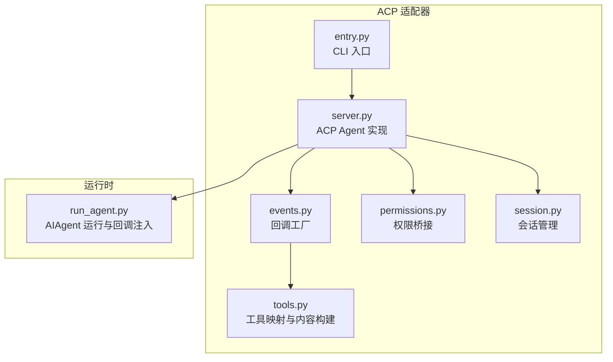
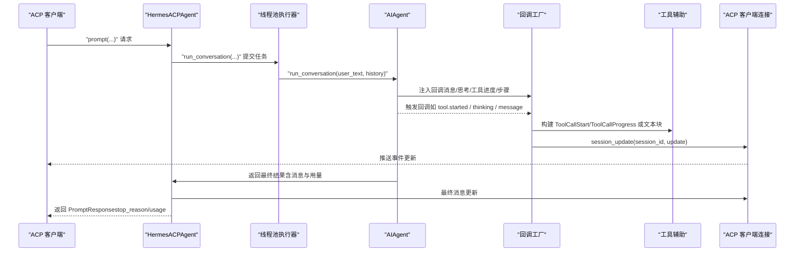
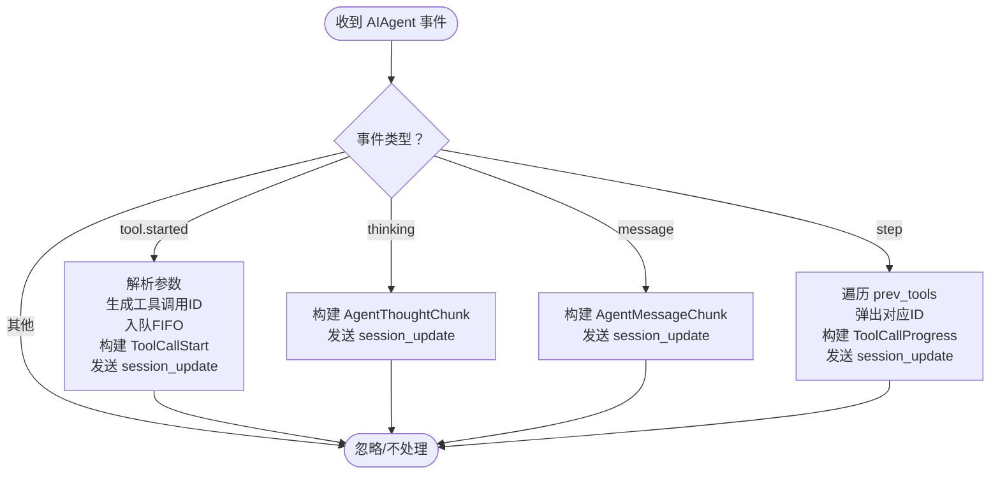
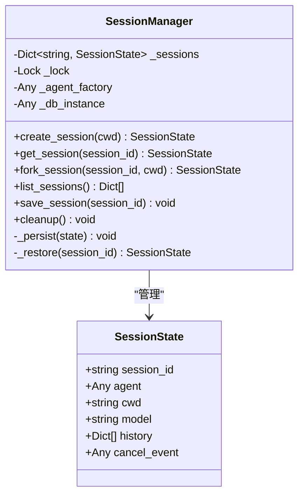
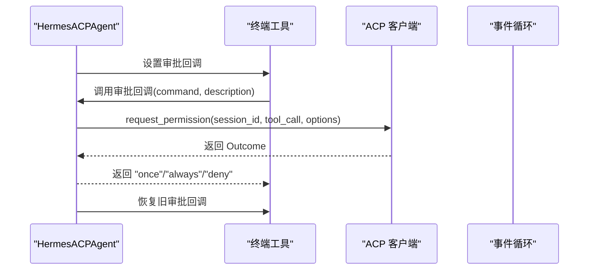
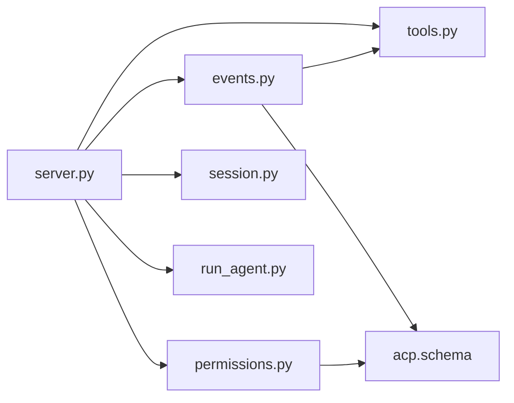

# 事件处理与回调

<cite>
**本文引用的文件**
- [acp_adapter/events.py](file://acp_adapter/events.py)
- [acp_adapter/server.py](file://acp_adapter/server.py)
- [acp_adapter/session.py](file://acp_adapter/session.py)
- [acp_adapter/tools.py](file://acp_adapter/tools.py)
- [acp_adapter/permissions.py](file://acp_adapter/permissions.py)
- [acp_adapter/entry.py](file://acp_adapter/entry.py)
- [tests/acp/test_events.py](file://tests/acp/test_events.py)
- [tests/gateway/test_step_callback_compat.py](file://tests/gateway/test_step_callback_compat.py)
- [run_agent.py](file://run_agent.py)
</cite>

## 目录
1. [简介](#简介)
2. [项目结构](#项目结构)
3. [核心组件](#核心组件)
4. [架构总览](#架构总览)
5. [详细组件分析](#详细组件分析)
6. [依赖分析](#依赖分析)
7. [性能考量](#性能考量)
8. [故障排查指南](#故障排查指南)
9. [结论](#结论)
10. [附录](#附录)

## 简介
本文件聚焦于 ACP（Agent Communication Protocol）适配器中的事件处理与回调系统，系统性阐述以下内容：
- 回调工厂：make_message_cb、make_step_cb、make_thinking_cb、make_tool_progress_cb 的设计与实现
- 事件流处理机制：从 AIAgent 到 ACP 客户端的推送路径、线程与事件循环交互
- 消息传递协议与状态更新：会话更新、工具调用生命周期、思考文本流式推送
- 事件类型与数据结构：ToolCallStart/ToolCallProgress、AgentThoughtChunk、AgentMessageChunk 等
- 异步事件处理、错误恢复与重试策略
- 事件监听器注册、回调定制与性能优化建议
- 调试工具、日志分析与监控实践

## 项目结构
ACP 适配器位于 acp_adapter 子目录，围绕事件回调工厂、会话管理、权限桥接与服务端入口展开，配合 run_agent 的回调注入完成端到端事件流。

图表来源
- [acp_adapter/entry.py:58-86](file://acp_adapter/entry.py#L58-L86)
- [acp_adapter/server.py:93-142](file://acp_adapter/server.py#L93-L142)
- [acp_adapter/events.py:47-175](file://acp_adapter/events.py#L47-L175)
- [acp_adapter/tools.py:58-215](file://acp_adapter/tools.py#L58-L215)
- [acp_adapter/permissions.py:26-77](file://acp_adapter/permissions.py#L26-L77)
- [acp_adapter/session.py:70-112](file://acp_adapter/session.py#L70-L112)
- [run_agent.py:7887-7911](file://run_agent.py#L7887-L7911)

章节来源
- [acp_adapter/entry.py:58-86](file://acp_adapter/entry.py#L58-L86)
- [acp_adapter/server.py:93-142](file://acp_adapter/server.py#L93-L142)
- [acp_adapter/events.py:47-175](file://acp_adapter/events.py#L47-L175)
- [acp_adapter/tools.py:58-215](file://acp_adapter/tools.py#L58-L215)
- [acp_adapter/permissions.py:26-77](file://acp_adapter/permissions.py#L26-L77)
- [acp_adapter/session.py:70-112](file://acp_adapter/session.py#L70-L112)
- [run_agent.py:7887-7911](file://run_agent.py#L7887-L7911)

## 核心组件
- 回调工厂模块（events.py）
  - make_tool_progress_cb：将工具进度事件转换为 ToolCallStart 并跟踪工具调用 ID 队列
  - make_step_cb：在每一步结束时完成已开始的工具调用，生成 ToolCallProgress
  - make_thinking_cb：将思考文本流式推送为 AgentThoughtChunk
  - make_message_cb：将最终消息文本流式推送为 AgentMessageChunk
- 工具辅助（tools.py）
  - 工具名到 ACP ToolKind 映射
  - 工具调用 ID 生成、标题与位置提取
  - 构建 ToolCallStart/ToolCallProgress 的内容对象
- 权限桥接（permissions.py）
  - 将 ACP 请求权限调用桥接到 Hermes 审批回调，支持超时与结果映射
- 会话管理（session.py）
  - 维护 SessionState，持久化与恢复会话历史，绑定工作目录与工具环境
- 服务端（server.py）
  - 实现 acp.Agent，注入回调至 AIAgent.run_conversation，调度可用命令更新
- CLI 入口（entry.py）
  - 加载环境变量、配置日志输出到 stderr，启动 ACP Agent

章节来源
- [acp_adapter/events.py:47-175](file://acp_adapter/events.py#L47-L175)
- [acp_adapter/tools.py:58-215](file://acp_adapter/tools.py#L58-L215)
- [acp_adapter/permissions.py:26-77](file://acp_adapter/permissions.py#L26-L77)
- [acp_adapter/session.py:58-112](file://acp_adapter/session.py#L58-L112)
- [acp_adapter/server.py:352-467](file://acp_adapter/server.py#L352-L467)
- [acp_adapter/entry.py:58-86](file://acp_adapter/entry.py#L58-L86)

## 架构总览
下图展示从用户输入到事件回调、再到 ACP 客户端更新的完整链路。

图表来源
- [acp_adapter/server.py:352-467](file://acp_adapter/server.py#L352-L467)
- [acp_adapter/events.py:47-175](file://acp_adapter/events.py#L47-L175)
- [acp_adapter/tools.py:104-197](file://acp_adapter/tools.py#L104-L197)
- [run_agent.py:7887-7911](file://run_agent.py#L7887-L7911)

## 详细组件分析

### 回调工厂与事件流
- 工具进度回调（make_tool_progress_cb）
  - 仅在事件类型为“工具开始”时发出 ToolCallStart
  - 解析参数（字符串 JSON 自动解码、非字典包裹）、生成唯一工具调用 ID
  - 使用 FIFO 队列按工具名维护 ID，确保同名并发调用正确匹配
  - 通过 _send_update 在主线程事件循环中安全提交 session_update
- 思考回调（make_thinking_cb）
  - 将思考文本封装为 AgentThoughtChunk 并推送
  - 空文本被忽略，避免冗余更新
- 步骤回调（make_step_cb）
  - 处理上一步工具调用结果，完成对应工具调用并生成 ToolCallProgress
  - 支持 prev_tools 为字符串或字典两种格式，向后兼容
  - 从队列弹出对应工具调用 ID，完成后清理
- 消息回调（make_message_cb）
  - 将最终响应文本封装为 AgentMessageChunk 推送
  - 空文本被忽略

图表来源
- [acp_adapter/events.py:47-175](file://acp_adapter/events.py#L47-L175)
- [acp_adapter/tools.py:104-197](file://acp_adapter/tools.py#L104-L197)

章节来源
- [acp_adapter/events.py:47-175](file://acp_adapter/events.py#L47-L175)
- [acp_adapter/tools.py:104-197](file://acp_adapter/tools.py#L104-L197)
- [tests/acp/test_events.py:41-281](file://tests/acp/test_events.py#L41-L281)
- [tests/gateway/test_step_callback_compat.py:38-111](file://tests/gateway/test_step_callback_compat.py#L38-L111)

### 会话管理与持久化
- SessionState 记录每个会话的 AIAgent 实例、工作目录、模型、历史与取消事件
- SessionManager 提供创建、fork、加载、恢复、列表与持久化能力
- 历史消息写入 SessionDB，支持跨进程重启后恢复会话
- 任务级工作目录通过工具环境覆盖绑定，确保工具执行上下文一致

图表来源
- [acp_adapter/session.py:58-112](file://acp_adapter/session.py#L58-L112)
- [acp_adapter/session.py:114-206](file://acp_adapter/session.py#L114-L206)
- [acp_adapter/session.py:238-332](file://acp_adapter/session.py#L238-L332)

章节来源
- [acp_adapter/session.py:58-112](file://acp_adapter/session.py#L58-L112)
- [acp_adapter/session.py:114-206](file://acp_adapter/session.py#L114-L206)
- [acp_adapter/session.py:238-332](file://acp_adapter/session.py#L238-L332)

### 权限桥接与审批回调
- make_approval_callback 将 ACP request_permission 调用桥接为 Hermes 审批回调
- 支持 allow_once/allow_always/reject_once/reject_always 四种选项映射
- 默认超时时间可配置；超时或异常自动拒绝，避免阻塞

图表来源
- [acp_adapter/server.py:408-439](file://acp_adapter/server.py#L408-L439)
- [acp_adapter/permissions.py:26-77](file://acp_adapter/permissions.py#L26-L77)

章节来源
- [acp_adapter/permissions.py:26-77](file://acp_adapter/permissions.py#L26-L77)
- [acp_adapter/server.py:408-439](file://acp_adapter/server.py#L408-L439)

### 事件类型与数据结构
- 工具调用事件
  - ToolCallStart：由 make_tool_progress_cb 构建，包含工具名、类型、标题、位置与原始输入
  - ToolCallProgress：由 make_step_cb 构建，标记 completed 并携带结果内容
- 思考与消息事件
  - AgentThoughtChunk：由 make_thinking_cb 构建
  - AgentMessageChunk：由 make_message_cb 构建
- 内容与位置
  - 工具内容通过工具辅助模块根据参数动态生成文本/差异/补丁等
  - 位置信息从参数中抽取文件路径与行号

章节来源
- [acp_adapter/tools.py:104-197](file://acp_adapter/tools.py#L104-L197)
- [acp_adapter/events.py:47-175](file://acp_adapter/events.py#L47-L175)

### 异步事件处理、错误恢复与重试
- 线程与事件循环交互
  - 回调在工作线程触发，通过 asyncio.run_coroutine_threadsafe 将 session_update 提交到主线程事件循环
  - _send_update 中对提交进行超时控制与异常记录，避免阻塞
- 错误恢复
  - 权限请求超时或异常时返回拒绝决策
  - 会话持久化失败时记录警告，不影响主流程
- 重试机制
  - 当前未内置通用重试逻辑；可通过上层客户端或外部钩子实现

章节来源
- [acp_adapter/events.py:27-41](file://acp_adapter/events.py#L27-L41)
- [acp_adapter/permissions.py:59-76](file://acp_adapter/permissions.py#L59-L76)
- [acp_adapter/session.py:330-332](file://acp_adapter/session.py#L330-L332)

### 事件监听器注册、回调定制与性能优化
- 监听器注册
  - 通过 Hook 机制（gateway/hooks.py）可注册事件处理器，支持通配符匹配
  - 事件类型示例："agent:start"、"agent:end"、"command:*"
- 回调定制
  - 可替换默认回调工厂返回的回调函数，以满足特定 UI 或审计需求
  - 工具调用 ID 队列与参数解析逻辑可按需扩展
- 性能优化
  - 合理拆分工具调用，避免单次结果过大导致 UI 截断与传输开销
  - 控制思考文本与消息文本的推送频率，减少不必要的 session_update
  - 使用线程池并行执行工具调用，降低阻塞

章节来源
- [acp_adapter/server.py:408-439](file://acp_adapter/server.py#L408-L439)
- [acp_adapter/tools.py:185-197](file://acp_adapter/tools.py#L185-L197)
- [gateway/hooks.py:138-170](file://gateway/hooks.py#L138-L170)

## 依赖分析
- 组件耦合
  - server.py 依赖 events.py、tools.py、permissions.py、session.py
  - events.py 依赖 tools.py 与 acp.schema
  - permissions.py 依赖 acp.schema
- 外部依赖
  - acp 包提供协议定义与客户端连接
  - run_agent.py 提供 AIAgent 的 run_conversation 与回调注入点

图表来源
- [acp_adapter/server.py:53-60](file://acp_adapter/server.py#L53-L60)
- [acp_adapter/events.py:18-22](file://acp_adapter/events.py#L18-L22)
- [acp_adapter/permissions.py:10-13](file://acp_adapter/permissions.py#L10-L13)
- [run_agent.py:7887-7911](file://run_agent.py#L7887-L7911)

章节来源
- [acp_adapter/server.py:53-60](file://acp_adapter/server.py#L53-L60)
- [acp_adapter/events.py:18-22](file://acp_adapter/events.py#L18-L22)
- [acp_adapter/permissions.py:10-13](file://acp_adapter/permissions.py#L10-L13)
- [run_agent.py:7887-7911](file://run_agent.py#L7887-L7911)

## 性能考量
- 事件循环与线程隔离
  - 回调在工作线程触发，通过 run_coroutine_threadsafe 提交到事件循环，避免阻塞
- 结果截断
  - 工具结果超过阈值会被截断，防止 UI 卡顿与网络拥塞
- 会话持久化
  - 历史消息写入数据库，减少内存占用并支持重启恢复
- 工具调用并发
  - 通过线程池并行执行工具，提高吞吐量

章节来源
- [acp_adapter/events.py:27-41](file://acp_adapter/events.py#L27-L41)
- [acp_adapter/tools.py:185-197](file://acp_adapter/tools.py#L185-L197)
- [acp_adapter/session.py:273-332](file://acp_adapter/session.py#L273-L332)
- [acp_adapter/server.py:69-70](file://acp_adapter/server.py#L69-L70)

## 故障排查指南
- 回调未触发
  - 检查是否正确注入回调（server.prompt 中设置 agent.*_callback）
  - 确认 conn 与事件循环存在
- 事件未到达客户端
  - 查看 _send_update 是否抛出异常或超时
  - 检查日志输出是否被重定向（entry.py 将日志输出到 stderr）
- 工具调用未完成
  - 确认 step 回调正确消费队列中的工具调用 ID
  - 检查 prev_tools 格式（字符串或字典）是否符合预期
- 权限请求超时
  - 调整超时时间或检查客户端交互是否卡住
- 会话历史丢失
  - 检查 SessionDB 初始化与写入是否成功

章节来源
- [acp_adapter/server.py:394-439](file://acp_adapter/server.py#L394-L439)
- [acp_adapter/events.py:27-41](file://acp_adapter/events.py#L27-L41)
- [acp_adapter/permissions.py:59-76](file://acp_adapter/permissions.py#L59-L76)
- [acp_adapter/session.py:273-332](file://acp_adapter/session.py#L273-L332)
- [acp_adapter/entry.py:23-41](file://acp_adapter/entry.py#L23-L41)

## 结论
ACP 适配器通过清晰的回调工厂与会话管理，实现了从 AIAgent 到 ACP 客户端的稳定事件流。工具调用生命周期、思考与消息流式推送、权限审批桥接与会话持久化共同构成完整的事件处理闭环。遵循本文的调试与优化建议，可进一步提升稳定性与性能。

## 附录
- 测试参考
  - 回调行为验证：tests/acp/test_events.py
  - 步骤回调兼容性：tests/gateway/test_step_callback_compat.py
- 关键实现定位
  - 回调工厂：acp_adapter/events.py
  - 服务端与回调注入：acp_adapter/server.py
  - 工具映射与内容构建：acp_adapter/tools.py
  - 权限桥接：acp_adapter/permissions.py
  - 会话管理：acp_adapter/session.py
  - CLI 入口：acp_adapter/entry.py
  - AIAgent 回调注入点：run_agent.py