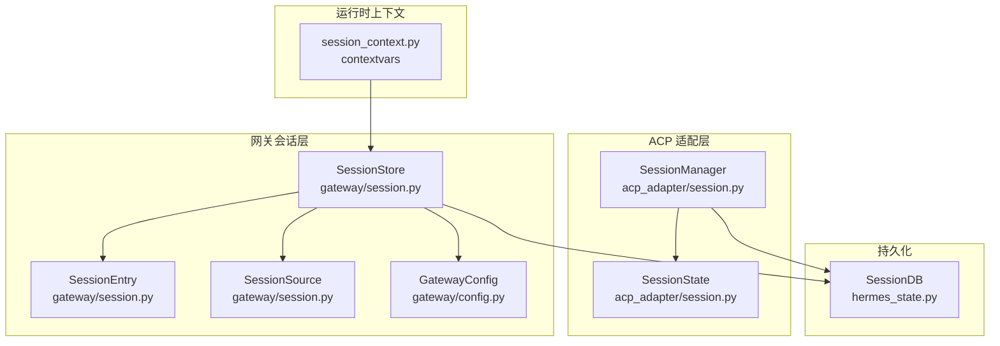
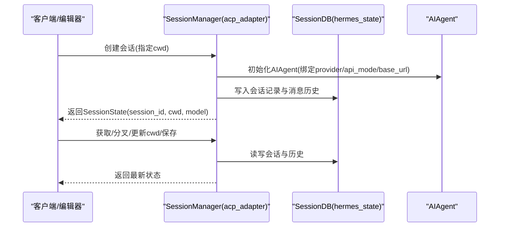
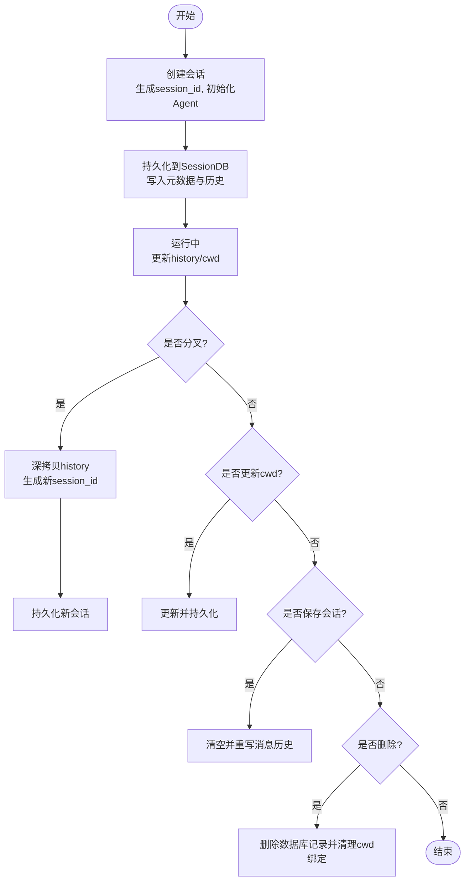
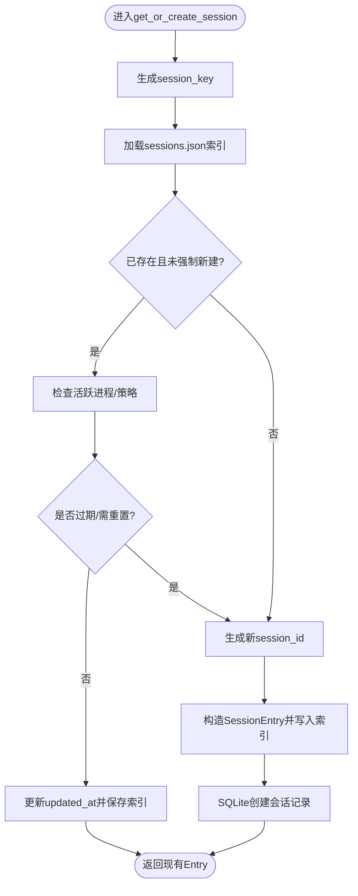
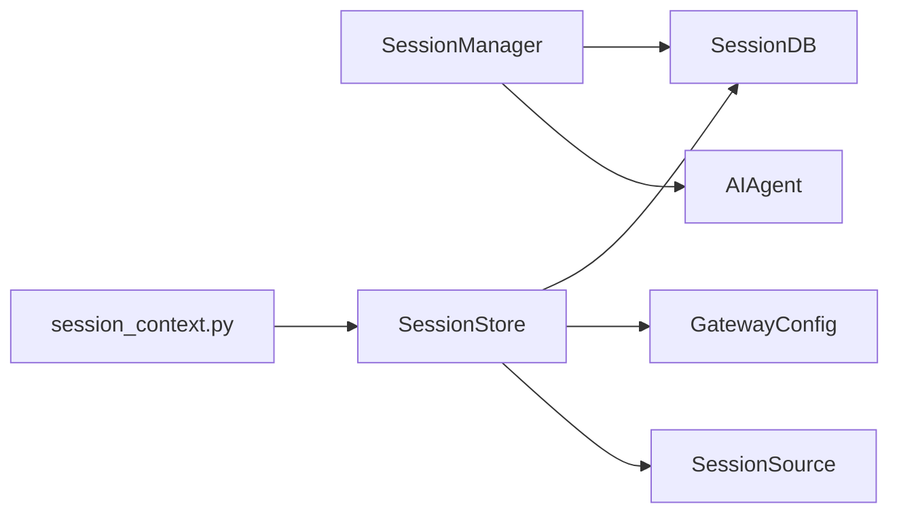

# 会话管理

<cite>
**本文引用的文件**
- [acp_adapter/session.py](file://acp_adapter/session.py)
- [tests/acp/test_session.py](file://tests/acp/test_session.py)
- [gateway/session.py](file://gateway/session.py)
- [gateway/config.py](file://gateway/config.py)
- [gateway/session_context.py](file://gateway/session_context.py)
- [tests/gateway/test_async_memory_flush.py](file://tests/gateway/test_async_memory_flush.py)
- [hermes_state.py](file://hermes_state.py)
- [tests/test_hermes_state.py](file://tests/test_hermes_state.py)
</cite>

## 目录
1. [简介](#简介)
2. [项目结构](#项目结构)
3. [核心组件](#核心组件)
4. [架构总览](#架构总览)
5. [详细组件分析](#详细组件分析)
6. [依赖分析](#依赖分析)
7. [性能考虑](#性能考虑)
8. [故障排除指南](#故障排除指南)
9. [结论](#结论)
10. [附录](#附录)

## 简介
本文件系统性阐述 ACP 协议会话管理系统，聚焦于 SessionManager 类的设计与实现，覆盖会话生命周期（创建、加载、恢复、分叉、销毁）、SessionState 数据结构与持久化、会话键生成策略、工作目录与工具环境绑定、并发与状态同步、配置与超时策略、以及资源清理与调试要点。文档同时给出 Gateway 侧会话存储与重置策略的对照，帮助读者建立端到端的理解。

## 项目结构
围绕会话管理的关键模块与测试如下：
- ACP 会话管理：acp_adapter/session.py 提供 SessionManager 与 SessionState，负责 ACP 场景下的会话创建、分叉、持久化与恢复。
- 网关会话存储：gateway/session.py 提供 SessionStore、SessionEntry、SessionSource 等，负责跨平台消息路由、会话键生成、重置策略评估与持久化索引。
- 配置与策略：gateway/config.py 定义 SessionResetPolicy 及 GatewayConfig 的策略解析与优先级。
- 会话上下文：gateway/session_context.py 使用 contextvars 替代进程全局变量，保障并发安全。
- 持久化后端：hermes_state.py 提供 SessionDB（SQLite），用于会话元数据与消息历史的持久化。
- 测试用例：tests/acp/test_session.py、tests/gateway/test_async_memory_flush.py、tests/test_hermes_state.py 等验证行为与边界。

图表来源
- [acp_adapter/session.py:70-476](file://acp_adapter/session.py#L70-L476)
- [gateway/session.py:495-1081](file://gateway/session.py#L495-L1081)
- [gateway/config.py:99-429](file://gateway/config.py#L99-L429)
- [gateway/session_context.py:1-129](file://gateway/session_context.py#L1-L129)
- [hermes_state.py:114-200](file://hermes_state.py#L114-L200)

章节来源
- [acp_adapter/session.py:1-476](file://acp_adapter/session.py#L1-L476)
- [gateway/session.py:1-1081](file://gateway/session.py#L1-L1081)
- [gateway/config.py:1-429](file://gateway/config.py#L1-L429)
- [gateway/session_context.py:1-129](file://gateway/session_context.py#L1-L129)
- [hermes_state.py:114-200](file://hermes_state.py#L114-L200)

## 核心组件
- SessionManager（ACP）
  - 负责在内存中维护会话，并通过 SessionDB 将会话元数据与消息历史持久化到 SQLite。
  - 支持创建、获取、分叉、更新工作目录、列出、清理与删除会话。
  - 会话 ID 基于 UUID 生成；工作目录通过工具环境覆盖进行绑定。
- SessionState（ACP）
  - 表示单个会话的内存态：包含 session_id、AIAgent 实例、cwd、model、history、取消事件等。
- SessionStore（网关）
  - 维护 sessions.json 索引与 SQLite（SessionDB）会话记录，支持按策略判断是否过期或需要重置。
  - 会话键由 build_session_key 从 SessionSource 构造，支持 DM、群组、线程、用户隔离等规则。
- SessionEntry（网关）
  - 记录会话键到会话 ID 的映射及时间戳、令牌统计、成本估算、自动重置标记、内存刷新标记等。
- SessionSource（网关）
  - 描述消息来源（平台、聊天类型、线程、用户等），用于路由与动态系统提示注入。
- GatewayConfig（网关）
  - 定义默认与按平台/类型的 SessionResetPolicy，支持“每日”“空闲”“两者”“不重置”等模式。
- SessionDB（持久化）
  - 提供会话创建、结束、消息增删查、全文检索、标题管理、版本迁移等能力。

章节来源
- [acp_adapter/session.py:58-112](file://acp_adapter/session.py#L58-L112)
- [acp_adapter/session.py:70-476](file://acp_adapter/session.py#L70-L476)
- [gateway/session.py:328-434](file://gateway/session.py#L328-L434)
- [gateway/session.py:66-139](file://gateway/session.py#L66-L139)
- [gateway/session.py:495-1081](file://gateway/session.py#L495-L1081)
- [gateway/config.py:99-140](file://gateway/config.py#L99-L140)
- [hermes_state.py:114-200](file://hermes_state.py#L114-L200)

## 架构总览
ACP 会话管理与网关会话管理分别服务于不同场景：
- ACP 侧：面向编辑器/stdio 传输，强调会话历史可恢复、工作目录绑定、stderr 输出隔离。
- 网关侧：面向多平台消息路由，强调会话键生成、重置策略、令牌与成本统计、后台内存刷新与自动重置。

图表来源
- [acp_adapter/session.py:94-112](file://acp_adapter/session.py#L94-L112)
- [acp_adapter/session.py:273-332](file://acp_adapter/session.py#L273-L332)
- [acp_adapter/session.py:333-405](file://acp_adapter/session.py#L333-L405)
- [hermes_state.py:114-200](file://hermes_state.py#L114-L200)

## 详细组件分析

### SessionManager（ACP）设计与生命周期
- 设计要点
  - 线程安全：内部使用锁保护内存会话表与持久化操作。
  - 懒加载 SessionDB：首次使用时才初始化，默认路径位于 HERMES_HOME 下 state.db。
  - 工作目录绑定：通过工具环境覆盖将 cwd 注册到任务，确保工具执行上下文一致。
  - 输出隔离：ACP stdio 通道要求 stdout 仅用于 JSON-RPC，人类可读输出重定向至 stderr。
- 生命周期流程
  - 创建：生成 UUID 作为 session_id，初始化 AIAgent，写入 SessionDB，注册 cwd。
  - 加载：若内存未命中，从 SessionDB 恢复，重建 AIAgent 并恢复历史。
  - 分叉：深拷贝历史到新会话，生成新 session_id，保留模型与 cwd。
  - 更新：更新 cwd 并持久化；保存会话触发历史全量替换。
  - 销毁：移除内存与数据库记录，清理 cwd 绑定。
- 关键接口与复杂度
  - create/get/fork/save/remove/list/update_cwd/cleanup：均受锁保护，I/O 主要发生在 SessionDB。
  - 列表合并：内存 + 数据库，数据库查询为 O(k)（k 为会话数）。

图表来源
- [acp_adapter/session.py:94-112](file://acp_adapter/session.py#L94-L112)
- [acp_adapter/session.py:136-163](file://acp_adapter/session.py#L136-L163)
- [acp_adapter/session.py:208-216](file://acp_adapter/session.py#L208-L216)
- [acp_adapter/session.py:238-248](file://acp_adapter/session.py#L238-L248)
- [acp_adapter/session.py:273-332](file://acp_adapter/session.py#L273-L332)
- [acp_adapter/session.py:407-416](file://acp_adapter/session.py#L407-L416)

章节来源
- [acp_adapter/session.py:70-476](file://acp_adapter/session.py#L70-L476)
- [tests/acp/test_session.py:29-247](file://tests/acp/test_session.py#L29-L247)

### SessionState 数据结构与持久化
- 字段
  - session_id：会话唯一标识（UUID）。
  - agent：AIAgent 实例。
  - cwd：工作目录。
  - model：当前模型字符串。
  - history：消息历史列表。
  - cancel_event：线程事件，用于取消。
- 持久化策略
  - 元数据：写入 model_config（含 cwd、provider、base_url、api_mode 等）。
  - 历史：清空旧历史，全量写入当前 history。
  - 恢复：从 SessionDB 读取会话与历史，重建 AIAgent，恢复 cwd 与 provider 快照。
- 一致性与兼容
  - 仅恢复 source="acp" 的会话。
  - 旧条目缺失字段默认为 False/0/""，to_dict/from_dict 保证序列化/反序列化稳定。

章节来源
- [acp_adapter/session.py:58-112](file://acp_adapter/session.py#L58-L112)
- [acp_adapter/session.py:273-332](file://acp_adapter/session.py#L273-L332)
- [acp_adapter/session.py:333-405](file://acp_adapter/session.py#L333-L405)
- [tests/acp/test_session.py:129-247](file://tests/acp/test_session.py#L129-L247)

### 会话键生成策略与工作目录管理
- 会话键（SessionKey）
  - 来源：build_session_key(SessionSource, group_sessions_per_user, thread_sessions_per_user)。
  - 规则：
    - DM：优先 chat_id，其次 thread_id，否则共享会话。
    - 群组/频道：chat_id + thread_id；默认共享线程会话，除非开启 per-user 隔离。
  - 作用：将来源信息映射为稳定的会话键，用于 SessionStore 的索引与重置判定。
- 工作目录与工具环境
  - 创建/更新会话时，调用工具环境覆盖注册 cwd，确保工具执行在正确工作目录。
  - 删除会话时清理 cwd 绑定，避免残留。

章节来源
- [gateway/session.py:436-493](file://gateway/session.py#L436-L493)
- [acp_adapter/session.py:36-56](file://acp_adapter/session.py#L36-L56)
- [acp_adapter/session.py:208-216](file://acp_adapter/session.py#L208-L216)

### 网关会话存储与重置策略
- SessionStore
  - sessions.json：轻量索引，保存 session_key -> SessionEntry 映射。
  - SQLite（SessionDB）：会话元数据与消息历史的持久化后端。
  - 重置策略评估：基于 SessionResetPolicy（idle/daily/both/none）与活跃进程检测。
- 重置逻辑
  - _is_session_expired：仅依据 Entry 与策略判断，用于后台观察者主动刷新内存。
  - _should_reset：结合活跃进程与策略，返回重置原因（idle/daily/suspended）。
  - get_or_create_session：根据策略决定是否新建会话并写入 SQLite。
- 自动重置与通知
  - 支持在重置时记录 was_auto_reset/auto_reset_reason/reset_had_activity。
  - 可配置通知开关与排除平台。

图表来源
- [gateway/session.py:683-768](file://gateway/session.py#L683-L768)
- [gateway/session.py:579-616](file://gateway/session.py#L579-L616)
- [gateway/session.py:617-659](file://gateway/session.py#L617-L659)

章节来源
- [gateway/session.py:495-1081](file://gateway/session.py#L495-L1081)
- [gateway/config.py:99-140](file://gateway/config.py#L99-L140)
- [tests/gateway/test_async_memory_flush.py:45-113](file://tests/gateway/test_async_memory_flush.py#L45-L113)

### 并发访问控制与状态同步
- ACP 侧
  - SessionManager 使用 Lock 保护内存字典与持久化写入，避免竞态。
  - ACP stdio 输出重定向至 stderr，避免 stdout 混入协议帧。
- 网关侧
  - SessionStore 使用 Lock 保护索引加载/保存。
  - session_context.py 使用 contextvars 替代 os.environ，确保 asyncio 并发下任务本地状态隔离。

章节来源
- [acp_adapter/session.py:88-91](file://acp_adapter/session.py#L88-L91)
- [acp_adapter/session.py:25-34](file://acp_adapter/session.py#L25-L34)
- [gateway/session.py:509-511](file://gateway/session.py#L509-L511)
- [gateway/session_context.py:39-129](file://gateway/session_context.py#L39-L129)

### 会话继承关系与历史记录保存
- 继承/分叉
  - SessionManager.fork_session 对 history 进行深拷贝，生成新的 session_id，保留模型与 cwd。
- 历史保存
  - SessionDB 提供 clear_messages 与 append_message，确保历史全量替换与工具调用信息保留。
- 标题与搜索
  - SessionDB 支持会话标题设置与全文检索（FTS5），便于会话查找与管理。

章节来源
- [acp_adapter/session.py:136-163](file://acp_adapter/session.py#L136-L163)
- [acp_adapter/session.py:320-329](file://acp_adapter/session.py#L320-L329)
- [tests/test_hermes_state.py:753-914](file://tests/test_hermes_state.py#L753-L914)

### 会话配置选项、超时设置与资源清理
- 配置项（GatewayConfig）
  - 默认与按平台/类型重置策略：mode、at_hour、idle_minutes、notify、notify_exclude_platforms。
  - 会话隔离：group_sessions_per_user、thread_sessions_per_user。
  - sessions_dir：会话索引与 SQLite 数据库存放目录。
- 资源清理
  - cleanup：清空内存与数据库中的所有 ACP 会话并清理 cwd 绑定。
  - remove_session/delete_persisted：删除单个会话。
  - suspend_recently_active：启动时对最近活跃会话加挂起标记，避免重启后误恢复。

章节来源
- [gateway/config.py:230-429](file://gateway/config.py#L230-L429)
- [acp_adapter/session.py:218-237](file://acp_adapter/session.py#L218-L237)
- [gateway/session.py:801-822](file://gateway/session.py#L801-L822)

## 依赖分析
- 组件耦合
  - SessionManager 依赖 SessionDB（SQLite）与 AIAgent；对外通过 hermes_state 导入 SessionDB。
  - SessionStore 依赖 GatewayConfig 与 SessionDB；对外通过 hermes_state 导入 SessionDB。
  - SessionContext 与 session_context.py 解耦平台路由与并发上下文。
- 外部依赖
  - SQLite（SessionDB）：提供事务、WAL、外键、FTS5 等能力。
  - contextvars：替代 os.environ，保障并发安全。

图表来源
- [acp_adapter/session.py:264-271](file://acp_adapter/session.py#L264-L271)
- [gateway/session.py:515-518](file://gateway/session.py#L515-L518)
- [gateway/session_context.py:39-129](file://gateway/session_context.py#L39-L129)

章节来源
- [acp_adapter/session.py:264-271](file://acp_adapter/session.py#L264-L271)
- [gateway/session.py:515-518](file://gateway/session.py#L515-L518)

## 性能考虑
- I/O 优化
  - SessionStore 在锁外执行 SQLite 操作，减少锁持有时间。
  - sessions.json 采用原子替换写入，fsync 保证落盘。
- 存储与检索
  - SessionDB 使用 WAL 模式与外键约束，提升并发与一致性。
  - FTS5 支持消息全文检索，加速会话内搜索。
- 重置与内存刷新
  - 后台观察者基于策略判断过期，避免不必要的重置。
  - memory_flushed 标记防止重复刷新，重启后仍持久化。

章节来源
- [gateway/session.py:548-570](file://gateway/session.py#L548-L570)
- [tests/gateway/test_async_memory_flush.py:19-43](file://tests/gateway/test_async_memory_flush.py#L19-L43)
- [tests/test_hermes_state.py:917-925](file://tests/test_hermes_state.py#L917-L925)

## 故障排除指南
- 会话无法恢复
  - 确认 SessionDB 可用且会话 source="acp"。
  - 检查 model_config 中 cwd/provider/base_url/api_mode 是否正确。
- 重置策略未生效
  - 检查 GatewayConfig 的默认/平台/类型策略与 at_hour/idle_minutes 设置。
  - 确认活跃进程检测函数未阻止重置。
- 并发冲突
  - 确保使用 contextvars 上下文变量而非 os.environ。
  - ACP 侧 stdout 仅用于协议帧，人类输出重定向至 stderr。
- 内存刷新异常
  - 查看 memory_flushed 标记与重试上限日志，必要时手动标记已刷新以避免无限重试。

章节来源
- [acp_adapter/session.py:333-405](file://acp_adapter/session.py#L333-L405)
- [gateway/session.py:579-616](file://gateway/session.py#L579-L616)
- [gateway/session_context.py:39-129](file://gateway/session_context.py#L39-L129)
- [tests/gateway/test_async_memory_flush.py:115-139](file://tests/gateway/test_async_memory_flush.py#L115-L139)

## 结论
ACP 会话管理系统通过 SessionManager 与 SessionDB 实现了跨进程、跨平台的会话持久化与恢复；网关侧 SessionStore 与 GatewayConfig 提供了灵活的会话键生成与重置策略。二者协同，既满足 ACP stdio 场景的严格协议要求，又兼顾多平台消息路由的复杂性。遵循本文的配置、并发与调试建议，可有效提升稳定性与可观测性。

## 附录
- 最佳实践
  - 会话 ID：使用 UUID，确保全局唯一。
  - 工作目录：始终通过工具环境覆盖绑定 cwd，避免工具执行上下文漂移。
  - 重置策略：结合 idle_minutes 与 at_hour，平衡上下文保留与资源占用。
  - 并发安全：使用 contextvars 替代进程全局变量；ACP stdio 输出隔离。
  - 清理策略：定期清理过期会话与历史，启用 memory_flushed 防抖。
- 扩展与自定义
  - 自定义 SessionDB：扩展消息表结构或引入压缩策略。
  - 自定义重置策略：在 GatewayConfig 中按平台/类型细化策略。
  - 自定义会话键：调整 build_session_key 的隔离规则以适配业务需求。