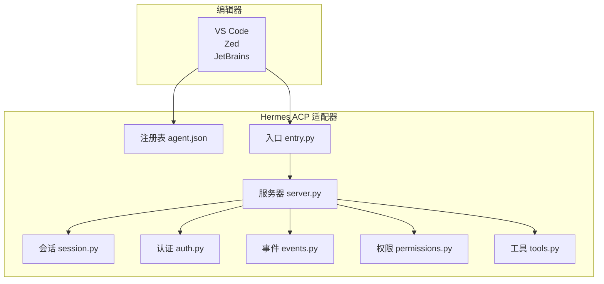
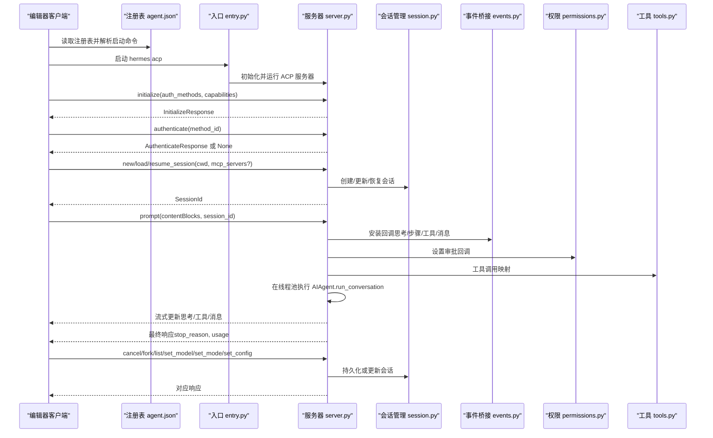
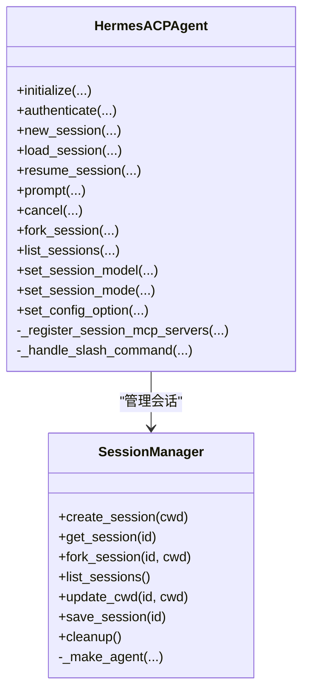
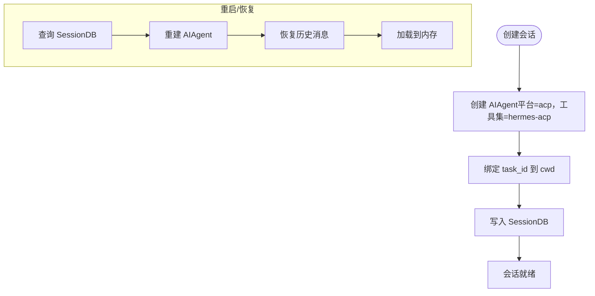
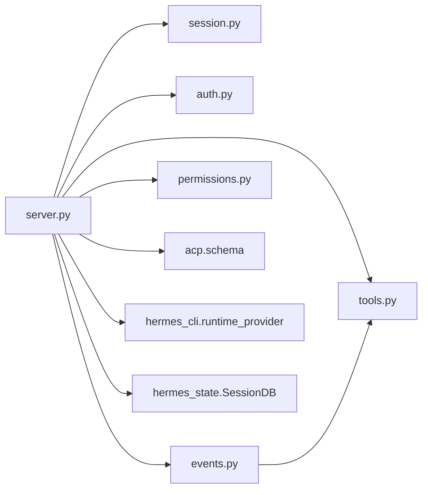

# 编辑器集成指南

<cite>
**本文档引用的文件**
- [acp_adapter/__init__.py](file://acp_adapter/__init__.py)
- [acp_adapter/server.py](file://acp_adapter/server.py)
- [acp_adapter/session.py](file://acp_adapter/session.py)
- [acp_adapter/auth.py](file://acp_adapter/auth.py)
- [acp_adapter/entry.py](file://acp_adapter/entry.py)
- [acp_adapter/events.py](file://acp_adapter/events.py)
- [acp_adapter/permissions.py](file://acp_adapter/permissions.py)
- [acp_adapter/tools.py](file://acp_adapter/tools.py)
- [acp_registry/agent.json](file://acp_registry/agent.json)
- [docs/acp-setup.md](file://docs/acp-setup.md)
- [website/docs/user-guide/features/acp.md](file://website/docs/user-guide/features/acp.md)
- [website/docs/developer-guide/acp-internals.md](file://website/docs/developer-guide/acp-internals.md)
- [tests/acp/test_server.py](file://tests/acp/test_server.py)
- [tests/acp/test_session.py](file://tests/acp/test_session.py)
- [tests/acp/test_entry.py](file://tests/acp/test_entry.py)
</cite>

## 目录
1. [简介](#简介)
2. [项目结构](#项目结构)
3. [核心组件](#核心组件)
4. [架构总览](#架构总览)
5. [详细组件分析](#详细组件分析)
6. [依赖关系分析](#依赖关系分析)
7. [性能考虑](#性能考虑)
8. [故障排除指南](#故障排除指南)
9. [结论](#结论)
10. [附录](#附录)

## 简介
本指南面向希望在 VS Code、Zed、JetBrains 等 ACP 兼容编辑器中使用 Hermes Agent 的开发者与用户。内容涵盖：
- ACP 服务器启动与运行方式
- 编辑器侧（VS Code、Zed、JetBrains）的集成配置步骤
- 连接建立、认证流程与会话管理
- 命令处理机制、工具映射与权限桥接
- 调试技巧、性能优化与常见问题排查
- 扩展开发与自定义集成的最佳实践

## 项目结构
ACP 集成由“适配器 + 注册表 + 文档”三部分组成：
- 适配器模块：实现 ACP 协议服务端，负责会话生命周期、事件推送、权限审批与工具渲染
- 注册表：声明 agent 启动方式，供编辑器发现与连接
- 文档：提供编辑器侧配置指引与故障排除

图表来源
- [acp_registry/agent.json:1-13](file://acp_registry/agent.json#L1-L13)
- [acp_adapter/entry.py:58-86](file://acp_adapter/entry.py#L58-L86)
- [acp_adapter/server.py:93-729](file://acp_adapter/server.py#L93-L729)
- [acp_adapter/session.py:70-476](file://acp_adapter/session.py#L70-L476)
- [acp_adapter/auth.py:8-25](file://acp_adapter/auth.py#L8-L25)
- [acp_adapter/events.py:27-176](file://acp_adapter/events.py#L27-L176)
- [acp_adapter/permissions.py:26-78](file://acp_adapter/permissions.py#L26-L78)
- [acp_adapter/tools.py:20-215](file://acp_adapter/tools.py#L20-L215)

章节来源
- [acp_registry/agent.json:1-13](file://acp_registry/agent.json#L1-L13)
- [acp_adapter/entry.py:58-86](file://acp_adapter/entry.py#L58-L86)
- [acp_adapter/server.py:93-729](file://acp_adapter/server.py#L93-L729)
- [acp_adapter/session.py:70-476](file://acp_adapter/session.py#L70-L476)
- [acp_adapter/auth.py:8-25](file://acp_adapter/auth.py#L8-L25)
- [acp_adapter/events.py:27-176](file://acp_adapter/events.py#L27-L176)
- [acp_adapter/permissions.py:26-78](file://acp_adapter/permissions.py#L26-L78)
- [acp_adapter/tools.py:20-215](file://acp_adapter/tools.py#L20-L215)

## 核心组件
- ACP 服务器（HermesACPAgent）
  - 实现 initialize/authenticate/new_session/load_session/resume_session/prompt/cancel/fork/list_sessions/set_session_model/set_session_mode/set_config_option 等 ACP 方法
  - 通过回调工厂将内部事件流式推送到编辑器
- 会话管理器（SessionManager）
  - 维护内存中的会话状态，并持久化到 SessionDB，支持重启后恢复
- 认证辅助（auth.py）
  - 复用 Hermes 当前运行时提供商信息，用于 ACP 认证能力声明
- 事件桥接（events.py）
  - 将思考、步骤、工具进度与消息流转换为 ACP 更新
- 权限桥接（permissions.py）
  - 将危险操作审批请求映射为 ACP 权限选项
- 工具映射（tools.py）
  - 将 Hermes 工具名映射为 ACP ToolKind 并构建 UI 内容
- 入口（entry.py）
  - 加载环境变量、配置日志、启动 ACP 服务器

章节来源
- [acp_adapter/server.py:93-729](file://acp_adapter/server.py#L93-L729)
- [acp_adapter/session.py:70-476](file://acp_adapter/session.py#L70-L476)
- [acp_adapter/auth.py:8-25](file://acp_adapter/auth.py#L8-L25)
- [acp_adapter/events.py:27-176](file://acp_adapter/events.py#L27-L176)
- [acp_adapter/permissions.py:26-78](file://acp_adapter/permissions.py#L26-L78)
- [acp_adapter/tools.py:20-215](file://acp_adapter/tools.py#L20-L215)
- [acp_adapter/entry.py:58-86](file://acp_adapter/entry.py#L58-L86)

## 架构总览
下图展示从编辑器发起连接到 Hermes 处理请求的端到端流程。

图表来源
- [acp_registry/agent.json:7-12](file://acp_registry/agent.json#L7-L12)
- [acp_adapter/entry.py:58-86](file://acp_adapter/entry.py#L58-L86)
- [acp_adapter/server.py:217-729](file://acp_adapter/server.py#L217-L729)
- [acp_adapter/session.py:94-476](file://acp_adapter/session.py#L94-L476)
- [acp_adapter/events.py:47-176](file://acp_adapter/events.py#L47-L176)
- [acp_adapter/permissions.py:26-78](file://acp_adapter/permissions.py#L26-L78)
- [acp_adapter/tools.py:104-215](file://acp_adapter/tools.py#L104-L215)

## 详细组件分析

### ACP 服务器（HermesACPAgent）
- 生命周期方法
  - initialize：声明协议版本、代理信息与能力（加载会话、会话 fork/list/resume）
  - authenticate：基于当前运行时提供商返回认证能力
- 会话管理
  - new_session/load_session/resume_session/fork_session/list_sessions
  - 与 SessionManager 协作，维护 session_id、cwd、model、history、cancel_event
- 提示处理（prompt）
  - 解析文本块，拦截斜杠命令（help/model/tools/context/reset/compact/version）
  - 安装回调与审批桥接，执行 AIAgent.run_conversation，流式推送结果
- 模型与模式设置
  - set_session_model：切换会话模型并重建 AIAgent
  - set_session_mode：记录编辑器请求的模式
  - set_config_option：接受配置项更新（暂存为会话配置）
- MCP 服务器注册
  - 在会话创建/加载/恢复时注册 ACP 提供的 MCP 服务器，刷新工具面

图表来源
- [acp_adapter/server.py:93-729](file://acp_adapter/server.py#L93-L729)
- [acp_adapter/session.py:70-476](file://acp_adapter/session.py#L70-L476)

章节来源
- [acp_adapter/server.py:217-729](file://acp_adapter/server.py#L217-L729)
- [acp_adapter/session.py:94-476](file://acp_adapter/session.py#L94-L476)

### 会话管理（SessionManager）
- 内存 + 数据库双层存储
  - 会话 ID、工作目录、模型、历史消息、取消事件
  - 使用 SessionDB（~/.hermes/state.db）持久化，支持重启恢复
- 任务 CWD 绑定
  - 将 task_id 与 cwd 绑定，确保文件/终端工具相对编辑器工作区执行
- 代理工厂
  - 基于运行时提供商与配置创建 AIAgent，支持平台为 "acp"、工具集为 "hermes-acp"

图表来源
- [acp_adapter/session.py:94-476](file://acp_adapter/session.py#L94-L476)

章节来源
- [acp_adapter/session.py:70-476](file://acp_adapter/session.py#L70-L476)

### 认证与提供商（auth.py）
- detect_provider：解析当前运行时提供商与密钥，用于 ACP initialize 时的能力声明
- has_provider：判断是否具备有效提供商凭据

章节来源
- [acp_adapter/auth.py:8-25](file://acp_adapter/auth.py#L8-L25)

### 事件桥接（events.py）
- 工具进度回调：仅对 tool.started 发出 ToolCallStart，跟踪同名并发调用
- 思考回调：推送思考文本
- 步骤回调：完成先前工具调用（匹配队列）
- 消息回调：流式推送最终响应文本

章节来源
- [acp_adapter/events.py:47-176](file://acp_adapter/events.py#L47-L176)

### 权限桥接（permissions.py）
- 将 ACP request_permission 映射为 Hermes 审批结果字符串
- 支持超时与失败回退为拒绝
- 映射关系：
  - allow_once → once
  - allow_always → always
  - reject_* → deny

章节来源
- [acp_adapter/permissions.py:18-78](file://acp_adapter/permissions.py#L18-L78)

### 工具映射（tools.py）
- 工具名到 ACP ToolKind 的映射（如 read/write/patch/search/execute/fetch/think 等）
- 构建工具标题与内容（含 diff、文本预览、截断大结果）

章节来源
- [acp_adapter/tools.py:20-215](file://acp_adapter/tools.py#L20-L215)

### 入口与注册表（entry.py, agent.json）
- 入口
  - 加载 .env、配置日志输出至 stderr、启动 acp.run_agent(use_unstable_protocol=True)
- 注册表
  - 声明 agent 名称、图标与启动命令（hermes acp）

章节来源
- [acp_adapter/entry.py:58-86](file://acp_adapter/entry.py#L58-L86)
- [acp_registry/agent.json:1-13](file://acp_registry/agent.json#L1-L13)

## 依赖关系分析
- 组件内聚与耦合
  - server.py 作为中枢，依赖 session.py、auth.py、events.py、permissions.py、tools.py
  - events.py 与 tools.py 仅依赖 acp.schema 与标准库，低耦合
  - entry.py 仅负责启动与环境装载
- 外部依赖
  - acp.schema：ACP 协议数据结构
  - hermes_cli.runtime_provider：运行时提供商解析
  - hermes_state.SessionDB：会话持久化
- 潜在循环依赖
  - 未见直接循环；各模块职责清晰

图表来源
- [acp_adapter/server.py:52-60](file://acp_adapter/server.py#L52-L60)
- [acp_adapter/events.py:16-22](file://acp_adapter/events.py#L16-L22)
- [acp_adapter/tools.py:8-14](file://acp_adapter/tools.py#L8-L14)

章节来源
- [acp_adapter/server.py:52-60](file://acp_adapter/server.py#L52-L60)
- [acp_adapter/events.py:16-22](file://acp_adapter/events.py#L16-L22)
- [acp_adapter/permissions.py:10-13](file://acp_adapter/permissions.py#L10-L13)
- [acp_adapter/tools.py:8-14](file://acp_adapter/tools.py#L8-L14)

## 性能考虑
- 线程池执行
  - 使用 ThreadPoolExecutor 并发运行 AIAgent，避免阻塞事件循环
- 流式输出
  - 通过回调工厂异步推送思考、步骤、工具与消息，提升交互体验
- 结果截断
  - 工具结果超过阈值自动截断，防止 UI 卡顿
- 日志与网络
  - ACP 模式日志输出到 stderr，stdout 专用于 JSON-RPC；合理设置日志级别以减少开销

章节来源
- [acp_adapter/server.py:69-70](file://acp_adapter/server.py#L69-L70)
- [acp_adapter/events.py:169-175](file://acp_adapter/events.py#L169-L175)
- [acp_adapter/tools.py:185-189](file://acp_adapter/tools.py#L185-L189)

## 故障排除指南
- 编辑器无法发现 ACP Agent
  - 检查注册表路径与 agent.json 是否正确
  - 确认 hermes 命令在 PATH 中
  - 重新启动编辑器
- ACP 启动后立即报错
  - 运行 hermes doctor 与 hermes status 检查配置
  - 直接运行 hermes acp 查看错误堆栈
- 缺少 ACP 依赖
  - 安装 pip install -e ".[acp]"
- 响应缓慢
  - 检查网络与提供商状态；必要时切换模型/提供商
- 权限被拒绝
  - 检查编辑器 ACP 客户端的审批策略（自动/手动）
- 日志定位
  - ACP 模式日志输出到 stderr；可在编辑器输出面板或进程终端查看

章节来源
- [docs/acp-setup.md:174-221](file://docs/acp-setup.md#L174-L221)
- [website/docs/user-guide/features/acp.md:162-191](file://website/docs/user-guide/features/acp.md#L162-L191)

## 结论
Hermes ACP 适配器通过清晰的模块划分与事件桥接，实现了与多编辑器的稳定集成。遵循本文档的配置步骤与最佳实践，可快速完成 VS Code、Zed、JetBrains 的 ACP 集成，并在生产环境中获得良好的性能与可观测性。

## 附录

### 编辑器集成配置步骤

- VS Code
  - 安装 ACP Client 扩展
  - 在 settings.json 中配置 agents.registryDir 指向 acp_registry
  - 重启 VS Code，从聊天/代理面板选择 Hermes Agent

- Zed
  - 在 settings.json 中添加 agent_servers.herames-agent，类型为 custom，命令为 hermes，参数为 ["acp"]
  - 重启 Zed，在代理面板选择 Hermes Agent

- JetBrains
  - 安装 ACP 插件
  - 在 ACP Agents 中添加新代理，注册表目录指向 acp_registry
  - 在右侧 ACP 面板选择 Hermes Agent

章节来源
- [docs/acp-setup.md:24-115](file://docs/acp-setup.md#L24-L115)
- [website/docs/user-guide/features/acp.md:68-108](file://website/docs/user-guide/features/acp.md#L68-L108)

### ACP 服务器启动方法
- hermes acp
- hermes-acp
- python -m acp_adapter

章节来源
- [website/docs/user-guide/features/acp.md:48-64](file://website/docs/user-guide/features/acp.md#L48-L64)
- [acp_adapter/entry.py:58-86](file://acp_adapter/entry.py#L58-L86)

### 连接参数与认证
- 认证能力由当前运行时提供商决定；若已配置提供商，则 ACP initialize 会声明相应 auth_methods
- 若未配置提供商，authenticate 返回 None

章节来源
- [acp_adapter/server.py:217-262](file://acp_adapter/server.py#L217-L262)
- [acp_adapter/auth.py:8-25](file://acp_adapter/auth.py#L8-L25)

### 编辑器侧连接管理与会话切换
- 新建/加载/恢复/分叉会话均携带 cwd，确保工具在编辑器工作区执行
- 支持取消当前会话，触发 stop_reason="cancelled"
- 模型与模式变更通过 set_session_model/set_session_mode 持久化

章节来源
- [acp_adapter/server.py:266-336](file://acp_adapter/server.py#L266-L336)
- [acp_adapter/server.py:699-710](file://acp_adapter/server.py#L699-L710)

### 命令处理机制
- 斜杠命令（help/model/tools/context/reset/compact/version）在本地处理，不调用 LLM
- 可用命令通过 AvailableCommandsUpdate 推送至编辑器

章节来源
- [acp_adapter/server.py:374-382](file://acp_adapter/server.py#L374-L382)
- [acp_adapter/server.py:487-514](file://acp_adapter/server.py#L487-L514)

### 工具映射与渲染
- 工具名映射为 ACP ToolKind，构建人类可读标题与内容
- 大结果自动截断，避免 UI 卡顿

章节来源
- [acp_adapter/tools.py:20-55](file://acp_adapter/tools.py#L20-L55)
- [acp_adapter/tools.py:104-197](file://acp_adapter/tools.py#L104-L197)

### 权限审批桥接
- ACP 权限选项映射到 Hermes 审批结果字符串
- 超时或失败默认拒绝

章节来源
- [acp_adapter/permissions.py:18-78](file://acp_adapter/permissions.py#L18-L78)

### 调试技巧
- 启用详细日志：HERMES_LOG_LEVEL=DEBUG hermes acp
- 使用 hermes doctor 与 hermes status 快速诊断
- 在编辑器输出面板查看 ACP Client/Hermes Agent 输出

章节来源
- [docs/acp-setup.md:216-221](file://docs/acp-setup.md#L216-L221)

### 集成测试方法
- 单元测试覆盖 initialize/authenticate/new_session/load_session/resume_session/prompt/cancel/fork/list_sessions/set_session_model/set_session_mode/set_config_option 等关键路径
- 会话持久化与恢复、任务 CWD 绑定、工具映射等场景均有测试保障

章节来源
- [tests/acp/test_server.py:51-200](file://tests/acp/test_server.py#L51-L200)
- [tests/acp/test_session.py:29-200](file://tests/acp/test_session.py#L29-L200)
- [tests/acp/test_entry.py:8-20](file://tests/acp/test_entry.py#L8-L20)

### 性能调优建议
- 控制工具输出大小，避免一次性传输过多文本
- 合理设置日志级别，减少 I/O 开销
- 使用合适的模型/提供商，避免频繁重试与限流

章节来源
- [acp_adapter/tools.py:185-189](file://acp_adapter/tools.py#L185-L189)
- [acp_adapter/entry.py:23-41](file://acp_adapter/entry.py#L23-L41)

### 常见问题解答
- 问：为什么编辑器看不到 ACP Agent？
  - 答：检查注册表路径、PATH 与 ACP extra 安装状态
- 问：ACP 启动报模块缺失？
  - 答：执行 pip install -e ".[acp]" 安装 ACP 依赖
- 问：如何切换模型？
  - 答：编辑 ~/.hermes/config.yaml 或设置 HERMES_MODEL 环境变量

章节来源
- [docs/acp-setup.md:174-203](file://docs/acp-setup.md#L174-L203)

### 社区最佳实践
- 使用 hermes-acp 工具集，聚焦编辑器工作流
- 保持 PROVIDER/KEY 配置与 CLI 一致
- 在 CI/CD 中固定模型与提供商，确保一致性

章节来源
- [website/docs/user-guide/features/acp.md:16-32](file://website/docs/user-guide/features/acp.md#L16-L32)
- [website/docs/user-guide/features/acp.md:123-133](file://website/docs/user-guide/features/acp.md#L123-L133)

### 开发者扩展与自定义集成
- 自定义工具映射：在 tools.py 中扩展 TOOL_KIND_MAP 与 build_* 辅助函数
- 自定义命令：在 server.py 的斜杠命令字典中新增条目
- 自定义会话行为：在 SessionManager 中扩展 _make_agent 或持久化逻辑
- 自定义权限策略：在 permissions.py 中调整映射与超时策略

章节来源
- [acp_adapter/tools.py:20-55](file://acp_adapter/tools.py#L20-L55)
- [acp_adapter/server.py:96-136](file://acp_adapter/server.py#L96-L136)
- [acp_adapter/session.py:420-476](file://acp_adapter/session.py#L420-L476)
- [acp_adapter/permissions.py:26-78](file://acp_adapter/permissions.py#L26-L78)