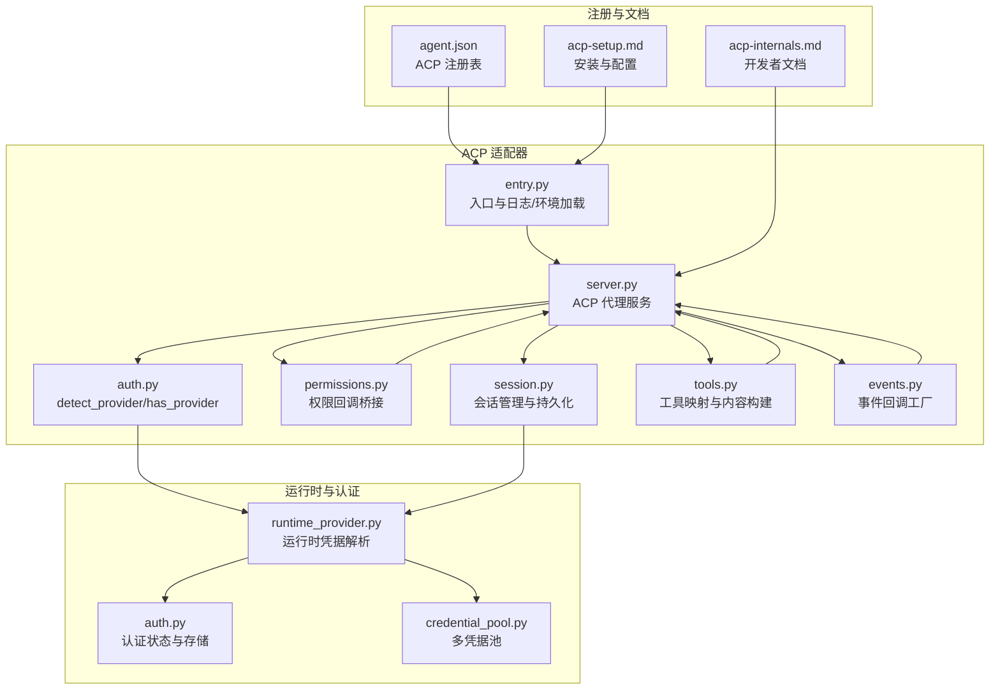
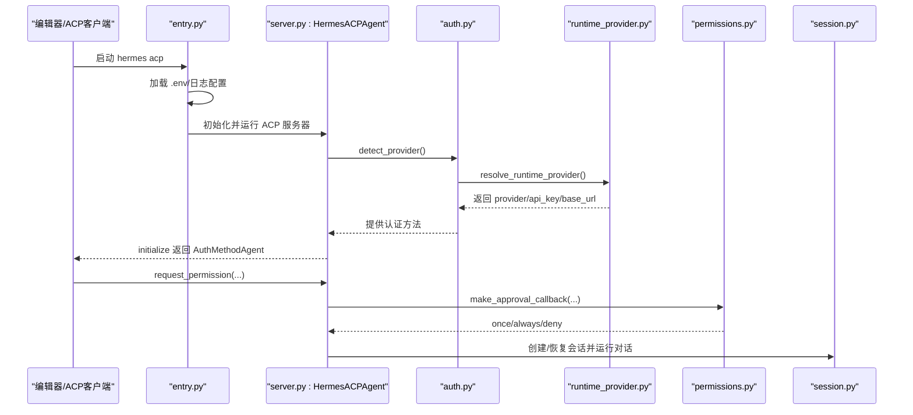
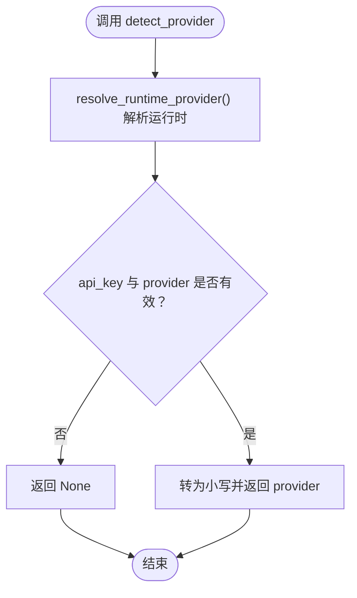
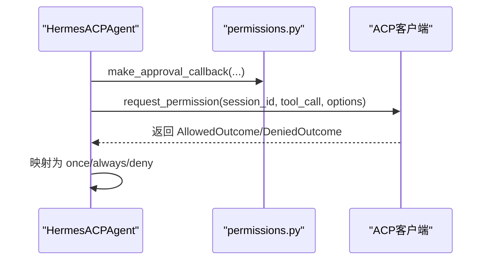
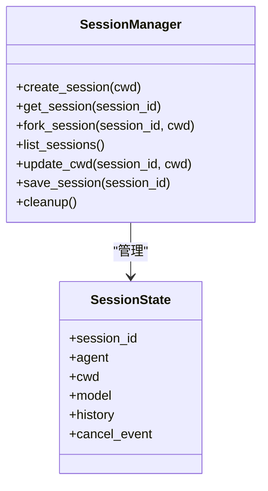
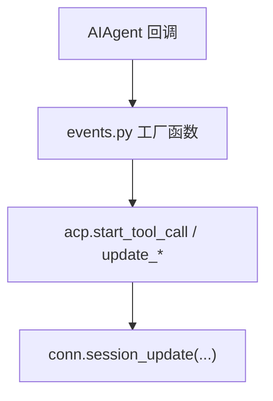
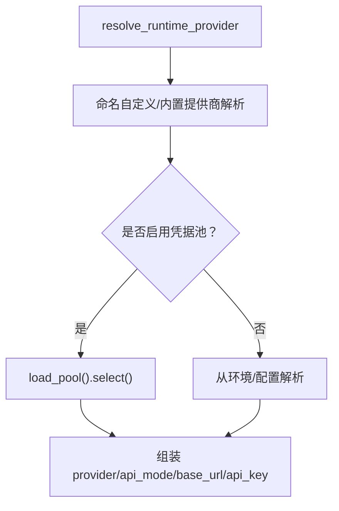
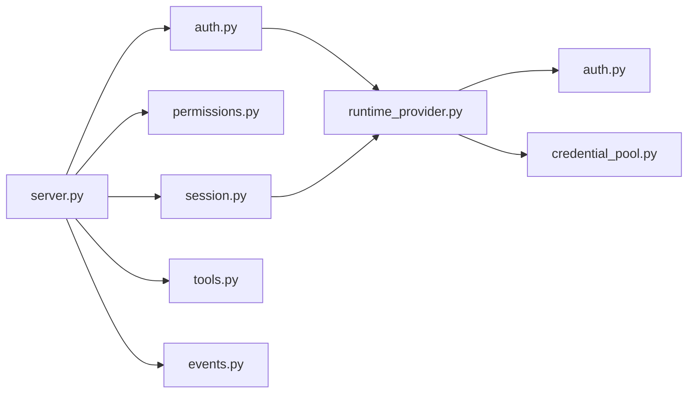

# 认证与权限

<cite>
**本文引用的文件**
- [acp_adapter/auth.py](file://acp_adapter/auth.py)
- [acp_adapter/entry.py](file://acp_adapter/entry.py)
- [acp_adapter/permissions.py](file://acp_adapter/permissions.py)
- [acp_adapter/server.py](file://acp_adapter/server.py)
- [acp_adapter/session.py](file://acp_adapter/session.py)
- [acp_adapter/tools.py](file://acp_adapter/tools.py)
- [acp_adapter/events.py](file://acp_adapter/events.py)
- [hermes_cli/runtime_provider.py](file://hermes_cli/runtime_provider.py)
- [hermes_cli/auth.py](file://hermes_cli/auth.py)
- [agent/credential_pool.py](file://agent/credential_pool.py)
- [acp_registry/agent.json](file://acp_registry/agent.json)
- [docs/acp-setup.md](file://docs/acp-setup.md)
- [website/docs/developer-guide/acp-internals.md](file://website/docs/developer-guide/acp-internals.md)
</cite>

## 目录
1. [简介](#简介)
2. [项目结构](#项目结构)
3. [核心组件](#核心组件)
4. [架构总览](#架构总览)
5. [详细组件分析](#详细组件分析)
6. [依赖分析](#依赖分析)
7. [性能考虑](#性能考虑)
8. [故障排查指南](#故障排查指南)
9. [结论](#结论)
10. [附录](#附录)

## 简介
本技术文档围绕 ACP（Agent Client Protocol）认证与权限控制系统展开，系统性阐述以下内容：
- 认证机制：detect_provider 函数工作流、运行时凭据检测与认证方法注册
- 权限控制：命令审批流程、工具调用权限与安全策略实施
- 使用指南：AuthMethodAgent 的使用方法、权限回调函数实现与审批 UI 集成
- 外部认证集成：与多提供商的对接、凭据存储与会话验证
- 实践建议：认证配置示例、安全最佳实践、常见问题与调试工具

## 项目结构
ACP 适配器位于 acp_adapter 目录，核心模块包括：
- 入口与服务：entry.py、server.py
- 认证与权限：auth.py、permissions.py
- 会话管理：session.py
- 工具映射与事件桥接：tools.py、events.py
- 运行时凭据解析：hermes_cli/runtime_provider.py
- 认证与凭据池：hermes_cli/auth.py、agent/credential_pool.py
- 注册表与安装文档：acp_registry/agent.json、docs/acp-setup.md

图示来源
- [acp_adapter/entry.py:1-86](file://acp_adapter/entry.py#L1-L86)
- [acp_adapter/server.py:1-120](file://acp_adapter/server.py#L1-L120)
- [acp_adapter/auth.py:1-25](file://acp_adapter/auth.py#L1-L25)
- [acp_adapter/permissions.py:1-78](file://acp_adapter/permissions.py#L1-L78)
- [acp_adapter/session.py:1-120](file://acp_adapter/session.py#L1-L120)
- [acp_adapter/tools.py:1-60](file://acp_adapter/tools.py#L1-L60)
- [acp_adapter/events.py:1-60](file://acp_adapter/events.py#L1-L60)
- [hermes_cli/runtime_provider.py:595-720](file://hermes_cli/runtime_provider.py#L595-L720)
- [hermes_cli/auth.py:567-782](file://hermes_cli/auth.py#L567-L782)
- [agent/credential_pool.py:358-420](file://agent/credential_pool.py#L358-L420)
- [acp_registry/agent.json:1-13](file://acp_registry/agent.json#L1-L13)
- [docs/acp-setup.md:1-60](file://docs/acp-setup.md#L1-L60)
- [website/docs/developer-guide/acp-internals.md:89-154](file://website/docs/developer-guide/acp-internals.md#L89-L154)

章节来源
- [acp_adapter/entry.py:1-86](file://acp_adapter/entry.py#L1-L86)
- [acp_adapter/server.py:1-120](file://acp_adapter/server.py#L1-L120)
- [acp_adapter/auth.py:1-25](file://acp_adapter/auth.py#L1-L25)
- [acp_adapter/permissions.py:1-78](file://acp_adapter/permissions.py#L1-L78)
- [acp_adapter/session.py:1-120](file://acp_adapter/session.py#L1-L120)
- [acp_adapter/tools.py:1-60](file://acp_adapter/tools.py#L1-L60)
- [acp_adapter/events.py:1-60](file://acp_adapter/events.py#L1-L60)
- [hermes_cli/runtime_provider.py:595-720](file://hermes_cli/runtime_provider.py#L595-L720)
- [hermes_cli/auth.py:567-782](file://hermes_cli/auth.py#L567-L782)
- [agent/credential_pool.py:358-420](file://agent/credential_pool.py#L358-L420)
- [acp_registry/agent.json:1-13](file://acp_registry/agent.json#L1-L13)
- [docs/acp-setup.md:1-60](file://docs/acp-setup.md#L1-L60)
- [website/docs/developer-guide/acp-internals.md:89-154](file://website/docs/developer-guide/acp-internals.md#L89-L154)

## 核心组件
- 认证探测与注册
  - detect_provider/has_provider：从运行时解析当前活跃提供商与密钥，用于 initialize 时注册 AuthMethodAgent
- 权限回调桥接
  - make_approval_callback：将 ACP 审批请求映射为 Hermes 的 once/always/deny 结果
- 会话生命周期
  - SessionManager：创建/恢复/保存/清理会话；绑定任务工作目录；持久化到 SessionDB
- 工具与事件桥接
  - tools.py：工具名到 ACP ToolKind 映射与内容构建
  - events.py：将 AIAgent 回调转换为 ACP session_update
- 运行时凭据解析
  - runtime_provider.resolve_runtime_provider：按优先级解析提供商、API 模式、Base URL 与密钥
- 凭据存储与池化
  - auth.py：认证状态持久化、锁与迁移
  - credential_pool.py：多凭据轮询、刷新与冷却

章节来源
- [acp_adapter/auth.py:8-25](file://acp_adapter/auth.py#L8-L25)
- [acp_adapter/permissions.py:26-78](file://acp_adapter/permissions.py#L26-L78)
- [acp_adapter/session.py:70-120](file://acp_adapter/session.py#L70-L120)
- [acp_adapter/tools.py:20-60](file://acp_adapter/tools.py#L20-L60)
- [acp_adapter/events.py:47-91](file://acp_adapter/events.py#L47-L91)
- [hermes_cli/runtime_provider.py:595-720](file://hermes_cli/runtime_provider.py#L595-L720)
- [hermes_cli/auth.py:567-782](file://hermes_cli/auth.py#L567-L782)
- [agent/credential_pool.py:358-420](file://agent/credential_pool.py#L358-L420)

## 架构总览
ACP 代理通过入口脚本启动，加载环境变量与日志配置，随后初始化 HermesACPAgent 并接入 ACP 协议。认证阶段由 detect_provider 基于运行时解析结果注册 AuthMethodAgent；权限阶段通过 make_approval_callback 将 ACP 审批映射回 Hermes 的审批语义；会话阶段由 SessionManager 维护对话历史与工作目录，并持久化到数据库。

图示来源
- [acp_adapter/entry.py:58-86](file://acp_adapter/entry.py#L58-L86)
- [acp_adapter/server.py:217-257](file://acp_adapter/server.py#L217-L257)
- [acp_adapter/auth.py:8-25](file://acp_adapter/auth.py#L8-L25)
- [hermes_cli/runtime_provider.py:595-720](file://hermes_cli/runtime_provider.py#L595-L720)
- [acp_adapter/permissions.py:26-78](file://acp_adapter/permissions.py#L26-L78)
- [acp_adapter/session.py:94-120](file://acp_adapter/session.py#L94-L120)

## 详细组件分析

### 认证机制与 detect_provider 流程
- detect_provider
  - 作用：解析当前运行时提供商与密钥，仅当 api_key 与 provider 均存在且非空时返回小写提供商标识
  - 失败保护：异常捕获并返回 None，避免因解析失败导致认证可用性误判
- has_provider
  - 作用：基于 detect_provider 的结果判断是否存在可用运行时凭据
- initialize 中的 AuthMethodAgent 注册
  - 当 detect_provider 返回有效值时，server.initialize 动态生成 AuthMethodAgent 列表，向客户端暴露“使用当前运行时凭据”的认证选项

图示来源
- [acp_adapter/auth.py:8-25](file://acp_adapter/auth.py#L8-L25)
- [acp_adapter/server.py:217-257](file://acp_adapter/server.py#L217-L257)
- [hermes_cli/runtime_provider.py:595-720](file://hermes_cli/runtime_provider.py#L595-L720)

章节来源
- [acp_adapter/auth.py:8-25](file://acp_adapter/auth.py#L8-L25)
- [acp_adapter/server.py:217-257](file://acp_adapter/server.py#L217-L257)
- [hermes_cli/runtime_provider.py:595-720](file://hermes_cli/runtime_provider.py#L595-L720)

### 权限控制与审批回调
- 权限桥接
  - make_approval_callback 接收 request_permission 协程、事件循环与 session_id
  - 构造 ACP ToolCall 与三类选项（允许一次/允许总是/拒绝），在超时或异常时默认拒绝
  - 将 ACP 的 AllowedOutcome.kind 映射为 Hermes 的 once/always/deny
- 审批 UI 集成
  - ACP 客户端展示“允许一次/允许总是/拒绝”等选项，用户选择后通过 request_permission 返回
  - 回调在 AIAgent 执行工具前触发，确保对潜在危险操作进行二次确认

图示来源
- [acp_adapter/permissions.py:26-78](file://acp_adapter/permissions.py#L26-L78)
- [acp_adapter/server.py:399-420](file://acp_adapter/server.py#L399-L420)

章节来源
- [acp_adapter/permissions.py:26-78](file://acp_adapter/permissions.py#L26-L78)
- [acp_adapter/server.py:399-420](file://acp_adapter/server.py#L399-L420)
- [website/docs/developer-guide/acp-internals.md:89-154](file://website/docs/developer-guide/acp-internals.md#L89-L154)

### 会话管理与持久化
- SessionManager
  - 创建/获取/复制/删除会话；线程安全；内存与数据库双写
  - 绑定任务工作目录到终端工具环境覆盖，保证工具执行上下文一致
  - 会话元数据（cwd、provider、base_url、api_mode）持久化至 SessionDB
- 生命周期
  - new/load/resume/fork/list/cancel/save 等完整生命周期管理
  - prompt 执行期间设置取消事件，支持中断与停止原因“cancelled”

图示来源
- [acp_adapter/session.py:70-120](file://acp_adapter/session.py#L70-L120)
- [acp_adapter/session.py:420-476](file://acp_adapter/session.py#L420-L476)

章节来源
- [acp_adapter/session.py:70-120](file://acp_adapter/session.py#L70-L120)
- [acp_adapter/session.py:251-332](file://acp_adapter/session.py#L251-L332)
- [acp_adapter/session.py:420-476](file://acp_adapter/session.py#L420-L476)

### 工具调用映射与事件桥接
- 工具映射
  - tools.py 将 Hermes 工具名映射为 ACP ToolKind（如 read/write/execute/fetch/search/think）
  - 构建人类可读标题与内容块，对大结果进行截断以保障 UI 安全
- 事件桥接
  - events.py 将 AIAgent 的 tool_progress/thinking/step/message 回调转换为 ACP session_update
  - 使用 run_coroutine_threadsafe 在主线程事件循环中推送更新

图示来源
- [acp_adapter/tools.py:20-60](file://acp_adapter/tools.py#L20-L60)
- [acp_adapter/tools.py:104-175](file://acp_adapter/tools.py#L104-L175)
- [acp_adapter/events.py:47-91](file://acp_adapter/events.py#L47-L91)
- [acp_adapter/events.py:117-156](file://acp_adapter/events.py#L117-L156)

章节来源
- [acp_adapter/tools.py:20-60](file://acp_adapter/tools.py#L20-L60)
- [acp_adapter/tools.py:104-175](file://acp_adapter/tools.py#L104-L175)
- [acp_adapter/events.py:47-91](file://acp_adapter/events.py#L47-L91)
- [acp_adapter/events.py:117-156](file://acp_adapter/events.py#L117-L156)

### 运行时凭据解析与外部认证提供商集成
- resolve_runtime_provider
  - 支持自定义提供商、OpenRouter、Nous、Codex、Qwen、Anthropic、Copilot 等
  - 自动推断 api_mode（如 codex_responses、anthropic_messages 等）
  - 支持从凭证池选择可用密钥，或直接从环境变量/配置解析
- 凭据池与刷新
  - credential_pool 提供多凭据轮询、过期冷却、OAuth 刷新与同步
  - auth 存储跨进程锁保护，支持迁移与版本化

图示来源
- [hermes_cli/runtime_provider.py:595-720](file://hermes_cli/runtime_provider.py#L595-L720)
- [agent/credential_pool.py:358-420](file://agent/credential_pool.py#L358-L420)
- [hermes_cli/auth.py:567-782](file://hermes_cli/auth.py#L567-L782)

章节来源
- [hermes_cli/runtime_provider.py:595-720](file://hermes_cli/runtime_provider.py#L595-L720)
- [agent/credential_pool.py:358-420](file://agent/credential_pool.py#L358-L420)
- [hermes_cli/auth.py:567-782](file://hermes_cli/auth.py#L567-L782)

### ACP 服务端点与会话交互
- initialize/authenticate/new_session/load_session/resume_session/prompt/cancel/fork_session/list_sessions/set_session_model/set_config_option 等
- 通过 ClientCapabilities/AgentCapabilities 描述能力边界
- prompt 内部安装回调与审批桥接，运行 AIAgent 并持久化历史

章节来源
- [acp_adapter/server.py:217-257](file://acp_adapter/server.py#L217-L257)
- [acp_adapter/server.py:266-336](file://acp_adapter/server.py#L266-L336)
- [acp_adapter/server.py:352-468](file://acp_adapter/server.py#L352-L468)
- [acp_adapter/server.py:675-729](file://acp_adapter/server.py#L675-L729)

## 依赖分析
- 组件耦合
  - server.py 依赖 auth.py（认证）、permissions.py（审批）、session.py（会话）、tools.py/events.py（事件）
  - auth.py 依赖 runtime_provider.py 获取运行时凭据
  - session.py 依赖 runtime_provider.py 与 hermes_state（SessionDB）进行会话重建
  - runtime_provider.py 依赖 auth.py 与 credential_pool.py 进行凭据解析与池化
- 外部依赖
  - ACP 协议库（acp.schema）用于消息类型与回调
  - hermes_state（SessionDB）用于会话持久化
  - httpx/webbrowser 等标准库用于认证与网络

图示来源
- [acp_adapter/server.py:52-61](file://acp_adapter/server.py#L52-L61)
- [acp_adapter/auth.py:11-12](file://acp_adapter/auth.py#L11-L12)
- [acp_adapter/session.py:434-436](file://acp_adapter/session.py#L434-L436)
- [hermes_cli/runtime_provider.py:13-29](file://hermes_cli/runtime_provider.py#L13-L29)

章节来源
- [acp_adapter/server.py:52-61](file://acp_adapter/server.py#L52-L61)
- [acp_adapter/auth.py:11-12](file://acp_adapter/auth.py#L11-L12)
- [acp_adapter/session.py:434-436](file://acp_adapter/session.py#L434-L436)
- [hermes_cli/runtime_provider.py:13-29](file://hermes_cli/runtime_provider.py#L13-L29)

## 性能考虑
- 线程池执行
  - AIAgent 在线程池中执行，避免阻塞事件循环，提升并发响应能力
- 事件推送
  - 使用 run_coroutine_threadsafe 异步推送 ACP 更新，减少阻塞风险
- 会话持久化
  - 仅在必要时写入 SessionDB，避免频繁 IO；合并批量更新
- 凭据池轮询
  - 优先选择可用凭据，减少重试与刷新开销；冷却策略降低 429/配额错误影响

## 故障排查指南
- ACP 客户端未显示代理
  - 检查 acp_registry/agent.json 的命令路径与 hermes 可执行文件是否在 PATH
  - 参考安装文档中的 VS Code/Zed/JetBrains 设置步骤
- 启动即报错
  - 运行 hermes doctor 检查配置；确认 hermes status 显示有效 API Key
  - 直接运行 hermes acp 查看 stderr 日志
- “模块未找到”
  - 确认已安装 ACP 可选依赖：pip install -e ".[acp]"
- 审批超时或被拒绝
  - 调整 make_approval_callback 的超时参数；检查 ACP 客户端审批 UI 是否可用
- 日志定位
  - ACP 模式下日志输出到 stderr；可在不同编辑器的输出面板查看
  - 可通过 HERMES_LOG_LEVEL=DEBUG 提升日志级别

章节来源
- [docs/acp-setup.md:174-229](file://docs/acp-setup.md#L174-L229)
- [website/docs/developer-guide/acp-internals.md:89-154](file://website/docs/developer-guide/acp-internals.md#L89-L154)

## 结论
ACP 适配器通过 detect_provider 与 runtime_provider 的协作实现“运行时凭据即认证”，结合 permissions.py 的审批桥接与 session.py 的会话管理，形成完整的认证与权限控制闭环。工具与事件桥接确保编辑器 UI 的一致性体验；凭据池与认证存储提供高可用与可维护性。配合安装文档与故障排查指南，可快速完成部署与运维。

## 附录
- ACP 注册表
  - hermes 命令 + acp 参数作为 ACP 服务器入口
- 安装与配置
  - 安装 ACP 可选依赖，配置编辑器侧 ACP 客户端指向 hermes
- 开发者参考
  - ACP 内部机制文档提供了权限桥接、工具渲染与会话生命周期的深入说明

章节来源
- [acp_registry/agent.json:7-11](file://acp_registry/agent.json#L7-L11)
- [docs/acp-setup.md:16-60](file://docs/acp-setup.md#L16-L60)
- [website/docs/developer-guide/acp-internals.md:89-154](file://website/docs/developer-guide/acp-internals.md#L89-L154)