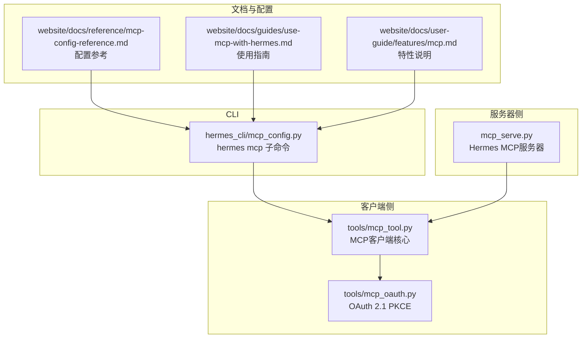
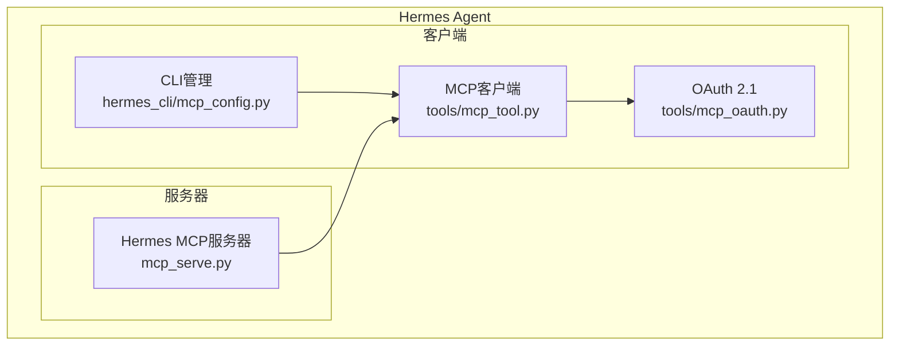
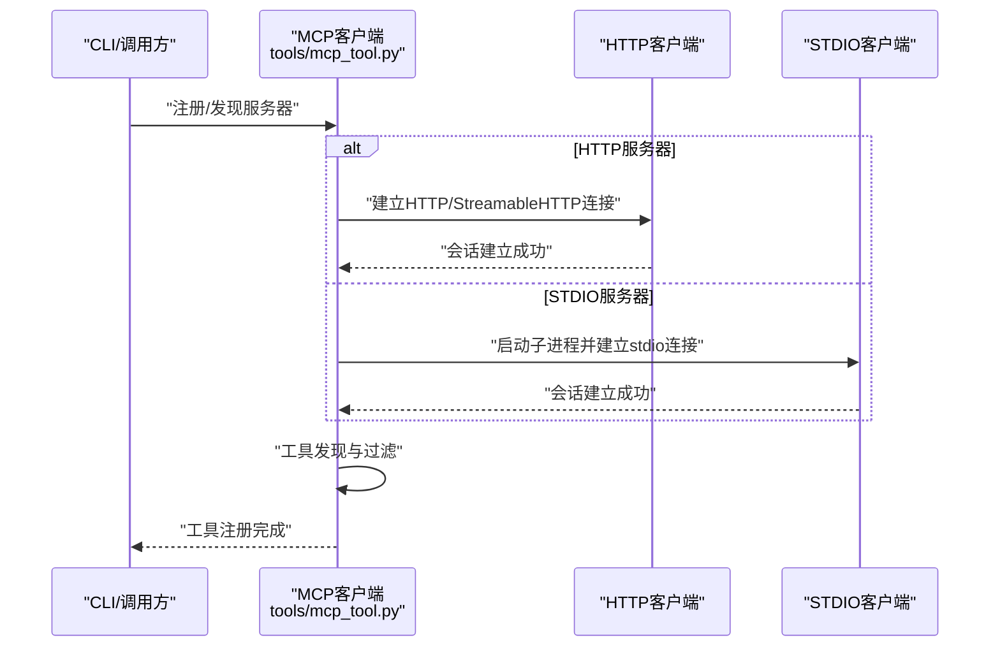
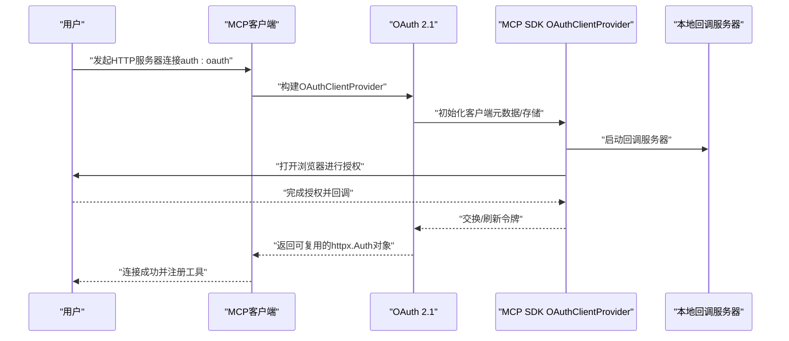
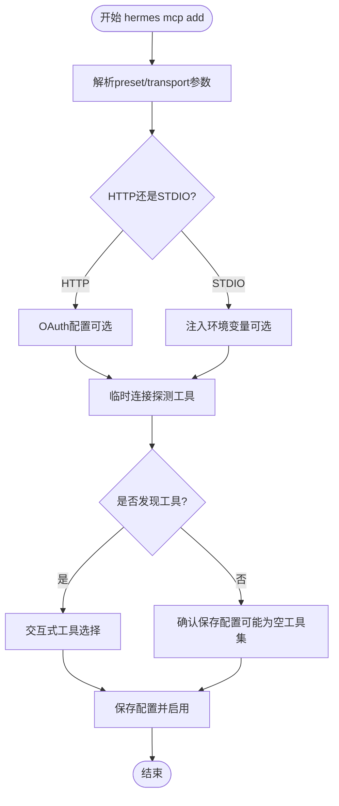
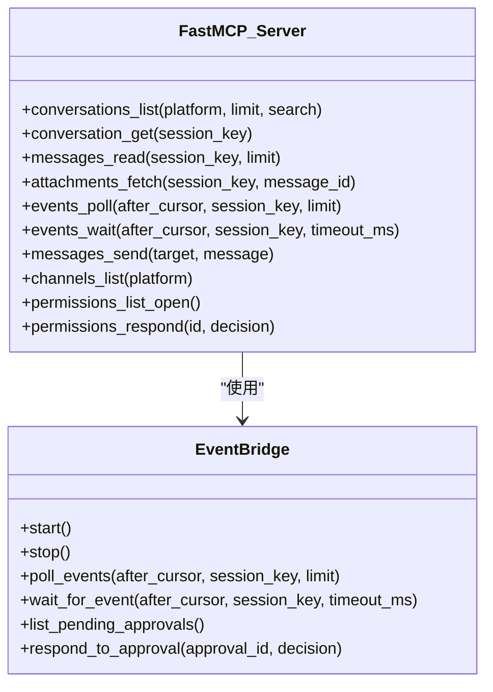
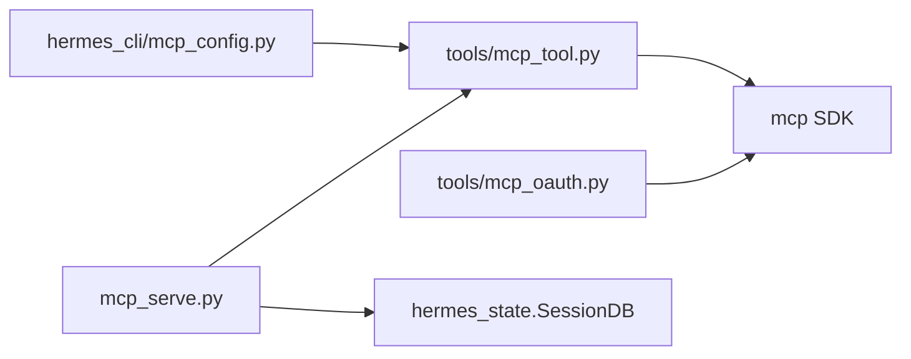

# MCP协议支持

<cite>
**本文引用的文件**
- [mcp_tool.py](file://tools/mcp_tool.py)
- [mcp_oauth.py](file://tools/mcp_oauth.py)
- [mcp_config.py](file://hermes_cli/mcp_config.py)
- [mcp_serve.py](file://mcp_serve.py)
- [mcp-config-reference.md](file://website/docs/reference/mcp-config-reference.md)
- [use-mcp-with-hermes.md](file://website/docs/guides/use-mcp-with-hermes.md)
- [mcp.md](file://website/docs/user-guide/features/mcp.md)
- [test_mcp_tool.py](file://tests/tools/test_mcp_tool.py)
- [test_mcp_oauth.py](file://tests/tools/test_mcp_oauth.py)
- [test_mcp_probe.py](file://tests/tools/test_mcp_probe.py)
- [test_mcp_serve.py](file://tests/test_mcp_serve.py)
</cite>

## 目录
1. [简介](#简介)
2. [项目结构](#项目结构)
3. [核心组件](#核心组件)
4. [架构总览](#架构总览)
5. [详细组件分析](#详细组件分析)
6. [依赖关系分析](#依赖关系分析)
7. [性能考量](#性能考量)
8. [故障排查指南](#故障排查指南)
9. [结论](#结论)
10. [附录](#附录)

## 简介
本文件系统性阐述Hermes Agent对MCP（Model Context Protocol）协议的支持与实现，覆盖协议技术规范、传输层（STDIO、HTTP、SSE）、服务器发现与连接、工具注册与过滤、认证授权与OAuth集成、配置与元数据管理、请求响应模式与错误处理、重连机制、开发与调试指南，以及扩展与第三方服务器集成的最佳实践。

## 项目结构
围绕MCP的关键模块分布如下：
- 客户端侧：tools/mcp_tool.py 提供MCP客户端能力（连接、发现、工具注册、重连、安全与过滤）
- OAuth辅助：tools/mcp_oauth.py 提供OAuth 2.1 PKCE认证与令牌持久化
- CLI管理：hermes_cli/mcp_config.py 提供hermes mcp子命令（添加/移除/测试/配置/列出）
- MCP服务器：mcp_serve.py 将Hermes会话桥接为MCP工具（消息读取、事件轮询、发送消息等）
- 配置参考：website/docs/reference/mcp-config-reference.md 提供配置键与策略
- 使用指南：website/docs/guides/use-mcp-with-hermes.md 与 website/docs/user-guide/features/mcp.md 提供使用范式

图表来源
- [mcp_tool.py](file://tools/mcp_tool.py)
- [mcp_oauth.py](file://tools/mcp_oauth.py)
- [mcp_config.py](file://hermes_cli/mcp_config.py)
- [mcp_serve.py](file://mcp_serve.py)
- [mcp-config-reference.md](file://website/docs/reference/mcp-config-reference.md)

章节来源
- [mcp_tool.py](file://tools/mcp_tool.py)
- [mcp_oauth.py](file://tools/mcp_oauth.py)
- [mcp_config.py](file://hermes_cli/mcp_config.py)
- [mcp_serve.py](file://mcp_serve.py)
- [mcp-config-reference.md](file://website/docs/reference/mcp-config-reference.md)

## 核心组件
- MCP客户端核心（tools/mcp_tool.py）
  - 支持STDIO与HTTP/StreamableHTTP两种传输
  - 自动重连与指数退避（最多5次重试）
  - 工具发现、过滤与注册（include/exclude、resources/prompts）
  - 环境变量过滤、凭据清洗、超时控制
  - 采样（sampling）与通知类型支持（动态工具发现）
- OAuth 2.1 PKCE（tools/mcp_oauth.py）
  - 基于MCP SDK的OAuthClientProvider
  - 本地回调服务器、浏览器授权、令牌持久化
  - 动态客户端注册、PKCE、刷新与升级授权
- CLI管理（hermes_cli/mcp_config.py）
  - hermes mcp add/remove/list/test/configure
  - 发现式工具选择、OAuth配置、环境变量注入
- MCP服务器（mcp_serve.py）
  - 将Hermes会话桥接为MCP工具集（会话列表、消息读取、附件提取、事件轮询/等待、消息发送、通道列表、权限管理）
  - 内部事件桥接（轮询SQLite数据库变更，维护内存事件队列）

章节来源
- [mcp_tool.py](file://tools/mcp_tool.py)
- [mcp_oauth.py](file://tools/mcp_oauth.py)
- [mcp_config.py](file://hermes_cli/mcp_config.py)
- [mcp_serve.py](file://mcp_serve.py)

## 架构总览
下图展示MCP客户端与服务器在Hermes中的交互关系与职责边界。

图表来源
- [mcp_tool.py](file://tools/mcp_tool.py)
- [mcp_oauth.py](file://tools/mcp_oauth.py)
- [mcp_config.py](file://hermes_cli/mcp_config.py)
- [mcp_serve.py](file://mcp_serve.py)

## 详细组件分析

### MCP客户端核心（连接、传输与重连）
- 传输方式
  - STDIO：通过command/args/env启动外部进程，使用stdio_client
  - HTTP/StreamableHTTP：通过url与headers建立HTTP连接，支持streamable_http_client
- 连接与重连
  - 首次连接失败会立即上报；后续断开按指数退避重连，最多5次
  - 支持connect_timeout与tool_call timeout
- 工具注册与过滤
  - 支持include/exclude白名单/黑名单，include优先级更高
  - 可启用/禁用资源工具（list_resources/read_resource）与提示工具（list_prompts/get_prompt），仅在服务端具备对应能力时注册
- 安全与合规
  - stdio子进程环境变量白名单过滤
  - 错误信息中敏感凭据自动清洗
  - 采样（sampling）与通知类型支持（动态工具发现）

图表来源
- [mcp_tool.py](file://tools/mcp_tool.py)

章节来源
- [mcp_tool.py](file://tools/mcp_tool.py)

### OAuth 2.1 PKCE认证与令牌管理
- 组件职责
  - OAuthClientProvider封装授权码+PKCE流程
  - 本地回调服务器监听授权回调
  - 令牌与客户端信息持久化到~/.hermes/mcp-tokens
- 行为特征
  - 首次连接触发浏览器授权，后续复用缓存令牌
  - 支持预注册client_id/client_secret与自定义scope
  - 非交互环境给出明确警告与指引

图表来源
- [mcp_oauth.py](file://tools/mcp_oauth.py)
- [mcp_tool.py](file://tools/mcp_tool.py)

章节来源
- [mcp_oauth.py](file://tools/mcp_oauth.py)
- [mcp_tool.py](file://tools/mcp_tool.py)

### CLI管理（hermes mcp 子命令）
- 主要功能
  - add：添加新服务器，支持preset、OAuth配置、环境变量注入、发现式工具选择
  - remove：移除服务器并清理OAuth令牌
  - list/test/configure：列出、测试连接、交互式工具筛选
- 交互与提示
  - 对OAuth不可用、非交互环境、URL与command冲突等情况给出明确提示
  - 测试阶段可保存disabled配置以便稍后修复

图表来源
- [mcp_config.py](file://hermes_cli/mcp_config.py)

章节来源
- [mcp_config.py](file://hermes_cli/mcp_config.py)

### MCP服务器（Hermes MCP服务器）
- 能力概览
  - 会话列表/详情、消息读取、附件提取
  - 事件轮询/等待（长轮询）、消息发送
  - 通道列表、权限管理（开放/响应）
- 实现要点
  - 基于FastMCP框架注册工具
  - 内部EventBridge轮询SQLite数据库变更，维护内存事件队列
  - 通过send_message_tool桥接到平台发送逻辑

图表来源
- [mcp_serve.py](file://mcp_serve.py)

章节来源
- [mcp_serve.py](file://mcp_serve.py)

## 依赖关系分析
- 模块耦合
  - mcp_tool.py依赖MCP SDK（可选），通过延迟导入与条件分支保证无SDK时可用性
  - mcp_oauth.py依赖MCP SDK的OAuthClientProvider，提供令牌存储与回调处理
  - mcp_config.py依赖mcp_tool.py进行连接探测与工具注册
  - mcp_serve.py依赖Hermes状态与会话数据库，提供MCP工具集
- 外部依赖
  - MCP SDK（mcp）：客户端/服务器框架、HTTP/StreamableHTTP、OAuth、通知类型
  - httpx/webbrowser/socket：OAuth回调与浏览器打开
  - hermes_state.SessionDB：会话数据库访问

图表来源
- [mcp_tool.py](file://tools/mcp_tool.py)
- [mcp_oauth.py](file://tools/mcp_oauth.py)
- [mcp_config.py](file://hermes_cli/mcp_config.py)
- [mcp_serve.py](file://mcp_serve.py)

章节来源
- [mcp_tool.py](file://tools/mcp_tool.py)
- [mcp_oauth.py](file://tools/mcp_oauth.py)
- [mcp_config.py](file://hermes_cli/mcp_config.py)
- [mcp_serve.py](file://mcp_serve.py)

## 性能考量
- 连接与重连
  - 默认最大重连次数5次，首次断线后按指数退避；建议根据网络稳定性调整
- 轮询与事件
  - 服务器侧EventBridge采用200ms轮询间隔，并基于mtime缓存避免无效工作
- 工具调用
  - 默认工具调用超时120秒，连接超时60秒；可通过配置调整
- 资源与I/O
  - stdio子进程环境变量白名单过滤，减少不必要的环境泄漏
  - 令牌文件写入使用原子重命名与严格权限（0600）

[本节为通用指导，无需特定文件引用]

## 故障排查指南
- 常见问题与定位
  - MCP SDK未安装：客户端与服务器均会提示安装依赖
  - OAuth不可用或非交互环境：检查MCP SDK版本与终端交互能力
  - URL与command同时存在：以HTTP传输为准，出现告警
  - 连接失败：查看连接超时、网络可达性、认证头/令牌有效性
  - 工具未注册：检查include/exclude策略、工具能力（resources/prompts）
- 调试建议
  - 使用hermes mcp test验证连接与工具发现
  - 启用verbose模式运行mcp_serve以观察日志
  - 在CLI中使用--env为stdio服务器注入必要环境变量
  - 观察~/.hermes/mcp-tokens目录下的令牌文件是否存在与格式正确

章节来源
- [mcp_tool.py](file://tools/mcp_tool.py)
- [mcp_oauth.py](file://tools/mcp_oauth.py)
- [mcp_config.py](file://hermes_cli/mcp_config.py)
- [mcp_serve.py](file://mcp_serve.py)

## 结论
Hermes Agent对MCP协议提供了完整的客户端与服务器实现：从CLI管理、OAuth认证、工具注册与过滤，到多传输方式支持与稳健的重连机制。通过清晰的配置策略与事件桥接，既满足企业内网API与知识库的“只读/受限”场景，也支持将Hermes会话桥接为MCP服务器，实现跨平台消息与权限管理的统一入口。

[本节为总结性内容，无需特定文件引用]

## 附录

### MCP配置参考（关键键位与语义）
- 根配置结构
  - mcp_servers.<server_name>: command/args/env 或 url/headers
  - enabled: true/false 控制是否连接/发现/注册
  - timeout/connect_timeout: 工具调用与连接超时
  - tools: include/exclude、resources/prompts
  - auth: oauth（仅HTTP）
  - sampling: 采样策略（可选）
- 工具过滤与策略
  - include：白名单优先
  - exclude：黑名单
  - resources/prompts：仅在服务端具备能力时注册
- 工具命名
  - server-native: mcp_<server>_<tool>（连字符与点替换为下划线）
  - utility: mcp_<server>_list_resources/read_resource 等

章节来源
- [mcp-config-reference.md](file://website/docs/reference/mcp-config-reference.md)

### 使用范式与最佳实践
- GitHub白名单、Stripe黑名单、文档服务器仅资源工具等典型配置
- 逐步扩展开白名单，配合/relaod-mcp热重载
- 内部API助手与知识库两类典型场景

章节来源
- [use-mcp-with-hermes.md](file://website/docs/guides/use-mcp-with-hermes.md)
- [mcp.md](file://website/docs/user-guide/features/mcp.md)

### 开发与测试要点
- 单元测试覆盖
  - 工具处理器、错误结果、断连检测、资源/提示工具列表
  - OAuth构建、令牌存储、非交互错误、端口分配
  - 探测工具函数、服务器端事件桥接
- 关键行为验证
  - 工具名前缀生成与名称规范化
  - include/exclude优先级与空结果行为
  - 服务器端工具集创建与权限响应

章节来源
- [test_mcp_tool.py](file://tests/tools/test_mcp_tool.py)
- [test_mcp_oauth.py](file://tests/tools/test_mcp_oauth.py)
- [test_mcp_probe.py](file://tests/tools/test_mcp_probe.py)
- [test_mcp_serve.py](file://tests/test_mcp_serve.py)