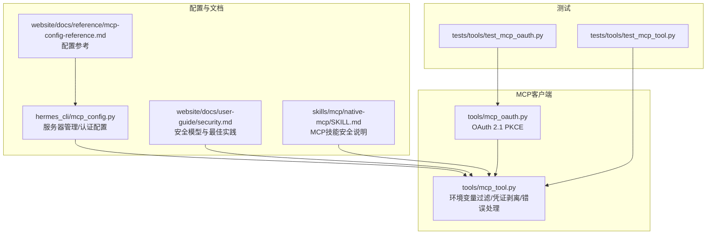
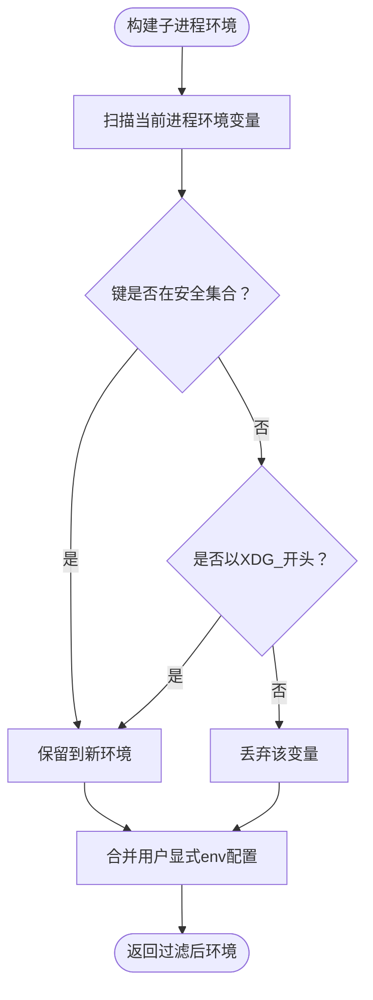
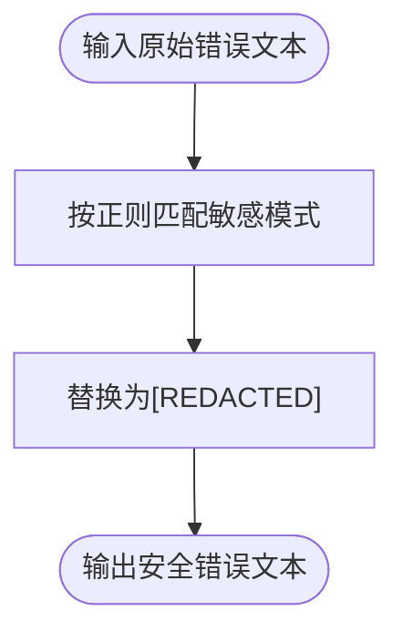
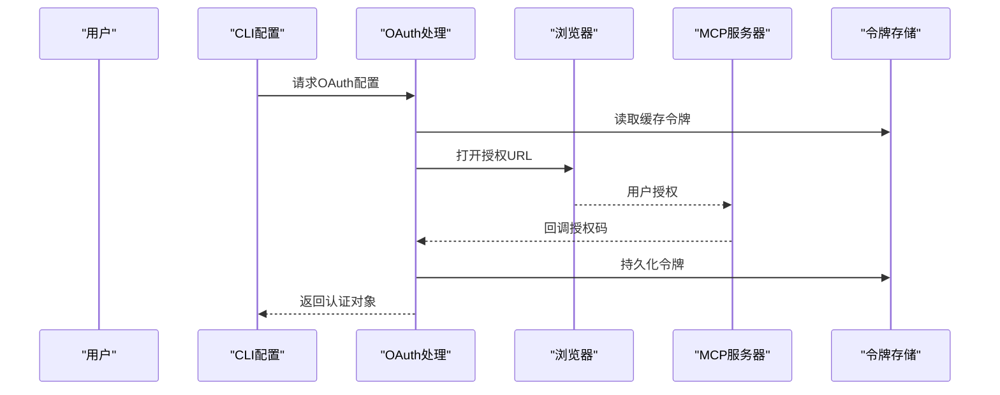
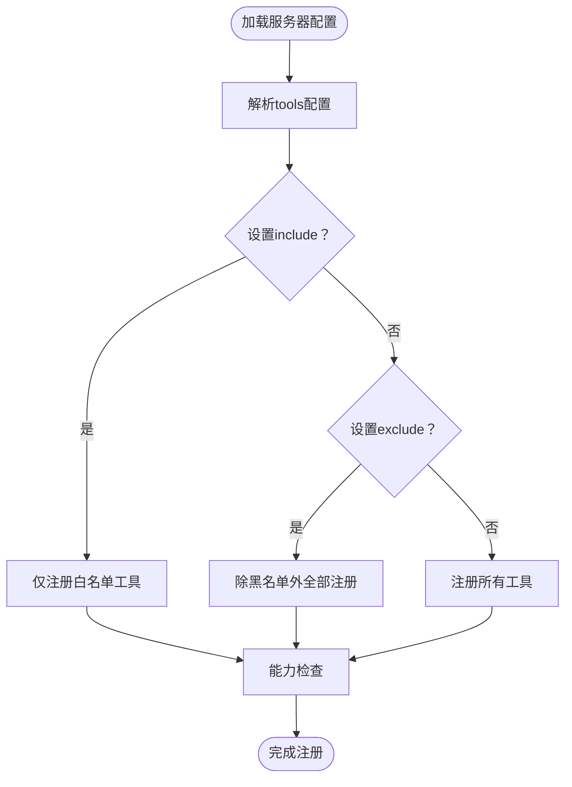
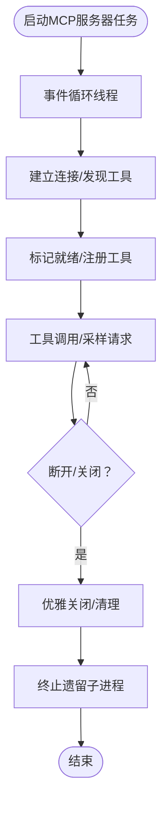
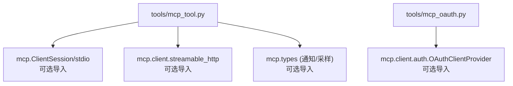

# MCP安全机制

<cite>
**本文档引用的文件**
- [tools/mcp_tool.py](file://tools/mcp_tool.py)
- [skills/mcp/native-mcp/SKILL.md](file://skills/mcp/native-mcp/SKILL.md)
- [hermes_cli/mcp_config.py](file://hermes_cli/mcp_config.py)
- [website/docs/user-guide/security.md](file://website/docs/user-guide/security.md)
- [website/docs/reference/mcp-config-reference.md](file://website/docs/reference/mcp-config-reference.md)
- [tools/mcp_oauth.py](file://tools/mcp_oauth.py)
- [tests/tools/test_mcp_tool.py](file://tests/tools/test_mcp_tool.py)
- [tests/tools/test_mcp_oauth.py](file://tests/tools/test_mcp_oauth.py)
</cite>

## 目录
1. [简介](#简介)
2. [项目结构](#项目结构)
3. [核心组件](#核心组件)
4. [架构总览](#架构总览)
5. [详细组件分析](#详细组件分析)
6. [依赖分析](#依赖分析)
7. [性能考虑](#性能考虑)
8. [故障排除指南](#故障排除指南)
9. [结论](#结论)
10. [附录](#附录)

## 简介
本文件系统性阐述Hermes Agent中MCP（Model Context Protocol）的安全机制与防护策略，覆盖环境变量过滤、凭证剥离、错误消息安全处理、进程隔离与安全边界、安全配置最佳实践以及安全审计与监控方法。内容基于仓库中的实际实现与文档，确保可操作性和一致性。

## 项目结构
围绕MCP安全的关键模块分布如下：
- 安全核心：tools/mcp_tool.py（环境变量过滤、凭证剥离、错误消息处理、OAuth集成）
- 用户指南与参考：website/docs/user-guide/security.md、website/docs/reference/mcp-config-reference.md
- 配置管理：hermes_cli/mcp_config.py（OAuth配置、工具选择、认证流程）
- 技能文档：skills/mcp/native-mcp/SKILL.md（安全章节与使用示例）
- 测试用例：tests/tools/test_mcp_tool.py、tests/tools/test_mcp_oauth.py（验证安全行为）



**图表来源**
- [tools/mcp_tool.py:1-2196](file://tools/mcp_tool.py#L1-L2196)
- [hermes_cli/mcp_config.py:1-717](file://hermes_cli/mcp_config.py#L1-L717)
- [website/docs/reference/mcp-config-reference.md:1-248](file://website/docs/reference/mcp-config-reference.md#L1-L248)
- [website/docs/user-guide/security.md:1-560](file://website/docs/user-guide/security.md#L1-L560)
- [skills/mcp/native-mcp/SKILL.md:1-357](file://skills/mcp/native-mcp/SKILL.md#L1-L357)
- [tools/mcp_oauth.py:1-483](file://tools/mcp_oauth.py#L1-L483)
- [tests/tools/test_mcp_tool.py:1-3064](file://tests/tools/test_mcp_tool.py#L1-L3064)
- [tests/tools/test_mcp_oauth.py:1-433](file://tests/tools/test_mcp_oauth.py#L1-L433)

**章节来源**
- [tools/mcp_tool.py:1-2196](file://tools/mcp_tool.py#L1-L2196)
- [hermes_cli/mcp_config.py:1-717](file://hermes_cli/mcp_config.py#L1-L717)
- [website/docs/reference/mcp-config-reference.md:1-248](file://website/docs/reference/mcp-config-reference.md#L1-L248)
- [website/docs/user-guide/security.md:1-560](file://website/docs/user-guide/security.md#L1-L560)
- [skills/mcp/native-mcp/SKILL.md:1-357](file://skills/mcp/native-mcp/SKILL.md#L1-L357)
- [tools/mcp_oauth.py:1-483](file://tools/mcp_oauth.py#L1-L483)
- [tests/tools/test_mcp_tool.py:1-3064](file://tests/tools/test_mcp_tool.py#L1-L3064)
- [tests/tools/test_mcp_oauth.py:1-433](file://tests/tools/test_mcp_oauth.py#L1-L433)

## 核心组件
- 环境变量过滤器：仅向stdio子进程传递安全基础变量与显式配置的变量，避免凭据泄露。
- 凭证剥离器：在错误消息返回给LLM前，自动识别并替换令牌、密钥等敏感模式。
- OAuth 2.1 PKCE：HTTP传输的MCP服务器通过浏览器授权与本地回调完成令牌交换与刷新。
- 错误消息安全处理：统一格式化连接错误，去重并进行凭证剥离。
- 进程生命周期与清理：后台事件循环、优雅关闭与孤儿进程清理，降低残留风险。
- 工具选择与能力控制：通过include/exclude与资源/提示工具开关，限制工具面。
- 配置管理：CLI交互式添加/测试/配置MCP服务器，支持OAuth与HTTP头认证。

**章节来源**
- [tools/mcp_tool.py:167-218](file://tools/mcp_tool.py#L167-L218)
- [tools/mcp_tool.py:270-328](file://tools/mcp_tool.py#L270-L328)
- [tools/mcp_oauth.py:378-483](file://tools/mcp_oauth.py#L378-L483)
- [hermes_cli/mcp_config.py:219-408](file://hermes_cli/mcp_config.py#L219-L408)
- [website/docs/reference/mcp-config-reference.md:54-131](file://website/docs/reference/mcp-config-reference.md#L54-L131)
- [website/docs/user-guide/security.md:416-449](file://website/docs/user-guide/security.md#L416-L449)

## 架构总览
MCP安全机制贯穿“配置—连接—执行—响应”全流程，形成多层防护：

```mermaid
sequenceDiagram
participant CLI as "CLI命令行<br/>hermes_cli/mcp_config.py"
participant CFG as "配置加载<br/>tools/mcp_tool.py"
participant ENV as "环境变量过滤<br/>_build_safe_env()"
participant OAUTH as "OAuth处理<br/>tools/mcp_oauth.py"
participant LOOP as "事件循环<br/>后台线程"
participant SERVER as "MCPServerTask<br/>连接/发现/注册"
participant ERR as "错误处理<br/>_format_connect_error/_sanitize_error"
CLI->>CFG : 添加/测试MCP服务器
CFG->>ENV : 构建子进程环境
CFG->>OAUTH : HTTP服务器OAuth配置
CFG->>LOOP : 启动/调度任务
LOOP->>SERVER : 建立会话/列出工具
SERVER-->>LOOP : 注册工具到工具集
LOOP->>ERR : 处理异常/格式化错误
ERR-->>CLI : 返回安全的错误信息
```

**图表来源**
- [hermes_cli/mcp_config.py:219-408](file://hermes_cli/mcp_config.py#L219-L408)
- [tools/mcp_tool.py:192-218](file://tools/mcp_tool.py#L192-L218)
- [tools/mcp_tool.py:270-328](file://tools/mcp_tool.py#L270-L328)
- [tools/mcp_oauth.py:378-483](file://tools/mcp_oauth.py#L378-L483)

## 详细组件分析

### 组件A：环境变量过滤机制
- 安全基线变量：PATH、HOME、USER、LANG、LC_ALL、TERM、SHELL、TMPDIR。
- XDG_*变量透传：扩展桌面环境变量的兼容性。
- 显式配置变量：仅允许在服务器配置的env中声明的变量进入子进程。
- stdio命令解析：对bare npx/npm/node进行路径解析与PATH前置，提升可用性同时保持安全边界。



**图表来源**
- [tools/mcp_tool.py:167-208](file://tools/mcp_tool.py#L167-L208)
- [tools/mcp_tool.py:234-267](file://tools/mcp_tool.py#L234-L267)

**章节来源**
- [tools/mcp_tool.py:167-208](file://tools/mcp_tool.py#L167-L208)
- [skills/mcp/native-mcp/SKILL.md:176-183](file://skills/mcp/native-mcp/SKILL.md#L176-L183)
- [website/docs/user-guide/security.md:416-429](file://website/docs/user-guide/security.md#L416-L429)

### 组件B：凭证剥离与错误消息安全处理
- 正则识别：GitHub PAT、OpenAI风格密钥、Bearer令牌及通用参数模式。
- 替换策略：将匹配到的敏感片段替换为占位符，防止泄露。
- 应用点：连接错误格式化、文本响应构建、采样回调错误处理。



**图表来源**
- [tools/mcp_tool.py:172-185](file://tools/mcp_tool.py#L172-L185)
- [tools/mcp_tool.py:211-217](file://tools/mcp_tool.py#L211-L217)
- [tools/mcp_tool.py:570](file://tools/mcp_tool.py#L570)

**章节来源**
- [tools/mcp_tool.py:172-185](file://tools/mcp_tool.py#L172-L185)
- [tools/mcp_tool.py:211-217](file://tools/mcp_tool.py#L211-L217)
- [website/docs/user-guide/security.md:441-449](file://website/docs/user-guide/security.md#L441-L449)

### 组件C：OAuth 2.1 PKCE认证（HTTP传输）
- 动态客户端注册：根据服务器元数据自动发现与注册。
- PKCE授权码流程：本地回调端口接收授权码，浏览器打开授权页面。
- 令牌持久化：按服务器名存储令牌与客户端信息，支持刷新与复用。
- 非交互保护：在非交互环境中给出明确警告，避免阻塞自动化流程。



**图表来源**
- [tools/mcp_oauth.py:378-483](file://tools/mcp_oauth.py#L378-L483)
- [hermes_cli/mcp_config.py:277-301](file://hermes_cli/mcp_config.py#L277-L301)
- [website/docs/reference/mcp-config-reference.md:231-248](file://website/docs/reference/mcp-config-reference.md#L231-L248)

**章节来源**
- [tools/mcp_oauth.py:378-483](file://tools/mcp_oauth.py#L378-L483)
- [hermes_cli/mcp_config.py:277-301](file://hermes_cli/mcp_config.py#L277-L301)
- [website/docs/reference/mcp-config-reference.md:231-248](file://website/docs/reference/mcp-config-reference.md#L231-L248)

### 组件D：工具选择与能力控制
- include/exclude：精确控制服务器原生工具的注册范围。
- 资源/提示工具：按需启用list_resources/read_resource或list_prompts/get_prompt。
- 能力感知注册：仅当服务器实际暴露对应能力时才注册工具。
- 名称规范化：连字符与点号替换为下划线，避免LLM函数调用标识符问题。



**图表来源**
- [website/docs/reference/mcp-config-reference.md:54-131](file://website/docs/reference/mcp-config-reference.md#L54-L131)
- [website/docs/reference/mcp-config-reference.md:200-229](file://website/docs/reference/mcp-config-reference.md#L200-L229)

**章节来源**
- [website/docs/reference/mcp-config-reference.md:54-131](file://website/docs/reference/mcp-config-reference.md#L54-L131)
- [website/docs/reference/mcp-config-reference.md:200-229](file://website/docs/reference/mcp-config-reference.md#L200-L229)

### 组件E：进程隔离与安全边界
- 后台事件循环：每个MCP服务器在独立异步任务中运行，保证取消作用域一致。
- 连接生命周期：支持指数退避重连（最多五次），优雅关闭与超时控制。
- 子进程清理：停止事件循环后尽力终止遗留stdio子进程，仅针对已跟踪PID。
- 安全边界：stdio子进程仅继承安全环境变量；HTTP服务器通过OAuth或静态Bearer头认证。



**图表来源**
- [tools/mcp_tool.py:716-799](file://tools/mcp_tool.py#L716-L799)
- [tools/mcp_tool.py:2127-2166](file://tools/mcp_tool.py#L2127-L2166)

**章节来源**
- [tools/mcp_tool.py:716-799](file://tools/mcp_tool.py#L716-L799)
- [tools/mcp_tool.py:2127-2166](file://tools/mcp_tool.py#L2127-L2166)

## 依赖分析
- MCP SDK可选依赖：若未安装，MCP功能降级为无操作并记录调试日志。
- OAuth支持：需要特定版本的MCP SDK类型；否则OAuth功能不可用。
- 通知与采样：根据SDK版本动态启用通知与采样类型，避免旧版不兼容。



**图表来源**
- [tools/mcp_tool.py:90-137](file://tools/mcp_tool.py#L90-L137)
- [tools/mcp_oauth.py:55-68](file://tools/mcp_oauth.py#L55-L68)

**章节来源**
- [tools/mcp_tool.py:90-137](file://tools/mcp_tool.py#L90-L137)
- [tools/mcp_oauth.py:55-68](file://tools/mcp_oauth.py#L55-L68)

## 性能考虑
- 异步事件循环：工具调用与采样请求在后台线程运行，避免阻塞主线程。
- 滑动窗口限流：采样回调内置速率限制，防止过度请求。
- 超时控制：连接与工具调用分别设置超时，避免长时间挂起。
- 资源限制：容器后端提供能力上限与临时文件系统限制，减少资源滥用风险。

[本节为通用指导，无需具体文件分析]

## 故障排除指南
- “MCP SDK不可用”：确认已安装mcp包；否则MCP功能降级。
- “无MCP服务器配置”：检查配置文件中mcp_servers键是否存在且非空。
- “连接失败”：检查命令可执行性、包存在性、超时设置与网络可达性。
- “HTTP传输不可用”：升级mcp包以包含streamable_http客户端支持。
- OAuth非交互：在非交互环境中需先在交互终端完成首次授权，后续使用缓存令牌。

**章节来源**
- [skills/mcp/native-mcp/SKILL.md:204-233](file://skills/mcp/native-mcp/SKILL.md#L204-L233)
- [website/docs/reference/mcp-config-reference.md:231-248](file://website/docs/reference/mcp-config-reference.md#L231-L248)
- [tools/mcp_oauth.py:411-419](file://tools/mcp_oauth.py#L411-L419)

## 结论
Hermes Agent的MCP安全机制通过“最小权限环境变量、凭证剥离、OAuth 2.1 PKCE、工具选择与能力控制、进程生命周期管理”等多层设计，有效降低了外部MCP服务器带来的安全风险。结合配置参考与用户指南，开发者可以安全地集成与管理MCP服务器，实现可控、可观测、可审计的工具调用链路。

[本节为总结性内容，无需具体文件分析]

## 附录

### 安全配置最佳实践
- 仅在服务器配置中显式声明必要环境变量，避免无意泄露。
- 使用OAuth 2.1 PKCE而非静态Bearer令牌，配合令牌持久化与自动刷新。
- 通过include/exclude与资源/提示工具开关，最小化工具面。
- 在生产环境使用容器后端隔离命令执行，减少主机影响面。
- 定期审查与轮换凭据，启用日志审计与告警。

**章节来源**
- [website/docs/user-guide/security.md:522-560](file://website/docs/user-guide/security.md#L522-L560)
- [website/docs/reference/mcp-config-reference.md:153-179](file://website/docs/reference/mcp-config-reference.md#L153-L179)

### 常见安全风险与缓解
- 凭据泄露：通过环境变量过滤与凭证剥离双重保障。
- 不受控工具调用：通过工具选择与能力检查限制工具面。
- SSRF与内部服务访问：结合网站访问策略与URL验证。
- 非交互OAuth：提前完成授权并在交互环境中缓存令牌。

**章节来源**
- [website/docs/user-guide/security.md:441-449](file://website/docs/user-guide/security.md#L441-L449)
- [website/docs/user-guide/security.md:450-482](file://website/docs/user-guide/security.md#L450-L482)

### 安全审计与监控方法
- 日志审计：关注MCP连接、工具注册、采样请求与错误处理日志。
- 配置变更：通过CLI命令查看/测试服务器状态与认证信息（值会被掩码显示）。
- 令牌清理：移除OAuth令牌与客户端信息，避免长期留存。

**章节来源**
- [hermes_cli/mcp_config.py:534-551](file://hermes_cli/mcp_config.py#L534-L551)
- [tools/mcp_oauth.py:371-376](file://tools/mcp_oauth.py#L371-L376)