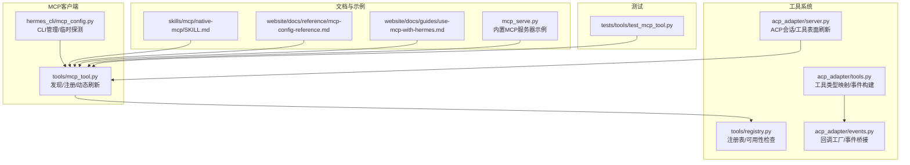
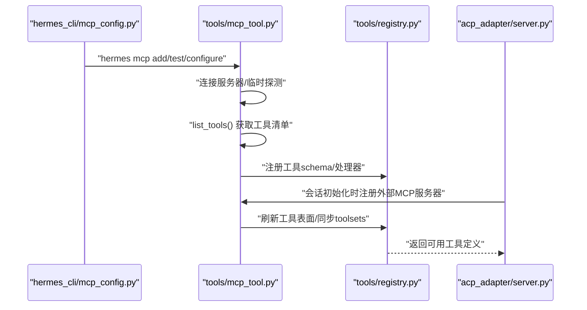
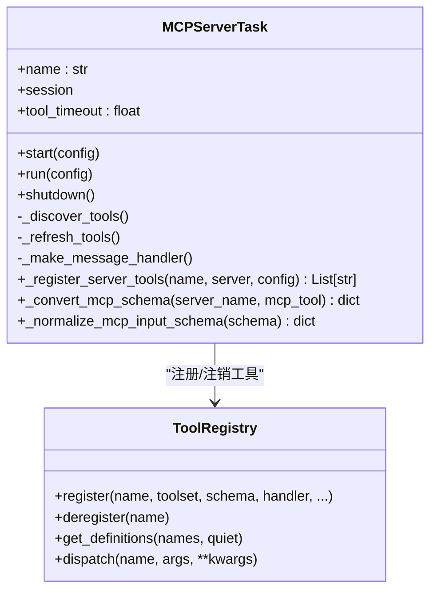
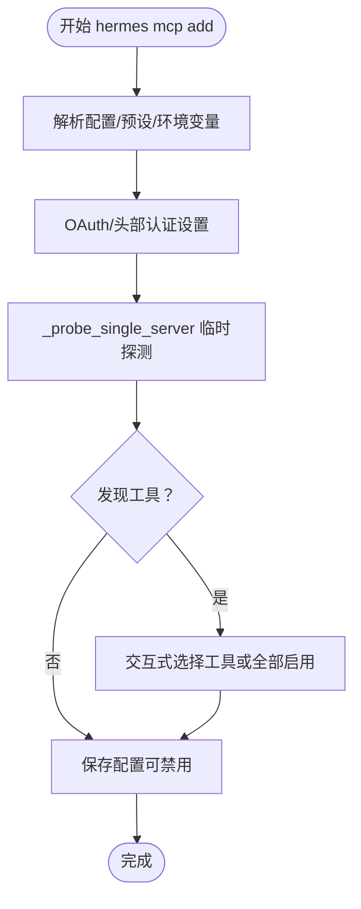
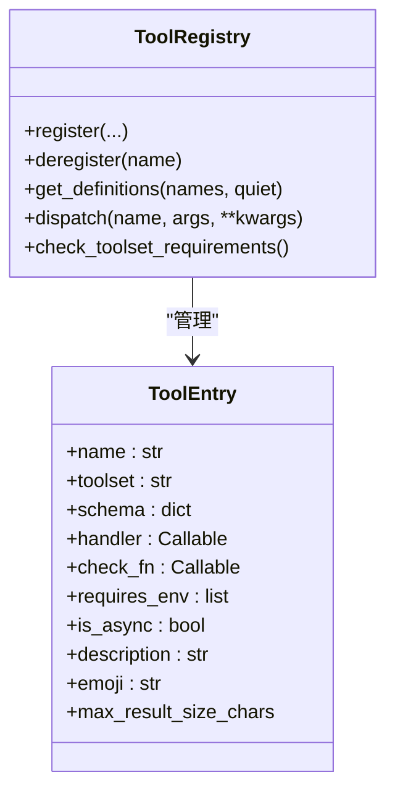
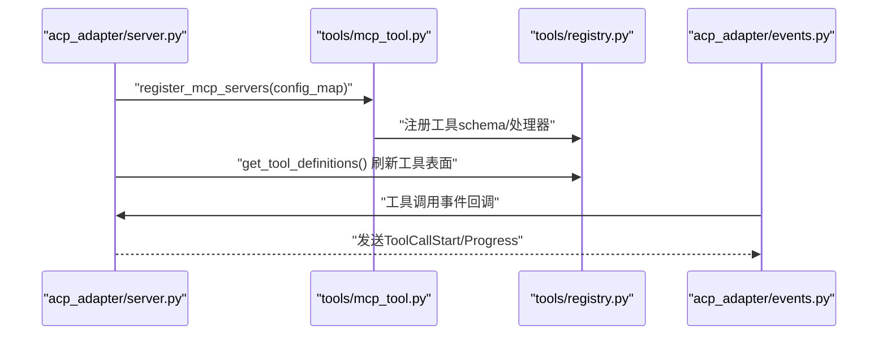
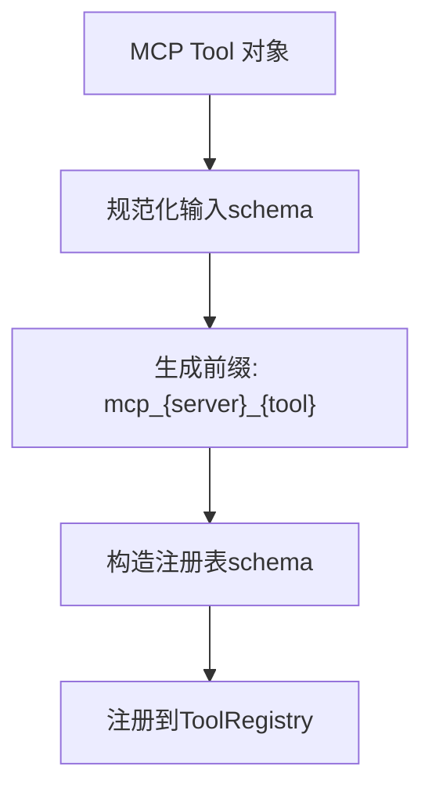
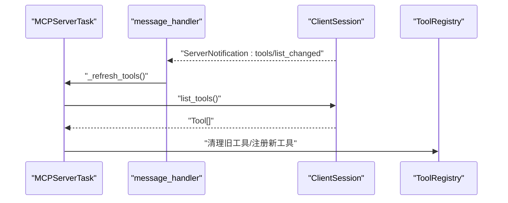
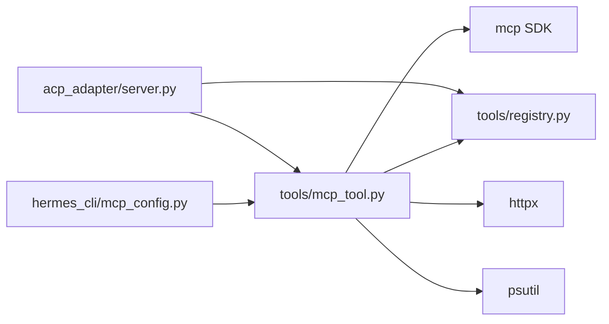

# MCP工具发现与注册

<cite>
**本文档引用的文件**
- [tools/mcp_tool.py](file://tools/mcp_tool.py)
- [hermes_cli/mcp_config.py](file://hermes_cli/mcp_config.py)
- [tools/registry.py](file://tools/registry.py)
- [acp_adapter/server.py](file://acp_adapter/server.py)
- [acp_adapter/tools.py](file://acp_adapter/tools.py)
- [acp_adapter/events.py](file://acp_adapter/events.py)
- [skills/mcp/native-mcp/SKILL.md](file://skills/mcp/native-mcp/SKILL.md)
- [website/docs/reference/mcp-config-reference.md](file://website/docs/reference/mcp-config-reference.md)
- [website/docs/guides/use-mcp-with-hermes.md](file://website/docs/guides/use-mcp-with-hermes.md)
- [mcp_serve.py](file://mcp_serve.py)
- [tests/tools/test_mcp_tool.py](file://tests/tools/test_mcp_tool.py)
</cite>

## 目录
1. [简介](#简介)
2. [项目结构](#项目结构)
3. [核心组件](#核心组件)
4. [架构总览](#架构总览)
5. [详细组件分析](#详细组件分析)
6. [依赖关系分析](#依赖关系分析)
7. [性能考虑](#性能考虑)
8. [故障排除指南](#故障排除指南)
9. [结论](#结论)

## 简介
本文件系统性阐述MCP（Model Context Protocol）工具发现与注册机制，涵盖以下关键主题：
- MCP服务器工具的自动发现流程：通过list_tools API调用与工具元数据解析
- 工具注册到Hermes Agent工具注册表的完整过程与命名规范
- 工具定义结构：名称、描述、参数schema与返回值格式
- 动态工具发现通知机制：tools/list_changed的通知处理与热刷新
- 权限控制与安全过滤：环境变量过滤、凭据脱敏、访问白名单/黑名单
- 错误处理与重试策略：连接失败、超时、重连与优雅关闭
- 调试方法与故障排除：日志、状态查询、配置验证与工具探测

## 项目结构
围绕MCP工具发现与注册的核心模块分布如下：
- 工具发现与注册主逻辑：tools/mcp_tool.py
- CLI管理与临时探测：hermes_cli/mcp_config.py
- 工具注册表：tools/registry.py
- ACP集成与会话管理：acp_adapter/server.py、acp_adapter/tools.py、acp_adapter/events.py
- 配置参考与使用指南：skills/mcp/native-mcp/SKILL.md、website/docs/reference/mcp-config-reference.md、website/docs/guides/use-mcp-with-hermes.md
- 内置MCP服务器示例：mcp_serve.py
- 测试用例与行为验证：tests/tools/test_mcp_tool.py

**图表来源**
- [tools/mcp_tool.py:1-2196](file://tools/mcp_tool.py#L1-L2196)
- [hermes_cli/mcp_config.py:1-717](file://hermes_cli/mcp_config.py#L1-L717)
- [tools/registry.py:1-336](file://tools/registry.py#L1-L336)
- [acp_adapter/server.py:1-729](file://acp_adapter/server.py#L1-L729)
- [acp_adapter/tools.py:1-215](file://acp_adapter/tools.py#L1-L215)
- [acp_adapter/events.py:1-176](file://acp_adapter/events.py#L1-L176)
- [skills/mcp/native-mcp/SKILL.md:42-123](file://skills/mcp/native-mcp/SKILL.md#L42-L123)
- [website/docs/reference/mcp-config-reference.md:54-145](file://website/docs/reference/mcp-config-reference.md#L54-L145)
- [website/docs/guides/use-mcp-with-hermes.md:302-364](file://website/docs/guides/use-mcp-with-hermes.md#L302-L364)
- [mcp_serve.py:798-837](file://mcp_serve.py#L798-L837)
- [tests/tools/test_mcp_tool.py:2561-2600](file://tests/tools/test_mcp_tool.py#L2561-L2600)

**章节来源**
- [tools/mcp_tool.py:1-2196](file://tools/mcp_tool.py#L1-L2196)
- [hermes_cli/mcp_config.py:1-717](file://hermes_cli/mcp_config.py#L1-L717)

## 核心组件
- MCP服务器任务（MCPServerTask）：负责连接、发现工具、维护会话、处理动态通知与工具刷新
- 注册表（ToolRegistry）：集中管理工具schema、处理器、可用性检查与调度
- CLI管理器（mcp_config）：提供hermes mcp add/test/configure等命令，支持临时连接探测
- ACP适配器：在ACP会话中注册外部MCP服务器并刷新工具表面
- 工具事件桥接：将工具调用进度转换为ACP事件流

**章节来源**
- [tools/mcp_tool.py:720-1200](file://tools/mcp_tool.py#L720-L1200)
- [tools/registry.py:48-336](file://tools/registry.py#L48-L336)
- [hermes_cli/mcp_config.py:219-408](file://hermes_cli/mcp_config.py#L219-L408)
- [acp_adapter/server.py:150-214](file://acp_adapter/server.py#L150-L214)
- [acp_adapter/events.py:47-155](file://acp_adapter/events.py#L47-L155)

## 架构总览
MCP工具发现与注册的整体流程如下：

**图表来源**
- [hermes_cli/mcp_config.py:160-193](file://hermes_cli/mcp_config.py#L160-L193)
- [tools/mcp_tool.py:755-822](file://tools/mcp_tool.py#L755-L822)
- [tools/registry.py:59-143](file://tools/registry.py#L59-L143)
- [acp_adapter/server.py:150-214](file://acp_adapter/server.py#L150-L214)

## 详细组件分析

### 组件A：MCP工具发现与注册（tools/mcp_tool.py）
- 自动发现机制
  - 连接服务器后调用list_tools()获取工具列表
  - 将MCP工具转换为Hermes注册表schema，统一参数schema格式
  - 支持include/exclude过滤、资源/提示工具能力检测与注册
- 工具注册到注册表
  - 使用前缀命名规则：mcp_{server_name}_{tool_name}
  - 创建专用toolset（mcp-{name}），并注入hermes-*伞形toolset
  - 为每个工具生成同步处理器，封装call_tool调用与结果序列化
- 动态工具发现通知
  - 基于消息处理器接收tools/list_changed通知
  - 在锁保护下重新拉取工具列表并原子性替换注册表内容
- 安全与权限
  - stdio子进程仅传递安全环境变量集合
  - 错误信息中的凭据模式被脱敏处理
  - 可选OAuth 2.1 PKCE认证
- 错误处理与重试
  - 初始连接失败时立即上报；后续断线按指数回退重连（最多5次）
  - 工具调用超时与异常被捕获并标准化返回
- 并发与线程安全
  - 后台事件循环线程守护，所有跨线程操作通过run_coroutine_threadsafe
  - 全局锁保护服务器集合与stdio子进程PID跟踪

**图表来源**
- [tools/mcp_tool.py:720-1200](file://tools/mcp_tool.py#L720-L1200)
- [tools/mcp_tool.py:1734-1846](file://tools/mcp_tool.py#L1734-L1846)
- [tools/registry.py:59-167](file://tools/registry.py#L59-L167)

**章节来源**
- [tools/mcp_tool.py:755-822](file://tools/mcp_tool.py#L755-L822)
- [tools/mcp_tool.py:1734-1846](file://tools/mcp_tool.py#L1734-L1846)
- [tools/mcp_tool.py:1878-2004](file://tools/mcp_tool.py#L1878-L2004)
- [tools/mcp_tool.py:2113-2151](file://tools/mcp_tool.py#L2113-L2151)

### 组件B：CLI工具发现与配置（hermes_cli/mcp_config.py）
- hermes mcp add：交互式添加服务器，临时连接探测工具，支持OAuth与头部认证
- hermes mcp test：测试单个服务器连接与工具发现
- hermes mcp configure：交互式选择include/exclude工具集
- 临时探测：_probe_single_server在独立事件循环中连接、列出工具并断开，不写入注册表

**图表来源**
- [hermes_cli/mcp_config.py:219-408](file://hermes_cli/mcp_config.py#L219-L408)
- [hermes_cli/mcp_config.py:160-193](file://hermes_cli/mcp_config.py#L160-L193)

**章节来源**
- [hermes_cli/mcp_config.py:219-408](file://hermes_cli/mcp_config.py#L219-L408)
- [hermes_cli/mcp_config.py:511-571](file://hermes_cli/mcp_config.py#L511-L571)

### 组件C：工具注册表与调度（tools/registry.py）
- 注册表职责：收集工具schema、处理器、工具集归属与可用性检查函数
- 调度接口：统一dispatch入口，支持异步处理器桥接与异常捕获
- 工具集管理：按工具集聚合工具，支持可用性检查与UI展示

**图表来源**
- [tools/registry.py:24-94](file://tools/registry.py#L24-L94)
- [tools/registry.py:116-167](file://tools/registry.py#L116-L167)

**章节来源**
- [tools/registry.py:48-336](file://tools/registry.py#L48-L336)

### 组件D：ACP集成与工具事件桥接（acp_adapter/server.py, acp_adapter/tools.py, acp_adapter/events.py）
- ACP会话管理：在新会话/加载会话/恢复会话时注册外部MCP服务器并刷新工具表面
- 工具事件桥接：将工具调用生命周期事件转换为ACP ToolCallStart/Progress等更新
- 工具类型映射：将Hermes工具名映射为ACPT schema的ToolKind，辅助UI展示

**图表来源**
- [acp_adapter/server.py:150-214](file://acp_adapter/server.py#L150-L214)
- [acp_adapter/events.py:47-155](file://acp_adapter/events.py#L47-L155)
- [acp_adapter/tools.py:53-96](file://acp_adapter/tools.py#L53-L96)

**章节来源**
- [acp_adapter/server.py:150-214](file://acp_adapter/server.py#L150-L214)
- [acp_adapter/events.py:47-155](file://acp_adapter/events.py#L47-L155)
- [acp_adapter/tools.py:53-96](file://acp_adapter/tools.py#L53-L96)

### 组件E：工具定义结构与命名规范
- 名称：mcp_{server_name}_{tool_name}，特殊字符替换为下划线以兼容模型API校验
- 描述：优先使用MCP工具描述，否则生成默认描述
- 参数schema：规范化为OpenAI function工具schema，确保properties存在
- 返回值格式：文本内容与结构化内容合并，必要时返回结构化字段

**图表来源**
- [tools/mcp_tool.py:1513-1531](file://tools/mcp_tool.py#L1513-L1531)
- [tools/mcp_tool.py:1491-1499](file://tools/mcp_tool.py#L1491-L1499)

**章节来源**
- [tools/mcp_tool.py:1513-1531](file://tools/mcp_tool.py#L1513-L1531)
- [tools/mcp_tool.py:1491-1499](file://tools/mcp_tool.py#L1491-L1499)

### 组件F：动态工具发现通知（tools/mcp_tool.py）
- 通知监听：message_handler根据ServerNotification类型分派
- 刷新流程：收到tools/list_changed后，重新list_tools并原子性替换注册表
- 并发控制：使用锁避免快速通知导致的并发刷新

**图表来源**
- [tools/mcp_tool.py:757-785](file://tools/mcp_tool.py#L757-L785)
- [tools/mcp_tool.py:787-822](file://tools/mcp_tool.py#L787-L822)

**章节来源**
- [tools/mcp_tool.py:757-785](file://tools/mcp_tool.py#L757-L785)
- [tools/mcp_tool.py:787-822](file://tools/mcp_tool.py#L787-L822)

### 组件G：权限控制与安全过滤
- 环境变量过滤：stdio子进程仅传递安全基线变量与显式配置项
- 凭据脱敏：错误消息中识别并替换令牌、密钥等敏感信息
- 认证支持：HTTP服务器支持OAuth 2.1 PKCE与Bearer Token头
- 工具集白名单/黑名单：通过include/exclude限制暴露范围

**章节来源**
- [tools/mcp_tool.py:192-218](file://tools/mcp_tool.py#L192-L218)
- [tools/mcp_tool.py:887-900](file://tools/mcp_tool.py#L887-L900)
- [website/docs/reference/mcp-config-reference.md:54-145](file://website/docs/reference/mcp-config-reference.md#L54-L145)

### 组件H：错误处理与重试策略
- 连接阶段：初始连接失败直接抛出；非首次失败进入指数回退重连
- 工具调用：捕获异常并返回标准化错误；超时控制在工具级别
- 关闭阶段：并行关闭所有服务器，优雅停止事件循环，强制清理孤儿子进程

**章节来源**
- [tools/mcp_tool.py:989-1035](file://tools/mcp_tool.py#L989-L1035)
- [tools/mcp_tool.py:1237-1284](file://tools/mcp_tool.py#L1237-L1284)
- [tools/mcp_tool.py:2113-2151](file://tools/mcp_tool.py#L2113-L2151)

## 依赖关系分析
- 模块耦合
  - tools/mcp_tool.py高度依赖mcp SDK（可选），并在缺失时降级为无操作
  - 与tools/registry.py强耦合，通过注册表统一管理工具
  - hermes_cli/mcp_config.py与tools/mcp_tool.py双向协作，前者负责配置与临时探测，后者负责持久连接与注册
  - ACP适配器依赖tools/mcp_tool.py进行服务器注册与工具表面刷新
- 外部依赖
  - mcp SDK：ClientSession、transport客户端、通知类型
  - httpx：HTTP传输与OAuth认证
  - psutil：进程树快照用于stdio子进程管理

**图表来源**
- [hermes_cli/mcp_config.py:160-193](file://hermes_cli/mcp_config.py#L160-L193)
- [tools/mcp_tool.py:90-137](file://tools/mcp_tool.py#L90-L137)
- [acp_adapter/server.py:150-214](file://acp_adapter/server.py#L150-L214)

**章节来源**
- [hermes_cli/mcp_config.py:1-717](file://hermes_cli/mcp_config.py#L1-L717)
- [tools/mcp_tool.py:1-2196](file://tools/mcp_tool.py#L1-L2196)
- [acp_adapter/server.py:1-729](file://acp_adapter/server.py#L1-L729)

## 性能考虑
- 并行发现：register_mcp_servers对多个服务器并行连接与注册，提升启动效率
- 事件循环隔离：后台线程运行事件循环，避免阻塞主线程
- 结果大小限制：注册表提供每工具最大结果长度配置，防止大结果影响性能
- 采样限流：MCP服务器发起的LLM请求支持速率限制与令牌上限，避免过载

[本节为通用指导，无需特定文件引用]

## 故障排除指南
- 常见问题定位
  - 无法连接：检查URL/命令、网络、认证头与OAuth配置；查看连接错误格式化输出
  - 工具未注册：确认include/exclude配置、服务器capabilities、工具集冲突
  - 动态刷新无效：确认SDK版本支持通知类型与message_handler参数
- 调试方法
  - 使用hermes mcp test验证连接与工具数量
  - 使用hermes mcp configure交互式调整工具集
  - 查看日志：关注MCP服务器连接、工具注册与动态刷新日志
  - 探测模式：使用probe_mcp_server_tools临时连接列出工具而不注册
- 配置验证
  - 参考配置参考文档，核对tools.include/exclude、resources/prompts开关与enabled标志
  - 使用内置MCP服务器示例验证端到端工作流

**章节来源**
- [hermes_cli/mcp_config.py:511-571](file://hermes_cli/mcp_config.py#L511-L571)
- [website/docs/reference/mcp-config-reference.md:54-145](file://website/docs/reference/mcp-config-reference.md#L54-L145)
- [website/docs/guides/use-mcp-with-hermes.md:302-364](file://website/docs/guides/use-mcp-with-hermes.md#L302-L364)
- [mcp_serve.py:798-837](file://mcp_serve.py#L798-L837)

## 结论
该MCP工具发现与注册系统通过清晰的模块划分与严格的错误处理，实现了从服务器发现、工具注册到动态刷新的完整闭环。其安全过滤与权限控制确保在开放生态中可控地扩展工具集，而并行化与事件驱动架构则保证了良好的性能与用户体验。配合CLI与ACP集成，用户可以以最小成本接入外部MCP服务器并将其无缝融入Hermes Agent的工作流。