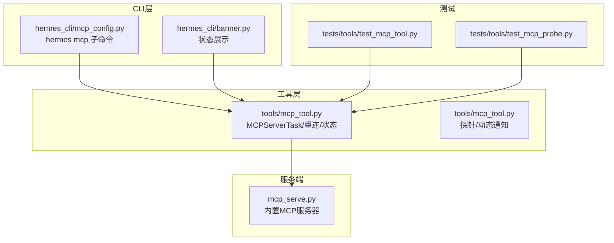
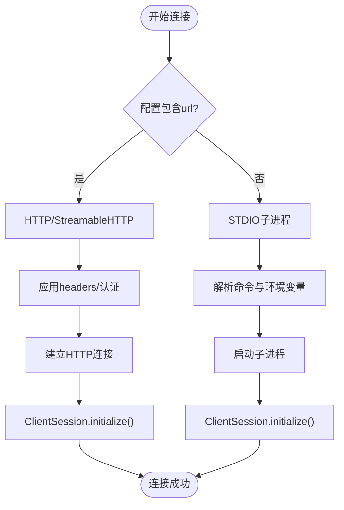
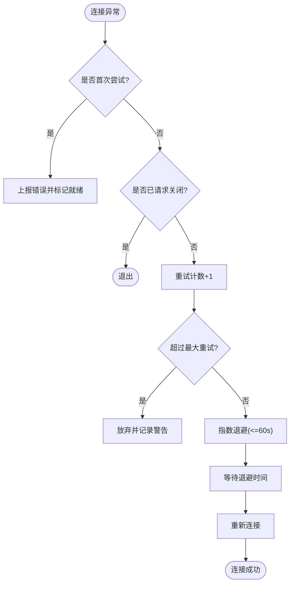
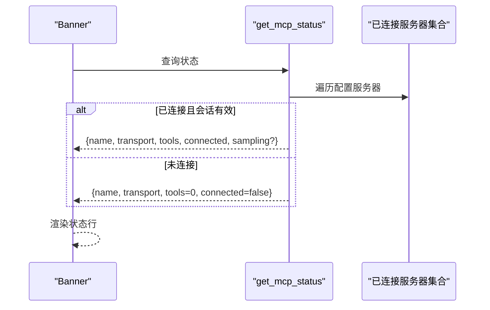
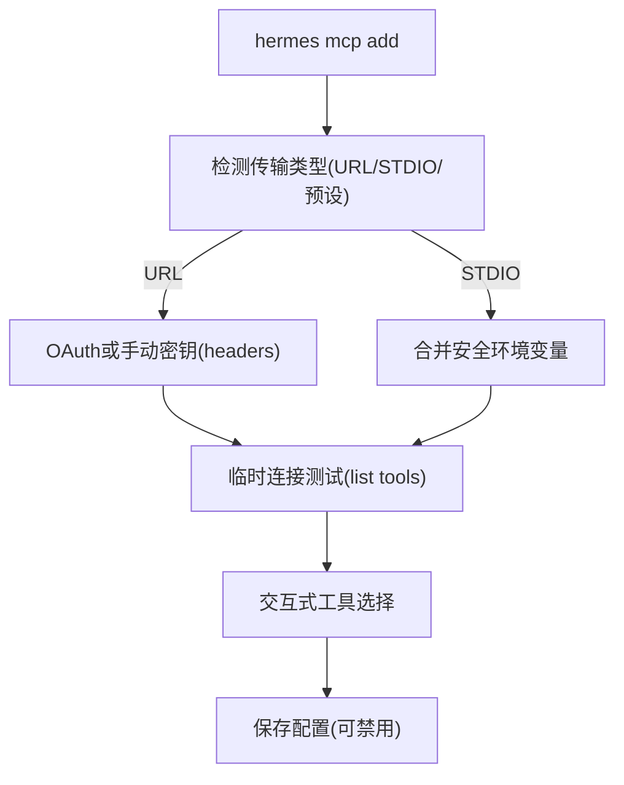
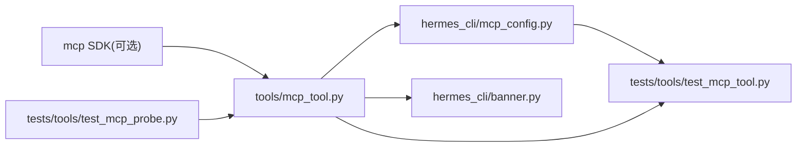

# MCP服务器管理

<cite>
**本文档引用的文件**
- [tools/mcp_tool.py](file://tools/mcp_tool.py)
- [hermes_cli/mcp_config.py](file://hermes_cli/mcp_config.py)
- [mcp_serve.py](file://mcp_serve.py)
- [hermes_cli/banner.py](file://hermes_cli/banner.py)
- [tests/tools/test_mcp_tool.py](file://tests/tools/test_mcp_tool.py)
- [tests/tools/test_mcp_probe.py](file://tests/tools/test_mcp_probe.py)
- [nix/nixosModules.nix](file://nix/nixosModules.nix)
</cite>

## 目录
1. [简介](#简介)
2. [项目结构](#项目结构)
3. [核心组件](#核心组件)
4. [架构总览](#架构总览)
5. [详细组件分析](#详细组件分析)
6. [依赖关系分析](#依赖关系分析)
7. [性能考虑](#性能考虑)
8. [故障排查指南](#故障排查指南)
9. [结论](#结论)
10. [附录](#附录)

## 简介
本文件系统性阐述MCP（Model Context Protocol）服务器在Hermes中的管理与运行机制，覆盖以下主题：
- 服务器生命周期：启动、连接、监控、关闭
- 传输方式：STDIO与HTTP/StreamableHTTP两种模式的配置与使用
- 配置参数详解：command、args、url、headers、timeout等
- 自动重连机制：指数退避策略与最大重试次数
- 状态监控与健康检查：工具发现、动态通知、状态展示
- 故障恢复与最佳实践：错误处理、超时控制、环境变量安全过滤
- 开发者参考：CLI命令、配置格式、测试用例与常见问题

## 项目结构
围绕MCP服务器管理的关键模块如下：
- 工具层：负责MCP客户端连接、工具注册、重连与状态查询
- CLI层：提供hermes mcp子命令，支持添加/删除/测试/配置MCP服务器
- 服务端：提供内置的MCP服务器实现（将会话桥接为MCP工具）
- 测试：覆盖重连、状态、探针、环境变量过滤等场景



**图表来源**
- [hermes_cli/mcp_config.py:1-717](file://hermes_cli/mcp_config.py#L1-L717)
- [tools/mcp_tool.py:1-2196](file://tools/mcp_tool.py#L1-L2196)
- [mcp_serve.py:1-868](file://mcp_serve.py#L1-L868)
- [hermes_cli/banner.py:440-537](file://hermes_cli/banner.py#L440-L537)
- [tests/tools/test_mcp_tool.py:1-3064](file://tests/tools/test_mcp_tool.py#L1-L3064)
- [tests/tools/test_mcp_probe.py:191-215](file://tests/tools/test_mcp_probe.py#L191-L215)

**章节来源**
- [hermes_cli/mcp_config.py:1-717](file://hermes_cli/mcp_config.py#L1-L717)
- [tools/mcp_tool.py:1-2196](file://tools/mcp_tool.py#L1-L2196)
- [mcp_serve.py:1-868](file://mcp_serve.py#L1-L868)
- [hermes_cli/banner.py:440-537](file://hermes_cli/banner.py#L440-L537)

## 核心组件
- MCPServerTask：每个MCP服务器在专用事件循环中以长连接任务运行，支持STDIO与HTTP两种传输；具备自动重连、动态工具刷新、采样回调等功能。
- 配置加载与校验：从配置文件读取mcp_servers，解析url/command/args/headers/timeout等字段，并进行环境变量过滤与安全校验。
- 状态监控：提供get_mcp_status用于Banner展示，包含连接状态、工具数量、采样指标等。
- CLI管理：hermes mcp add/test/list/configure等子命令，支持OAuth认证、预设模板、交互式工具选择。

**章节来源**
- [tools/mcp_tool.py:720-1061](file://tools/mcp_tool.py#L720-L1061)
- [tools/mcp_tool.py:2007-2044](file://tools/mcp_tool.py#L2007-L2044)
- [hermes_cli/mcp_config.py:219-408](file://hermes_cli/mcp_config.py#L219-L408)

## 架构总览
MCP客户端采用“后台事件循环 + 每服务器长连接任务”的架构，确保：
- 同一任务内完成连接/初始化/工具发现/断开，保证取消作用域一致性
- 所有I/O调度通过run_coroutine_threadsafe进入事件循环，避免线程安全问题
- 支持动态工具列表变更通知，触发工具刷新
- 提供探针功能用于一次性连接测试与工具枚举

```mermaid
sequenceDiagram
participant CLI as "CLI命令"
participant Config as "配置加载"
participant Loop as "后台事件循环"
participant Task as "MCPServerTask"
participant SDK as "MCP SDK"
participant Server as "外部MCP服务器"
CLI->>Config : hermes mcp add/test/list/configure
Config-->>Loop : 注册/更新服务器配置
Loop->>Task : 创建任务并启动
Task->>Task : 判断传输类型(HTTP/STDIO)
alt HTTP
Task->>SDK : streamable_http_client
else STDIO
Task->>SDK : stdio_client
end
Task->>SDK : ClientSession.initialize()
SDK-->>Task : 工具列表
Task->>Task : 注册工具到全局注册表
Task->>SDK : 订阅动态通知(可选)
SDK-->>Task : tools/list_changed
Task->>Task : 刷新工具列表
Task-->>Loop : 连接保持活跃
Note over Task,Server : 断开或异常时按策略重连
```

**图表来源**
- [tools/mcp_tool.py:720-800](file://tools/mcp_tool.py#L720-L800)
- [tools/mcp_tool.py:800-1061](file://tools/mcp_tool.py#L800-L1061)
- [hermes_cli/mcp_config.py:219-408](file://hermes_cli/mcp_config.py#L219-L408)

## 详细组件分析

### 传输方式：STDIO vs HTTP/StreamableHTTP
- STDIO传输
  - 使用command + args启动外部进程，支持env环境变量过滤（仅允许安全变量与用户显式指定变量）
  - 命令解析支持npx/npm/node等可执行文件定位与PATH前置
  - 断开后按指数退避重连，最多5次
- HTTP/StreamableHTTP传输
  - 使用url作为端点，支持headers（如Authorization）与可选OAuth
  - 若SDK不支持HTTP传输，会抛出导入错误提示
  - 断开后同样进行重连，遵循相同退避策略



**图表来源**
- [tools/mcp_tool.py:977-1037](file://tools/mcp_tool.py#L977-L1037)
- [tools/mcp_tool.py:234-267](file://tools/mcp_tool.py#L234-L267)
- [hermes_cli/mcp_config.py:244-246](file://hermes_cli/mcp_config.py#L244-L246)

**章节来源**
- [tools/mcp_tool.py:977-1037](file://tools/mcp_tool.py#L977-L1037)
- [tools/mcp_tool.py:234-267](file://tools/mcp_tool.py#L234-L267)
- [hermes_cli/mcp_config.py:244-246](file://hermes_cli/mcp_config.py#L244-L246)

### 自动重连机制与指数退避
- 最大重试次数：5次
- 初始退避时间：1秒，每次翻倍，上限60秒
- 重连条件：非首次连接、未请求关闭、异常发生
- 首次连接失败：直接上报错误并标记就绪，后续异常触发重连



**图表来源**
- [tools/mcp_tool.py:986-1037](file://tools/mcp_tool.py#L986-L1037)

**章节来源**
- [tools/mcp_tool.py:986-1037](file://tools/mcp_tool.py#L986-L1037)

### 配置参数详解
- command：STDIO传输的可执行命令（如npx），配合args
- args：STDIO传输的参数列表
- url：HTTP传输的端点URL
- headers：HTTP传输的请求头（如Authorization）
- timeout：单个工具调用超时（秒，默认120）
- connect_timeout：初始连接超时（秒，默认60）
- env：STDIO传输的环境变量映射（仅允许安全变量与显式指定变量）
- auth：认证方式（如oauth），用于远程HTTP服务器
- enabled：是否启用该服务器
- sampling：服务器发起LLM请求的采样能力配置（模型、令牌上限、速率限制、工具轮次限制等）

NixOS模块中对上述选项的描述与默认值亦有体现。

**章节来源**
- [tools/mcp_tool.py:13-44](file://tools/mcp_tool.py#L13-L44)
- [tools/mcp_tool.py:162-165](file://tools/mcp_tool.py#L162-L165)
- [nix/nixosModules.nix:328-364](file://nix/nixosModules.nix#L328-L364)
- [hermes_cli/mcp_config.py:277-301](file://hermes_cli/mcp_config.py#L277-L301)

### 动态工具发现与刷新
- 通过ClientSession的消息处理器接收ServerNotification
- 当收到tools/list_changed通知时，异步锁保护下重新拉取工具列表并更新注册表
- 通知类型包括工具列表、提示词列表、资源列表变化（当前仅工具变更触发刷新）

**章节来源**
- [tools/mcp_tool.py:755-796](file://tools/mcp_tool.py#L755-L796)

### 状态监控与健康检查
- get_mcp_status：返回所有已配置服务器的状态，包含名称、传输类型、工具数量、连接状态，以及采样指标（若启用）
- Banner展示：在启动界面显示MCP服务器连接情况与工具数量
- 探针功能：临时连接服务器列出工具，不注册到全局注册表，用于配置前验证



**图表来源**
- [tools/mcp_tool.py:2007-2044](file://tools/mcp_tool.py#L2007-L2044)
- [hermes_cli/banner.py:447-466](file://hermes_cli/banner.py#L447-L466)

**章节来源**
- [tools/mcp_tool.py:2007-2044](file://tools/mcp_tool.py#L2007-L2044)
- [hermes_cli/banner.py:447-466](file://hermes_cli/banner.py#L447-L466)

### CLI管理与工具选择
- hermes mcp add：交互式添加服务器，支持URL/STDIO/预设模板；HTTP服务器可配置OAuth或手动输入密钥；STDIO支持env参数（仅STDIO）
- hermes mcp test：临时连接测试，显示传输与认证信息，耗时与工具数量
- hermes mcp list/configure：列出与配置工具集，支持全选/反选/交互式勾选
- hermes mcp serve：启动内置MCP服务器，暴露会话与消息工具



**图表来源**
- [hermes_cli/mcp_config.py:219-408](file://hermes_cli/mcp_config.py#L219-L408)
- [hermes_cli/mcp_config.py:511-571](file://hermes_cli/mcp_config.py#L511-L571)

**章节来源**
- [hermes_cli/mcp_config.py:219-408](file://hermes_cli/mcp_config.py#L219-L408)
- [hermes_cli/mcp_config.py:511-571](file://hermes_cli/mcp_config.py#L511-L571)

### 内置MCP服务器（Hermes Agent桥接）
- 将会话数据库与通道目录桥接为MCP工具，提供对话列表、消息读取、附件提取、事件轮询/等待、消息发送、通道列表、权限管理等
- 事件桥接基于SQLite数据库轮询与内存队列，支持长轮询等待
- 适用于外部MCP客户端（如Claude Desktop、Cursor等）访问Hermes的多平台消息能力

**章节来源**
- [mcp_serve.py:431-800](file://mcp_serve.py#L431-L800)

## 依赖关系分析
- 工具层依赖MCP SDK（可选），根据可用性决定功能启用
- CLI层依赖工具层提供的状态查询与探针功能
- Banner依赖工具层状态接口
- 测试覆盖重连、状态、探针、环境变量过滤等关键路径



**图表来源**
- [tools/mcp_tool.py:90-137](file://tools/mcp_tool.py#L90-L137)
- [hermes_cli/mcp_config.py:18-26](file://hermes_cli/mcp_config.py#L18-L26)
- [tests/tools/test_mcp_tool.py:1-3064](file://tests/tools/test_mcp_tool.py#L1-L3064)
- [tests/tools/test_mcp_probe.py:191-215](file://tests/tools/test_mcp_probe.py#L191-L215)

**章节来源**
- [tools/mcp_tool.py:90-137](file://tools/mcp_tool.py#L90-L137)
- [hermes_cli/mcp_config.py:18-26](file://hermes_cli/mcp_config.py#L18-L26)

## 性能考虑
- 事件循环与并发：后台事件循环串行化任务，工具调用通过run_coroutine_threadsafe调度，避免线程竞争
- 并行关闭：批量关闭服务器使用asyncio.gather并行执行，缩短停机时间
- 轮询优化：事件桥接使用mtime缓存与限频轮询，降低数据库压力
- 采样速率限制：滑动窗口限流（每分钟请求数），防止过载

**章节来源**
- [tools/mcp_tool.py:2128-2150](file://tools/mcp_tool.py#L2128-L2150)
- [mcp_serve.py:320-358](file://mcp_serve.py#L320-L358)
- [tools/mcp_tool.py:387-396](file://tools/mcp_tool.py#L387-L396)

## 故障排查指南
- HTTP传输不可用：当SDK缺少streamable_http支持时会报导入错误，需安装支持包
- STDIO命令缺失：找不到可执行文件时会给出明确提示（含Node.js相关指引）
- 环境变量安全：仅传递安全变量与用户显式指定变量，避免泄露敏感信息
- 重连失败：超过最大重试次数后放弃，检查网络、认证与服务器可用性
- 工具刷新：若服务器发出tools/list_changed通知，系统会自动刷新工具列表
- 探针失败：临时连接失败会被记录日志，不影响其他服务器

**章节来源**
- [tools/mcp_tool.py:923-927](file://tools/mcp_tool.py#L923-L927)
- [tools/mcp_tool.py:312-327](file://tools/mcp_tool.py#L312-L327)
- [tools/mcp_tool.py:195-208](file://tools/mcp_tool.py#L195-L208)
- [tests/tools/test_mcp_tool.py:916-927](file://tests/tools/test_mcp_tool.py#L916-L927)

## 结论
本文件提供了MCP服务器在Hermes中的完整管理参考，涵盖生命周期、传输方式、配置参数、自动重连、状态监控与故障恢复等方面。通过CLI与工具层的协同，开发者可以便捷地接入外部MCP服务器或构建自定义MCP服务，同时获得稳健的连接管理与可观测性支持。

## 附录

### 配置最佳实践
- 优先使用HTTPS与headers或OAuth进行认证，避免在URL中携带凭据
- STDIO服务器建议显式声明env白名单，减少环境变量泄漏风险
- 合理设置timeout与connect_timeout，平衡响应速度与稳定性
- 对频繁变更的服务器启用tools/list_changed通知，确保工具列表实时更新
- 使用hermes mcp test在配置阶段验证连接与工具可用性

**章节来源**
- [hermes_cli/mcp_config.py:277-301](file://hermes_cli/mcp_config.py#L277-L301)
- [hermes_cli/mcp_config.py:511-571](file://hermes_cli/mcp_config.py#L511-L571)
- [tools/mcp_tool.py:162-165](file://tools/mcp_tool.py#L162-L165)