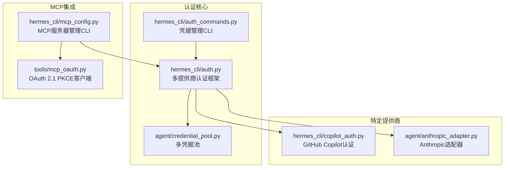
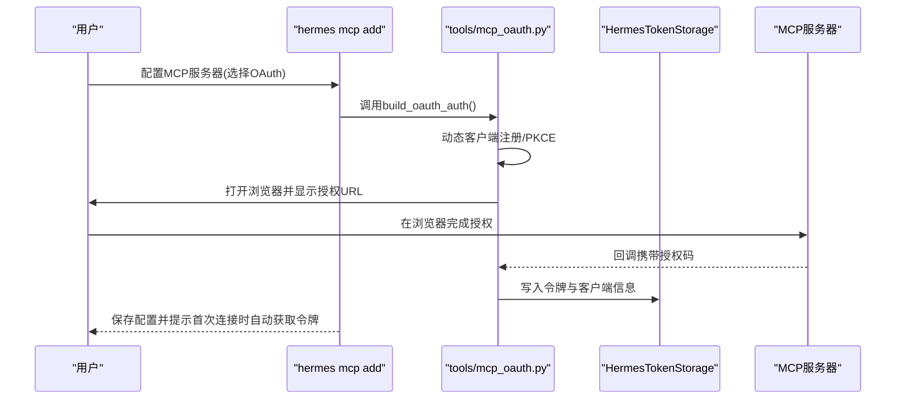
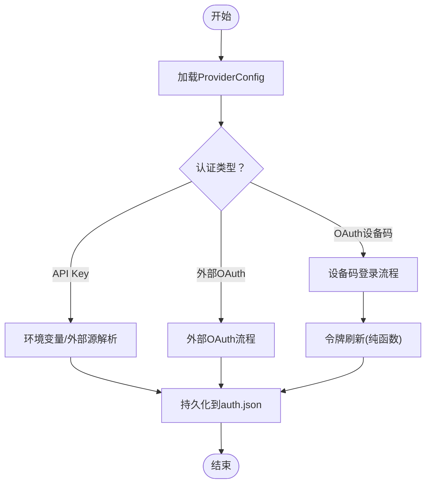
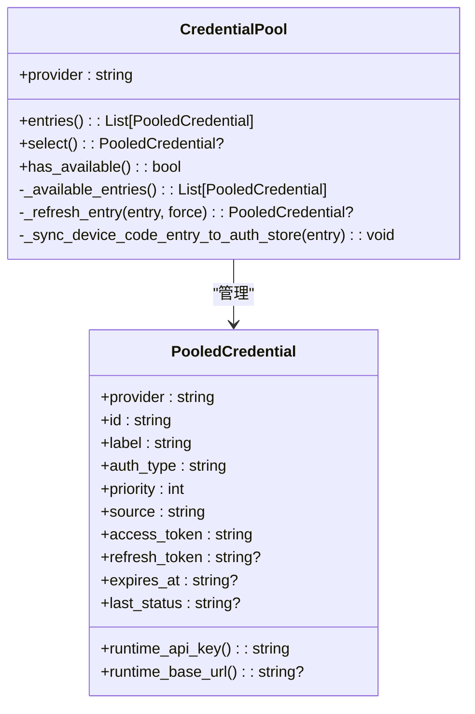
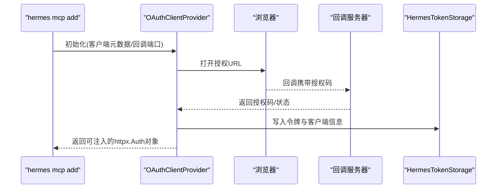
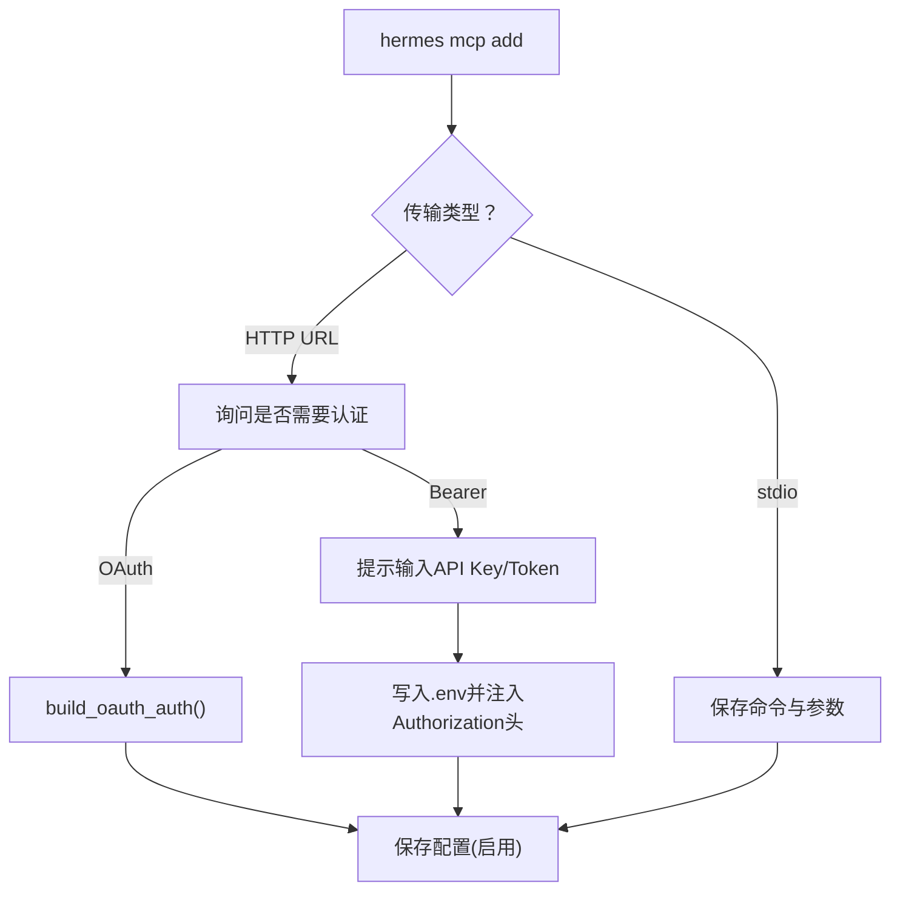
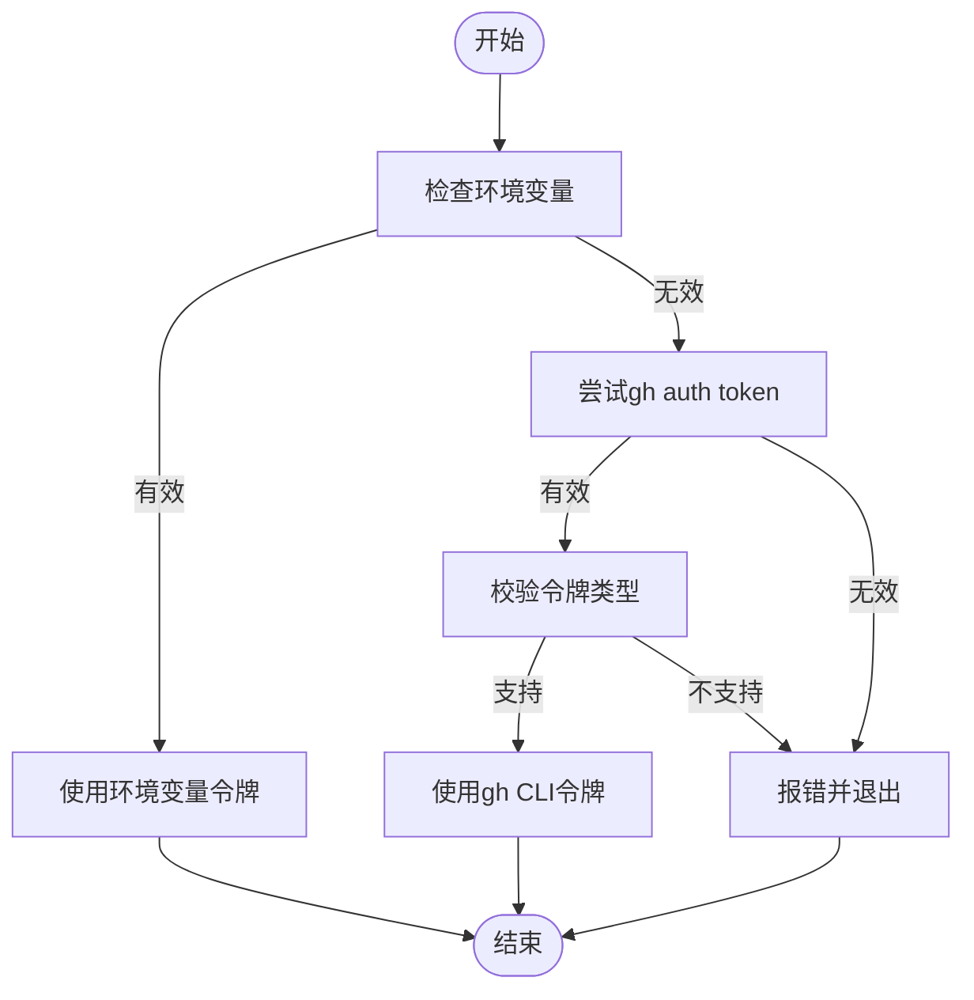
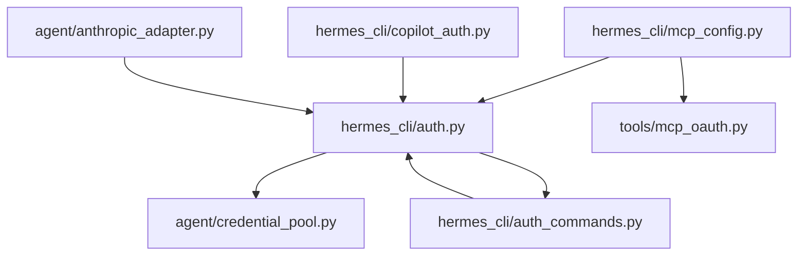

# MCP认证与授权

<cite>
**本文档引用的文件**
- [auth.py](file://hermes_cli/auth.py)
- [auth_commands.py](file://hermes_cli/auth_commands.py)
- [mcp_oauth.py](file://tools/mcp_oauth.py)
- [mcp_config.py](file://hermes_cli/mcp_config.py)
- [credential_pool.py](file://agent/credential_pool.py)
- [copilot_auth.py](file://hermes_cli/copilot_auth.py)
- [anthropic_adapter.py](file://agent/anthropic_adapter.py)
</cite>

## 目录
1. [简介](#简介)
2. [项目结构](#项目结构)
3. [核心组件](#核心组件)
4. [架构总览](#架构总览)
5. [详细组件分析](#详细组件分析)
6. [依赖关系分析](#依赖关系分析)
7. [性能考量](#性能考量)
8. [故障排除指南](#故障排除指南)
9. [结论](#结论)

## 简介
本文件系统性阐述MCP（Model Context Protocol）认证与授权体系在代码库中的实现，覆盖以下要点：
- 认证机制：Bearer Token、API Key、OAuth设备码与PKCE等多模式支持
- OAuth集成：设备码流程、令牌刷新、安全存储与跨进程一致性
- 配置参数与最佳实践：环境变量、CLI交互式配置、令牌持久化
- 失败处理与重试策略：错误分类、冷却时间、重试路径
- 安全考虑：令牌保护、凭证剥离、敏感信息过滤
- MCP服务器配置示例与故障排除

## 项目结构
围绕认证与授权的关键模块分布如下：
- hermes_cli/auth.py：统一的多提供商认证框架，含OAuth设备码、令牌刷新、状态持久化
- hermes_cli/auth_commands.py：CLI子命令入口，提供添加/列出/移除/重置凭据等操作
- tools/mcp_oauth.py：MCP专用OAuth 2.1 PKCE客户端，负责令牌发现、注册、回调与存储
- hermes_cli/mcp_config.py：MCP服务器管理CLI，支持OAuth与Bearer头两种认证方式
- agent/credential_pool.py：多凭据池，支持轮询/随机/最少使用等策略，内置过期冷却与刷新
- hermes_cli/copilot_auth.py：GitHub Copilot专用OAuth设备码与令牌校验
- agent/anthropic_adapter.py：Anthropic适配器，支持OAuth与API Key两种认证形态

**图表来源**
- [auth.py:85-261](file://hermes_cli/auth.py#L85-L261)
- [credential_pool.py:358-760](file://agent/credential_pool.py#L358-L760)
- [auth_commands.py:138-274](file://hermes_cli/auth_commands.py#L138-L274)
- [mcp_oauth.py:378-483](file://tools/mcp_oauth.py#L378-L483)
- [mcp_config.py:219-408](file://hermes_cli/mcp_config.py#L219-L408)
- [copilot_auth.py:67-96](file://hermes_cli/copilot_auth.py#L67-L96)
- [anthropic_adapter.py:165-187](file://agent/anthropic_adapter.py#L165-L187)

**章节来源**
- [auth.py:85-261](file://hermes_cli/auth.py#L85-L261)
- [credential_pool.py:358-760](file://agent/credential_pool.py#L358-L760)
- [auth_commands.py:138-274](file://hermes_cli/auth_commands.py#L138-L274)
- [mcp_oauth.py:378-483](file://tools/mcp_oauth.py#L378-L483)
- [mcp_config.py:219-408](file://hermes_cli/mcp_config.py#L219-L408)
- [copilot_auth.py:67-96](file://hermes_cli/copilot_auth.py#L67-L96)
- [anthropic_adapter.py:165-187](file://agent/anthropic_adapter.py#L165-L187)

## 核心组件
- ProviderConfig注册表：定义各提供商的认证类型、端点、作用域、环境变量等元数据
- OAuth设备码流程：支持Nous Portal、OpenAI Codex、Qwen OAuth等
- 令牌刷新与持久化：通过auth.json跨进程锁保证一致性；Codex迁移至独立存储避免冲突
- 多凭据池：支持API Key与OAuth凭据混合，按策略轮换，内置过期冷却与刷新
- MCP OAuth 2.1 PKCE：动态客户端注册、本地回调、令牌存储与清理
- Copilot认证：设备码与令牌校验，支持多种令牌前缀与gh CLI回退
- Anthropic认证：OAuth与API Key双通道，支持Claude Code与setup token

**章节来源**
- [auth.py:85-261](file://hermes_cli/auth.py#L85-L261)
- [auth.py:1363-1450](file://hermes_cli/auth.py#L1363-L1450)
- [auth.py:1514-1559](file://hermes_cli/auth.py#L1514-L1559)
- [credential_pool.py:358-760](file://agent/credential_pool.py#L358-L760)
- [mcp_oauth.py:378-483](file://tools/mcp_oauth.py#L378-L483)
- [copilot_auth.py:67-96](file://hermes_cli/copilot_auth.py#L67-L96)
- [anthropic_adapter.py:165-187](file://agent/anthropic_adapter.py#L165-L187)

## 架构总览
下图展示从用户发起到服务端认证的整体流程，涵盖MCP服务器配置、OAuth回调、令牌存储与运行时凭据解析。

**图表来源**
- [mcp_config.py:277-301](file://hermes_cli/mcp_config.py#L277-L301)
- [mcp_oauth.py:378-483](file://tools/mcp_oauth.py#L378-L483)
- [mcp_oauth.py:175-236](file://tools/mcp_oauth.py#L175-L236)

**章节来源**
- [mcp_config.py:277-301](file://hermes_cli/mcp_config.py#L277-L301)
- [mcp_oauth.py:378-483](file://tools/mcp_oauth.py#L378-L483)

## 详细组件分析

### 统一认证框架（hermes_cli/auth.py）
- ProviderConfig注册表：集中定义提供商元数据，支持OAuth设备码、外部OAuth、API Key、外部进程等多种认证类型
- 设备码登录：封装Nous Portal与OpenAI Codex的设备码流程，包含轮询、超时、错误映射
- 令牌刷新：纯函数式刷新（不修改全局状态），支持Codex与Nou的刷新逻辑
- 状态持久化：auth.json采用跨进程文件锁，支持版本化结构与迁移
- 环境探测：针对特定提供商（如Z.AI、Kimi）进行端点探测与缓存

**图表来源**
- [auth.py:85-261](file://hermes_cli/auth.py#L85-L261)
- [auth.py:2855-2999](file://hermes_cli/auth.py#L2855-L2999)
- [auth.py:1363-1450](file://hermes_cli/auth.py#L1363-L1450)

**章节来源**
- [auth.py:85-261](file://hermes_cli/auth.py#L85-L261)
- [auth.py:2855-2999](file://hermes_cli/auth.py#L2855-L2999)
- [auth.py:1363-1450](file://hermes_cli/auth.py#L1363-L1450)

### 凭据池（agent/credential_pool.py）
- 数据模型：PooledCredential承载令牌、过期时间、来源、优先级等字段
- 选择策略：支持fill_first、round_robin、random、least_used
- 过期冷却：基于HTTP状态码与provider提供的reset_at计算冷却时长
- 刷新机制：对OAuth凭据按需刷新，同步到auth.json与第三方共享文件（Codex）
- 同步策略：从Claude Code与Codex CLI文件同步最新令牌，避免单次刷新令牌被重复使用

**图表来源**
- [credential_pool.py:92-174](file://agent/credential_pool.py#L92-L174)
- [credential_pool.py:358-760](file://agent/credential_pool.py#L358-L760)

**章节来源**
- [credential_pool.py:92-174](file://agent/credential_pool.py#L92-L174)
- [credential_pool.py:358-760](file://agent/credential_pool.py#L358-L760)

### MCP OAuth 2.1 PKCE（tools/mcp_oauth.py）
- 动态客户端注册：根据配置生成客户端元数据，支持预注册client_id与client_secret
- 本地回调服务器：临时启动HTTP服务接收授权码，支持非交互环境检测
- 令牌存储：HermesTokenStorage将令牌与客户端信息写入独立JSON文件，权限限制为0600
- 清理与重用：支持删除令牌、检测缓存令牌、跨会话复用

**图表来源**
- [mcp_oauth.py:378-483](file://tools/mcp_oauth.py#L378-L483)
- [mcp_oauth.py:286-364](file://tools/mcp_oauth.py#L286-L364)
- [mcp_oauth.py:175-236](file://tools/mcp_oauth.py#L175-L236)

**章节来源**
- [mcp_oauth.py:378-483](file://tools/mcp_oauth.py#L378-L483)
- [mcp_oauth.py:286-364](file://tools/mcp_oauth.py#L286-L364)
- [mcp_oauth.py:175-236](file://tools/mcp_oauth.py#L175-L236)

### MCP服务器配置（hermes_cli/mcp_config.py）
- 支持OAuth与Bearer两种认证方式：OAuth通过tools/mcp_oauth.py自动配置；Bearer通过环境变量注入Authorization头
- 交互式配置：询问是否需要认证、保存API Key到.env并以${ENV_VAR}形式注入请求头
- 工具发现：连接服务器后枚举可用工具，支持全选或交互式选择
- 测试连接：掩码显示敏感头，测试连通性与工具数量

**图表来源**
- [mcp_config.py:277-325](file://hermes_cli/mcp_config.py#L277-L325)
- [mcp_config.py:511-571](file://hermes_cli/mcp_config.py#L511-L571)

**章节来源**
- [mcp_config.py:277-325](file://hermes_cli/mcp_config.py#L277-L325)
- [mcp_config.py:511-571](file://hermes_cli/mcp_config.py#L511-L571)

### GitHub Copilot认证（hermes_cli/copilot_auth.py）
- 设备码流程：与opencode/Copilot CLI一致的OAuth设备码流程
- 令牌校验：拒绝经典PAT（ghp_），仅支持gho_/github_pat_/ghu_等
- 回退机制：优先环境变量，其次gh CLI输出

**图表来源**
- [copilot_auth.py:67-96](file://hermes_cli/copilot_auth.py#L67-L96)
- [copilot_auth.py:139-260](file://hermes_cli/copilot_auth.py#L139-L260)

**章节来源**
- [copilot_auth.py:67-96](file://hermes_cli/copilot_auth.py#L67-L96)
- [copilot_auth.py:139-260](file://hermes_cli/copilot_auth.py#L139-L260)

### Anthropic认证（agent/anthropic_adapter.py）
- 认证形态：API Key（x-api-key）与OAuth（setup token/claude code）
- OAuth识别：通过前缀(sk-ant- 或 eyJ)判断是否为OAuth令牌
- 请求头增强：附加beta头与身份标识，确保OAuth流量正确路由

**章节来源**
- [anthropic_adapter.py:165-187](file://agent/anthropic_adapter.py#L165-L187)

## 依赖关系分析
- hermes_cli/auth.py是多提供商认证的核心，被凭据池与CLI命令广泛依赖
- agent/credential_pool.py依赖hermes_cli/auth的刷新与状态读取能力
- hermes_cli/mcp_config.py依赖tools/mcp_oauth.py实现OAuth MCP服务器配置
- hermes_cli/copilot_auth.py与agent/anthropic_adapter.py分别处理特定提供商的OAuth与API Key

**图表来源**
- [auth.py:85-261](file://hermes_cli/auth.py#L85-L261)
- [credential_pool.py:358-760](file://agent/credential_pool.py#L358-L760)
- [auth_commands.py:138-274](file://hermes_cli/auth_commands.py#L138-L274)
- [mcp_config.py:277-301](file://hermes_cli/mcp_config.py#L277-L301)
- [mcp_oauth.py:378-483](file://tools/mcp_oauth.py#L378-L483)
- [copilot_auth.py:67-96](file://hermes_cli/copilot_auth.py#L67-L96)
- [anthropic_adapter.py:165-187](file://agent/anthropic_adapter.py#L165-L187)

**章节来源**
- [auth.py:85-261](file://hermes_cli/auth.py#L85-L261)
- [credential_pool.py:358-760](file://agent/credential_pool.py#L358-L760)
- [auth_commands.py:138-274](file://hermes_cli/auth_commands.py#L138-L274)
- [mcp_config.py:277-301](file://hermes_cli/mcp_config.py#L277-L301)
- [mcp_oauth.py:378-483](file://tools/mcp_oauth.py#L378-L483)
- [copilot_auth.py:67-96](file://hermes_cli/copilot_auth.py#L67-L96)
- [anthropic_adapter.py:165-187](file://agent/anthropic_adapter.py#L165-L187)

## 性能考量
- 凭据池策略：fill_first适合稳定令牌；round_robin/least_used/random适合多令牌均衡
- 刷新时机：Codex使用过期阈值提前刷新；Nou在运行时解析时才触发刷新/签发，减少不必要的网络往返
- 文件锁与原子写：auth.json写入采用临时文件+原子替换，降低竞态风险
- MCP回调端口：自动选择空闲端口，避免绑定冲突

[本节为通用指导，无需具体文件分析]

## 故障排除指南
- OAuth设备码未完成
  - 现象：等待授权超时或返回错误
  - 排查：确认浏览器已打开、输入验证码、网络可达
  - 参考：[auth.py:2855-2999](file://hermes_cli/auth.py#L2855-L2999)
- Codex刷新令牌被占用
  - 现象：refresh_token_reused错误
  - 排查：其他客户端（Codex CLI/VS Code）可能已消费刷新令牌
  - 处理：重新执行Codex CLI获取新令牌，再在hermes中重新认证
  - 参考：[auth.py:1363-1450](file://hermes_cli/auth.py#L1363-L1450)
- MCP OAuth回调超时
  - 现象：无法绑定回调端口或未收到授权码
  - 排查：非交互环境需先在交互终端完成授权，后续可复用缓存令牌
  - 参考：[mcp_oauth.py:312-364](file://tools/mcp_oauth.py#L312-L364)
- Copilot令牌类型不支持
  - 现象：classic PAT（ghp_）被拒绝
  - 处理：使用gho_/github_pat_/ghu_令牌或通过gh CLI获取
  - 参考：[copilot_auth.py:46-65](file://hermes_cli/copilot_auth.py#L46-L65)
- 凭据池冷却未恢复
  - 现象：凭据标记exhausted且长时间不可用
  - 处理：使用`hermes auth reset`重置状态，或等待冷却结束
  - 参考：[credential_pool.py:268-277](file://agent/credential_pool.py#L268-L277)

**章节来源**
- [auth.py:1363-1450](file://hermes_cli/auth.py#L1363-L1450)
- [auth.py:2855-2999](file://hermes_cli/auth.py#L2855-L2999)
- [mcp_oauth.py:312-364](file://tools/mcp_oauth.py#L312-L364)
- [copilot_auth.py:46-65](file://hermes_cli/copilot_auth.py#L46-L65)
- [credential_pool.py:268-277](file://agent/credential_pool.py#L268-L277)

## 结论
该认证与授权系统通过统一的ProviderConfig注册表与多凭据池设计，实现了对Bearer Token、API Key、OAuth设备码与PKCE的全面支持。配合MCP OAuth 2.1 PKCE客户端与CLI交互式配置，既满足了开发者的易用性需求，又兼顾了生产环境的安全性与可靠性。建议在实际部署中：
- 使用凭据池策略与过期冷却机制提升稳定性
- 对MCP服务器优先采用OAuth 2.1 PKCE，避免长期静态令牌
- 严格控制auth.json与MCP令牌文件权限，防止泄露
- 在非交互环境中预先完成OAuth授权，确保后续复用