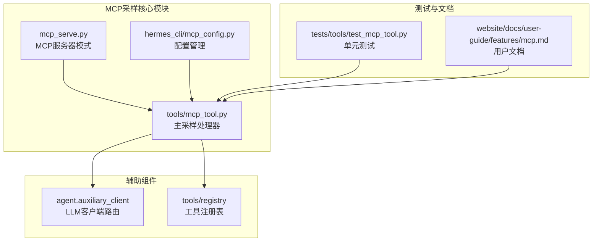
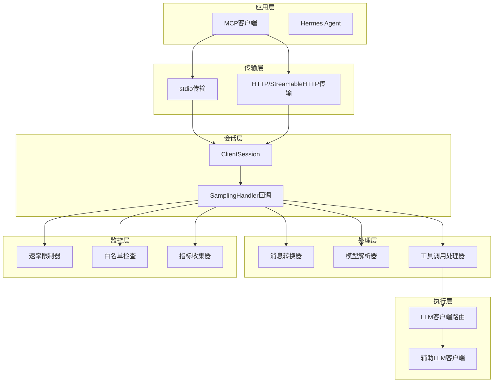
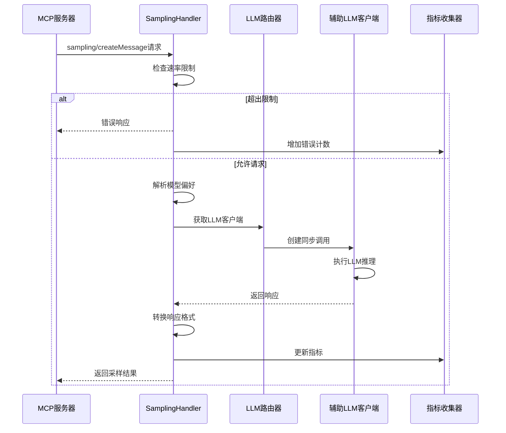
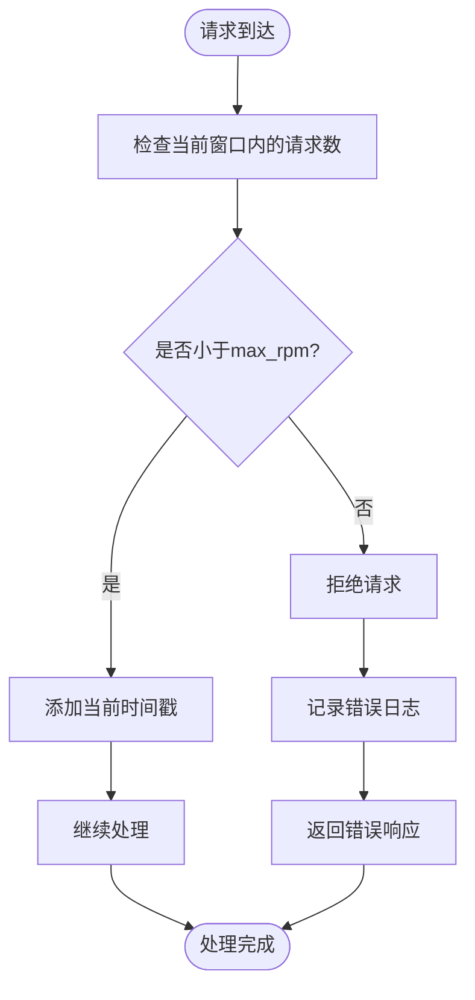
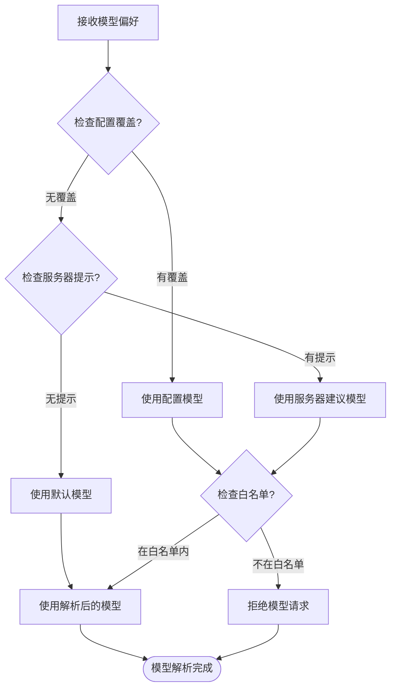
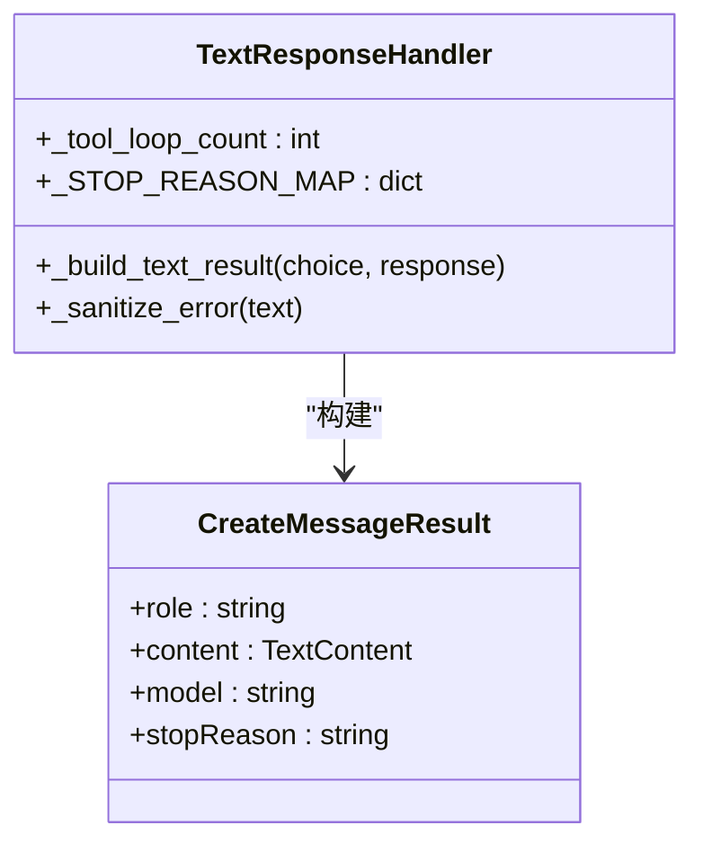
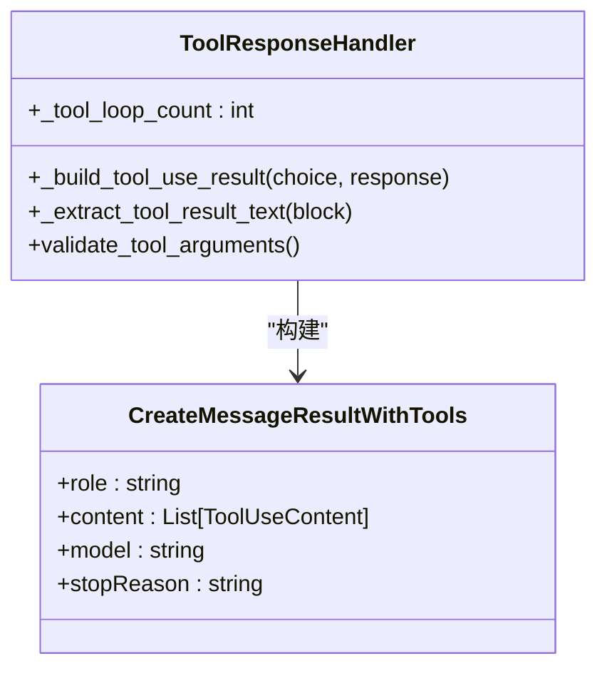
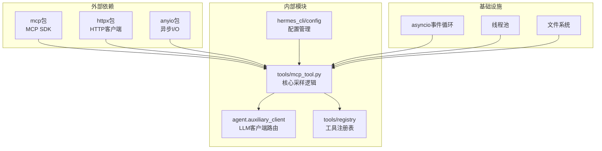

# MCP采样与服务器请求

<cite>
**本文档引用的文件**
- [tools/mcp_tool.py](file://tools/mcp_tool.py)
- [mcp_serve.py](file://mcp_serve.py)
- [hermes_cli/mcp_config.py](file://hermes_cli/mcp_config.py)
- [website/docs/user-guide/features/mcp.md](file://website/docs/user-guide/features/mcp.md)
- [tests/tools/test_mcp_tool.py](file://tests/tools/test_mcp_tool.py)
</cite>

## 目录
1. [简介](#简介)
2. [项目结构](#项目结构)
3. [核心组件](#核心组件)
4. [架构概览](#架构概览)
5. [详细组件分析](#详细组件分析)
6. [依赖关系分析](#依赖关系分析)
7. [性能考虑](#性能考虑)
8. [故障排除指南](#故障排除指南)
9. [结论](#结论)
10. [附录](#附录)

## 简介

本文档深入解析了Hermes Agent中的MCP（Model Context Protocol）采样功能，这是一个强大的服务器发起的LLM请求机制。该功能允许外部MCP服务器主动向Hermes请求语言模型推理，实现真正的双向交互。

MCP采样功能的核心价值在于：
- **服务器主动请求**：MCP服务器可以主动发起LLM请求，而不仅仅是被动执行工具调用
- **统一采样接口**：通过sampling/createMessage协议提供标准化的采样能力
- **安全防护机制**：内置速率限制、模型白名单、工具循环限制等多重安全控制
- **灵活配置选项**：支持模型偏好、最大令牌数、温度设置等细粒度控制
- **实时监控指标**：完整的请求统计、错误计数、令牌使用量跟踪

## 项目结构

基于代码库分析，MCP采样功能主要分布在以下模块中：



**图表来源**
- [tools/mcp_tool.py:1-1200](file://tools/mcp_tool.py#L1-L1200)
- [mcp_serve.py:1-800](file://mcp_serve.py#L1-L800)

**章节来源**
- [tools/mcp_tool.py:1-1200](file://tools/mcp_tool.py#L1-L1200)
- [mcp_serve.py:1-800](file://mcp_serve.py#L1-L800)

## 核心组件

### 采样处理器（SamplingHandler）

`SamplingHandler`是MCP采样功能的核心组件，负责处理服务器发起的采样请求。它实现了完整的采样生命周期管理：

**主要职责**：
- 速率限制控制（滑动窗口算法）
- 模型解析与白名单验证
- 消息格式转换（MCP到OpenAI格式）
- LLM调用执行与结果构建
- 工具循环限制与防滥用保护
- 审计日志与监控指标收集

**配置参数**：
- `max_rpm`：每分钟最大请求数（默认10）
- `timeout`：单次请求超时时间（默认30秒）
- `max_tokens_cap`：最大令牌数限制（默认4096）
- `max_tool_rounds`：工具调用轮次限制（默认5）
- `allowed_models`：模型白名单
- `log_level`：审计日志级别

**章节来源**
- [tools/mcp_tool.py:349-714](file://tools/mcp_tool.py#L349-L714)
- [website/docs/user-guide/features/mcp.md:416-431](file://website/docs/user-guide/features/mcp.md#L416-L431)

### MCP服务器任务（MCPServerTask）

`MCPServerTask`管理单个MCP服务器连接的完整生命周期：

**核心功能**：
- 连接管理（stdio和HTTP传输）
- 动态工具发现与注册
- 会话状态维护
- 自动重连机制
- 事件处理与通知

**线程安全设计**：
- 使用守护线程运行后台事件循环
- 线程锁保护共享状态
- 异步任务隔离执行

**章节来源**
- [tools/mcp_tool.py:720-1062](file://tools/mcp_tool.py#L720-L1062)

### MCP服务器模式

Hermes还支持作为MCP服务器运行，提供消息平台桥接功能：

**提供的工具集**：
- conversations_list：列出活动对话
- conversation_get：获取对话详情
- messages_read：读取消息历史
- attachments_fetch：提取附件
- events_poll/wait：事件轮询与等待
- messages_send：发送消息
- channels_list：列出可用频道
- permissions管理：权限列表与响应

**章节来源**
- [mcp_serve.py:431-800](file://mcp_serve.py#L431-L800)

## 架构概览

MCP采样功能采用分层架构设计，确保高可用性和可扩展性：



**图表来源**
- [tools/mcp_tool.py:588-714](file://tools/mcp_tool.py#L588-L714)
- [tools/mcp_tool.py:823-948](file://tools/mcp_tool.py#L823-L948)

## 详细组件分析

### 采样回调函数实现

采样回调函数是MCP采样功能的核心执行逻辑：



**图表来源**
- [tools/mcp_tool.py:588-714](file://tools/mcp_tool.py#L588-L714)

**实现要点**：
1. **异步非阻塞**：使用`asyncio.to_thread()`将同步LLM调用移至线程池
2. **超时保护**：通过`asyncio.wait_for()`确保不会无限等待
3. **错误处理**：完整的异常捕获和错误响应生成
4. **资源清理**：自动超时和异常情况下的资源释放

**章节来源**
- [tools/mcp_tool.py:588-714](file://tools/mcp_tool.py#L588-L714)

### 速率限制机制

系统实现了高效的滑动窗口速率限制：



**图表来源**
- [tools/mcp_tool.py:387-396](file://tools/mcp_tool.py#L387-L396)

**配置参数**：
- `max_rpm`：每分钟最大请求数（默认10）
- 时间窗口：60秒滑动窗口
- 内存效率：仅存储最近60秒的时间戳

**章节来源**
- [tools/mcp_tool.py:387-396](file://tools/mcp_tool.py#L387-L396)

### 模型解析与白名单验证

模型解析过程确保安全性与合规性：



**图表来源**
- [tools/mcp_tool.py:399-408](file://tools/mcp_tool.py#L399-L408)

**白名单机制**：
- 支持空白名单（允许所有模型）
- 精确匹配验证
- 实时配置更新支持

**章节来源**
- [tools/mcp_tool.py:399-408](file://tools/mcp_tool.py#L399-L408)

### 工具循环限制与防滥用

系统实施多层防滥用保护：

**工具循环限制**：
- `max_tool_rounds`参数控制工具调用深度
- 默认值5轮，防止无限工具循环
- 设置为0时完全禁用工具循环

**防滥用机制**：
- 速率限制（每分钟请求数）
- 请求超时保护（默认30秒）
- 模型白名单验证
- 工具调用参数验证
- 审计日志记录

**章节来源**
- [tools/mcp_tool.py:503-517](file://tools/mcp_tool.py#L503-L517)
- [website/docs/user-guide/features/mcp.md:428](file://website/docs/user-guide/features/mcp.md#L428)

### 采样结果处理

系统支持两种采样结果类型：

**纯文本响应处理**：


**图表来源**
- [tools/mcp_tool.py:556-573](file://tools/mcp_tool.py#L556-L573)

**工具调用响应处理**：


**图表来源**
- [tools/mcp_tool.py:499-554](file://tools/mcp_tool.py#L499-L554)

**章节来源**
- [tools/mcp_tool.py:499-573](file://tools/mcp_tool.py#L499-L573)

## 依赖关系分析

MCP采样功能的依赖关系呈现清晰的分层结构：



**图表来源**
- [tools/mcp_tool.py:90-137](file://tools/mcp_tool.py#L90-L137)

**关键依赖特性**：
- **可选依赖**：MCP SDK为可选安装，未安装时功能降级
- **版本兼容**：支持多个MCP SDK版本（新旧API兼容）
- **异步设计**：完全基于asyncio的异步架构
- **线程安全**：多线程环境下的安全访问

**章节来源**
- [tools/mcp_tool.py:90-137](file://tools/mcp_tool.py#L90-L137)

## 性能考虑

### 并发与资源管理

**线程池优化**：
- 使用`asyncio.to_thread()`避免阻塞事件循环
- 合理的线程数量配置
- 资源自动清理机制

**内存管理**：
- 滑动窗口时间戳自动清理
- 事件队列长度限制（1000条）
- 连接池复用策略

### 缓存与预热

**配置缓存**：
- 环境变量插值结果缓存
- 工具列表动态刷新缓存
- OAuth令牌本地缓存

**连接预热**：
- 首次连接延迟最小化
- 失败重试指数退避
- 连接状态健康检查

### 监控与可观测性

**指标收集**：
- 请求总数统计
- 错误率监控
- 令牌使用量追踪
- 工具调用次数统计

**日志策略**：
- 可配置审计级别
- 敏感信息脱敏处理
- 性能关键路径标注

## 故障排除指南

### 常见问题诊断

**连接问题**：
- 检查MCP SDK安装状态
- 验证传输参数配置
- 确认网络连通性
- 检查防火墙设置

**采样失败排查**：
- 查看速率限制日志
- 验证模型白名单配置
- 检查LLM客户端状态
- 分析超时原因

**性能问题定位**：
- 监控事件循环阻塞
- 检查线程池饱和度
- 分析内存使用趋势
- 评估网络延迟

### 配置验证

**基本配置检查**：
```yaml
mcp_servers:
  test_server:
    command: "npx"
    args: ["@modelcontextprotocol/server-test"]
    sampling:
      enabled: true
      max_rpm: 10
      timeout: 30
      max_tokens_cap: 4096
```

**高级配置示例**：
- 模型偏好设置
- 工具循环限制
- 审计日志级别
- 超时参数调整

**章节来源**
- [website/docs/user-guide/features/mcp.md:416-443](file://website/docs/user-guide/features/mcp.md#L416-L443)

## 结论

MCP采样功能为Hermes Agent提供了强大而安全的服务器发起LLM请求能力。通过精心设计的架构和完善的防护机制，该功能在保证安全性的同时，提供了高度的灵活性和可扩展性。

**核心优势**：
- **安全性优先**：多重防护机制防止滥用
- **配置灵活**：丰富的参数控制选项
- **性能优化**：异步架构和资源管理
- **可观测性**：完整的监控和审计能力
- **易用性**：简洁的配置和使用方式

**最佳实践建议**：
1. 合理设置速率限制参数
2. 维护准确的模型白名单
3. 监控关键性能指标
4. 定期审查审计日志
5. 优化超时和重试策略

## 附录

### 开发者实现指南

**基础集成步骤**：
1. 安装MCP支持依赖
2. 配置MCP服务器参数
3. 启用采样功能
4. 测试连接和采样请求
5. 监控运行状态

**高级定制选项**：
- 自定义速率限制策略
- 扩展模型白名单规则
- 配置审计日志级别
- 调整超时和重试参数

**监控指标参考**：
- `requests`：总请求数
- `errors`：错误计数
- `tokens_used`：令牌使用量
- `tool_use_count`：工具调用次数

**章节来源**
- [hermes_cli/mcp_config.py:219-407](file://hermes_cli/mcp_config.py#L219-L407)
- [tests/tools/test_mcp_tool.py:1676-2343](file://tests/tools/test_mcp_tool.py#L1676-L2343)