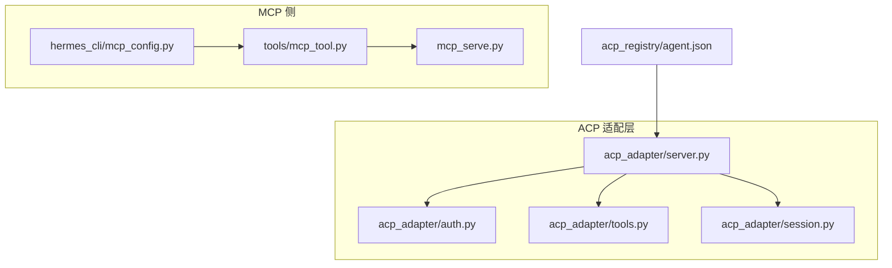
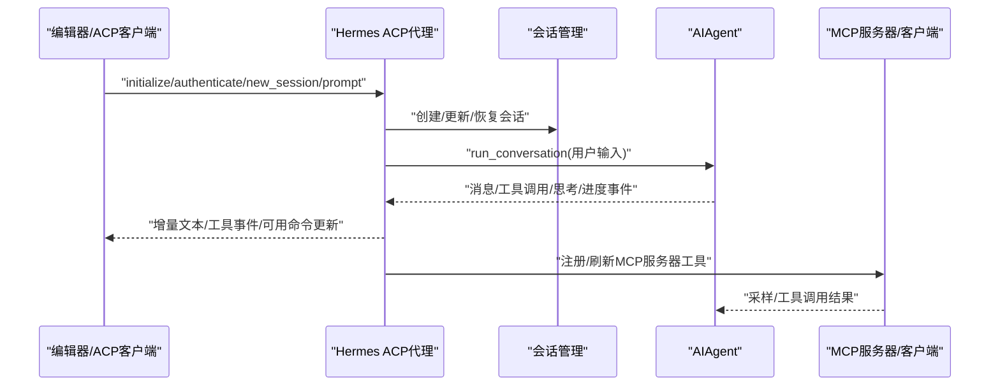
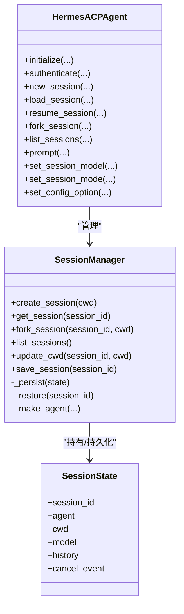
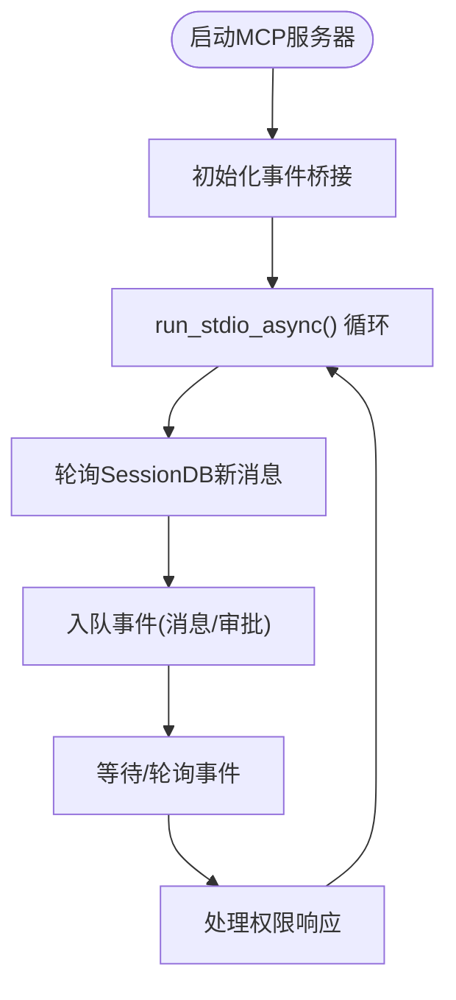
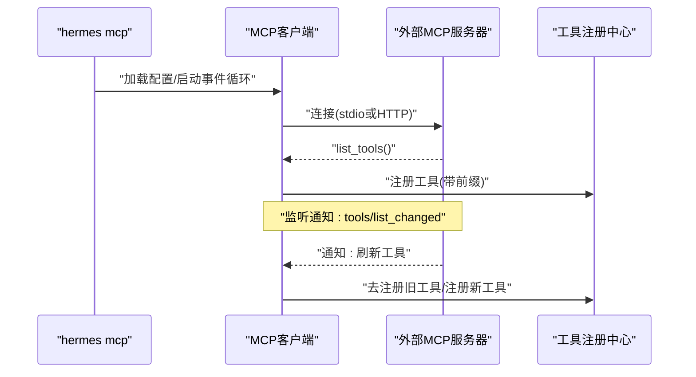
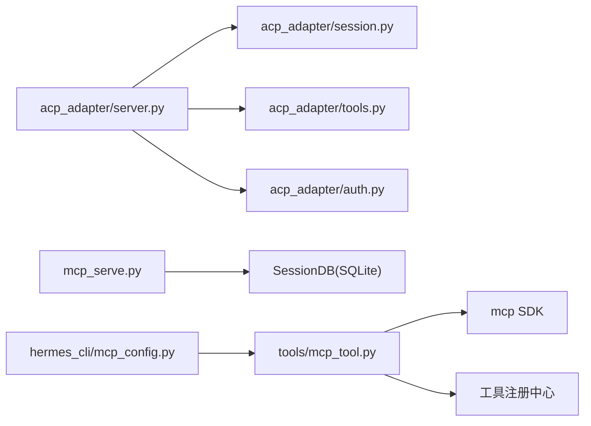

# 集成协议

<cite>
**本文引用的文件**
- [acp_adapter/server.py](file://acp_adapter/server.py)
- [acp_adapter/auth.py](file://acp_adapter/auth.py)
- [acp_adapter/tools.py](file://acp_adapter/tools.py)
- [acp_adapter/session.py](file://acp_adapter/session.py)
- [acp_registry/agent.json](file://acp_registry/agent.json)
- [docs/acp-setup.md](file://docs/acp-setup.md)
- [mcp_serve.py](file://mcp_serve.py)
- [tools/mcp_tool.py](file://tools/mcp_tool.py)
- [hermes_cli/mcp_config.py](file://hermes_cli/mcp_config.py)
</cite>

## 目录
1. [简介](#简介)
2. [项目结构](#项目结构)
3. [核心组件](#核心组件)
4. [架构总览](#架构总览)
5. [详细组件分析](#详细组件分析)
6. [依赖分析](#依赖分析)
7. [性能考虑](#性能考虑)
8. [故障排除指南](#故障排除指南)
9. [结论](#结论)
10. [附录](#附录)

## 简介
本文件系统性梳理 Hermes Agent 的两类核心集成协议：ACP（Agent Client Protocol）与 MCP（Model Context Protocol）。内容覆盖技术规范、实现细节、编辑器集成配置、MCP 服务器连接与工具发现、认证授权流程、扩展开发与最佳实践、调试与监控、以及与核心系统的数据交换格式与集成点。目标是为开发者提供可操作的参考与落地指南。

## 项目结构
围绕集成协议的关键目录与文件：
- ACP 适配层：acp_adapter/* 提供 ACP 代理实现、会话管理、工具映射与认证辅助
- MCP 服务端：mcp_serve.py 暴露消息通道工具集，作为 MCP 服务器运行
- MCP 客户端：tools/mcp_tool.py 负责连接外部 MCP 服务器、动态发现与注册工具
- CLI 管理：hermes_cli/mcp_config.py 提供 hermes mcp 子命令，支持添加/测试/配置 MCP 服务器
- 注册表：acp_registry/agent.json 用于 ACP 客户端识别与启动 Hermes Agent

图示来源
- [acp_adapter/server.py](file://acp_adapter/server.py)
- [acp_adapter/session.py](file://acp_adapter/session.py)
- [acp_adapter/tools.py](file://acp_adapter/tools.py)
- [acp_adapter/auth.py](file://acp_adapter/auth.py)
- [mcp_serve.py](file://mcp_serve.py)
- [tools/mcp_tool.py](file://tools/mcp_tool.py)
- [hermes_cli/mcp_config.py](file://hermes_cli/mcp_config.py)
- [acp_registry/agent.json](file://acp_registry/agent.json)

章节来源
- [acp_adapter/server.py](file://acp_adapter/server.py)
- [acp_adapter/session.py](file://acp_adapter/session.py)
- [acp_adapter/tools.py](file://acp_adapter/tools.py)
- [acp_adapter/auth.py](file://acp_adapter/auth.py)
- [mcp_serve.py](file://mcp_serve.py)
- [tools/mcp_tool.py](file://tools/mcp_tool.py)
- [hermes_cli/mcp_config.py](file://hermes_cli/mcp_config.py)
- [acp_registry/agent.json](file://acp_registry/agent.json)

## 核心组件
- ACP 代理实现与生命周期
  - 初始化、认证、会话管理（新建/加载/恢复/分叉/列出）、取消、提示处理、可用命令通告
- 会话管理与持久化
  - 基于内存 + SQLite 的会话状态存储，支持跨进程重启恢复
- 工具映射与事件流
  - 将内部工具调用映射为 ACP 工具事件，构建人类可读标题与位置信息
- MCP 服务器（消息桥）
  - 对外暴露对话列表、消息读取、附件提取、事件轮询/等待、消息发送、频道列表、权限请求与响应等工具
- MCP 客户端
  - 连接外部 MCP 服务器（stdio 或 HTTP/StreamableHTTP），自动重连、动态工具刷新、采样回调、凭据安全处理
- CLI 管理
  - hermes mcp 子命令：添加/移除/列出/测试/配置 MCP 服务器；支持 OAuth、环境变量插值、工具选择

章节来源
- [acp_adapter/server.py](file://acp_adapter/server.py)
- [acp_adapter/session.py](file://acp_adapter/session.py)
- [acp_adapter/tools.py](file://acp_adapter/tools.py)
- [mcp_serve.py](file://mcp_serve.py)
- [tools/mcp_tool.py](file://tools/mcp_tool.py)
- [hermes_cli/mcp_config.py](file://hermes_cli/mcp_config.py)

## 架构总览
ACP 与 MCP 在 Hermes 中分别承担“编辑器客户端代理”和“外部工具桥接”的角色，二者通过统一的会话与工具体系协同工作。

图示来源
- [acp_adapter/server.py](file://acp_adapter/server.py)
- [acp_adapter/session.py](file://acp_adapter/session.py)
- [mcp_serve.py](file://mcp_serve.py)
- [tools/mcp_tool.py](file://tools/mcp_tool.py)

## 详细组件分析

### ACP 协议实现与会话管理
- 生命周期与能力声明
  - 支持初始化、认证、会话管理（fork/list/load/resume）、取消、提示处理、模型切换、模式设置、配置项更新
- 会话状态
  - 内存字典 + SQLite 数据库存储，含 cwd、模型、历史、取消事件等
- 事件与工具映射
  - 将内部工具调用转换为 ACP 工具事件，生成标题与位置信息
- 认证
  - 基于运行时提供商检测，支持基于提供商的认证方法上报

图示来源
- [acp_adapter/server.py](file://acp_adapter/server.py)
- [acp_adapter/session.py](file://acp_adapter/session.py)

章节来源
- [acp_adapter/server.py](file://acp_adapter/server.py)
- [acp_adapter/session.py](file://acp_adapter/session.py)
- [acp_adapter/tools.py](file://acp_adapter/tools.py)
- [acp_adapter/auth.py](file://acp_adapter/auth.py)

### MCP 服务器（消息桥）
- 工具集
  - conversations_list、conversation_get、messages_read、attachments_fetch、events_poll、events_wait、messages_send、permissions_list_open、permissions_respond、channels_list
- 事件桥接
  - 基于 SessionDB 的轮询与内存队列，支持长轮询等待、游标推进、待决审批跟踪与响应
- 启动与运行
  - stdio 启动，后台线程运行，日志级别可配置

图示来源
- [mcp_serve.py](file://mcp_serve.py)

章节来源
- [mcp_serve.py](file://mcp_serve.py)

### MCP 客户端（连接外部服务器）
- 连接与传输
  - stdio 与 HTTP/StreamableHTTP 双栈；自动重连（最多5次，指数退避）
- 动态工具发现
  - 监听 tools/list_changed 通知，触发工具刷新；注册到中央工具集
- 安全与采样
  - 环境变量白名单过滤、命令解析与路径前置、凭据脱敏、采样回调（限速、令牌计数、工具循环限制）
- 配置与生命周期
  - 从 ~/.hermes/config.yaml 读取 mcp_servers；支持 ${ENV_VAR} 插值；线程安全的后台事件循环

图示来源
- [tools/mcp_tool.py](file://tools/mcp_tool.py)
- [hermes_cli/mcp_config.py](file://hermes_cli/mcp_config.py)

章节来源
- [tools/mcp_tool.py](file://tools/mcp_tool.py)
- [hermes_cli/mcp_config.py](file://hermes_cli/mcp_config.py)

### 编辑器集成（VS Code、Zed、JetBrains）
- VS Code
  - 安装 ACP Client 扩展；在 settings.json 中配置 agents.registryDir 指向 acp_registry
- Zed
  - 在 settings.json 中配置 agent_servers，指定 hermes 命令与参数
- JetBrains
  - 安装 ACP 插件，在 ACP Agents 中添加注册目录
- ACP 客户端识别
  - 使用 acp_registry/agent.json 的 distribution.command 与 args 启动 Hermes

章节来源
- [docs/acp-setup.md](file://docs/acp-setup.md)
- [acp_registry/agent.json](file://acp_registry/agent.json)

## 依赖分析
- 组件耦合
  - ACP 代理依赖会话管理与工具映射；会话管理依赖运行时配置与 AIAgent；MCP 服务器依赖 SessionDB 与事件桥；MCP 客户端依赖 MCP SDK 与工具注册中心
- 外部依赖
  - ACP SDK、MCP SDK、SQLite（SessionDB）、httpx（HTTP MCP）
- 潜在循环
  - 当前模块间以功能边界划分，未见直接循环导入

图示来源
- [acp_adapter/server.py](file://acp_adapter/server.py)
- [acp_adapter/session.py](file://acp_adapter/session.py)
- [acp_adapter/tools.py](file://acp_adapter/tools.py)
- [acp_adapter/auth.py](file://acp_adapter/auth.py)
- [mcp_serve.py](file://mcp_serve.py)
- [tools/mcp_tool.py](file://tools/mcp_tool.py)
- [hermes_cli/mcp_config.py](file://hermes_cli/mcp_config.py)

章节来源
- [acp_adapter/server.py](file://acp_adapter/server.py)
- [acp_adapter/session.py](file://acp_adapter/session.py)
- [acp_adapter/tools.py](file://acp_adapter/tools.py)
- [acp_adapter/auth.py](file://acp_adapter/auth.py)
- [mcp_serve.py](file://mcp_serve.py)
- [tools/mcp_tool.py](file://tools/mcp_tool.py)
- [hermes_cli/mcp_config.py](file://hermes_cli/mcp_config.py)

## 性能考虑
- 会话持久化
  - 使用 SQLite 存储消息与元数据，避免每次重启丢失上下文；通过 mtime 快速跳过空轮询
- 事件桥接
  - 内存队列上限与轮询间隔（200ms）平衡实时性与 CPU 开销
- MCP 客户端
  - 后台事件循环与线程安全；工具调用超时与连接超时可配置；采样回调限速与令牌上限控制成本
- ACP 代理
  - 线程池执行同步 AIAgent，避免阻塞事件循环；工具调用结果截断以控制 UI 显示开销

## 故障排除指南
- ACP
  - 代理未出现在编辑器：检查 registry 路径、hermes 是否在 PATH、重启编辑器
  - 启动即报错：运行 hermes doctor 与 hermes status，查看日志
  - “模块未找到”：安装 ACP 可选依赖
  - 权限被拒：调整 ACP 客户端扩展的自动/手动批准策略
- MCP 服务器（消息桥）
  - 无法连接：确认 SessionDB 可用、sessions.json 存在且可读
  - 事件不更新：检查轮询间隔与队列上限，确认 SessionDB 文件 mtime 变化
- MCP 客户端
  - 连接失败：检查命令/URL、超时、HTTP 头部、OAuth 设置；查看重试与指数退避
  - 工具未出现：确认配置键名、缩进、工具前缀；查看启动日志
  - 采样受限：调整速率限制、最大令牌数、允许模型白名单

章节来源
- [docs/acp-setup.md](file://docs/acp-setup.md)
- [mcp_serve.py](file://mcp_serve.py)
- [tools/mcp_tool.py](file://tools/mcp_tool.py)

## 结论
Hermes Agent 通过 ACP 与 MCP 实现了编辑器内智能代理与外部工具生态的深度融合。ACP 提供一致的代理接口与会话体验，MCP 则打通消息通道与外部工具生态。借助完善的会话持久化、事件桥接与工具注册机制，系统在易用性、可观测性与扩展性上达到良好平衡。建议在生产环境中结合日志与监控，合理配置超时与采样策略，并通过 CLI 工具链进行持续维护与演进。

## 附录

### ACP 协议要点（基于实现）
- 能力声明：支持会话 fork/list/load/resume，支持 set_session_model/set_session_mode/set_config_option
- 认证：基于运行时提供商检测，返回可用认证方法
- 会话：支持 cwd 更新、历史持久化、取消事件
- 提示：支持斜杠命令（help/model/tools/context/reset/compact/version），文本块提取与事件流回传

章节来源
- [acp_adapter/server.py](file://acp_adapter/server.py)
- [acp_adapter/session.py](file://acp_adapter/session.py)

### MCP 协议要点（基于实现）
- 服务器工具（消息桥）：对话列表/详情/消息读取/附件提取/事件轮询/等待/消息发送/频道列表/权限列表/权限响应
- 客户端特性：stdio/HTTP 双栈、自动重连、动态工具刷新、采样回调、凭据脱敏、环境变量过滤、超时与限速

章节来源
- [mcp_serve.py](file://mcp_serve.py)
- [tools/mcp_tool.py](file://tools/mcp_tool.py)

### 编辑器集成步骤（摘要）
- VS Code：安装 ACP Client，配置 settings.json 的 agents.registryDir 指向 acp_registry
- Zed：在 settings.json 中配置 agent_servers，command 指向 hermes，args 包含 acp
- JetBrains：安装 ACP 插件，添加注册目录

章节来源
- [docs/acp-setup.md](file://docs/acp-setup.md)
- [acp_registry/agent.json](file://acp_registry/agent.json)

### 协议扩展与最佳实践
- 扩展 MCP 服务器
  - 使用 hermes mcp add 添加 stdio 或 HTTP 服务器；通过 tools/list_changed 自动刷新工具
  - 注意：工具名称前缀为 mcp_{server}_{tool}，便于区分来源
- 安全与合规
  - stdio 仅传递安全环境变量；命令解析与 PATH 前置；错误信息中敏感信息脱敏
- 监控与可观测性
  - 启用 DEBUG 日志级别，关注连接、重连、工具刷新与采样指标
- 配置管理
  - 使用 ${ENV_VAR} 插值；OAuth 令牌由 SDK 管理；定期使用 hermes mcp test 验证连通性

章节来源
- [hermes_cli/mcp_config.py](file://hermes_cli/mcp_config.py)
- [tools/mcp_tool.py](file://tools/mcp_tool.py)