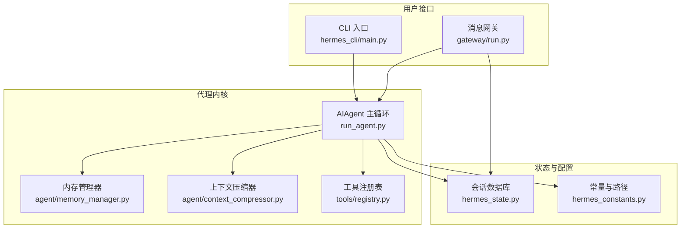
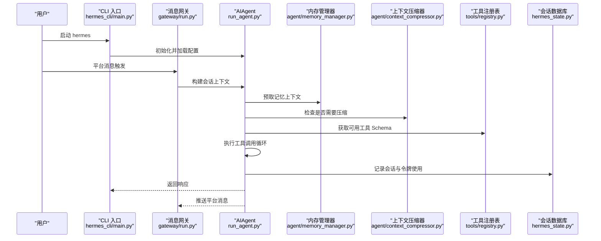
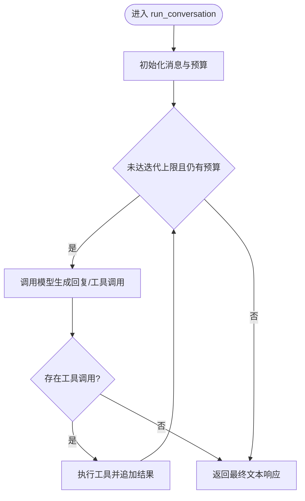
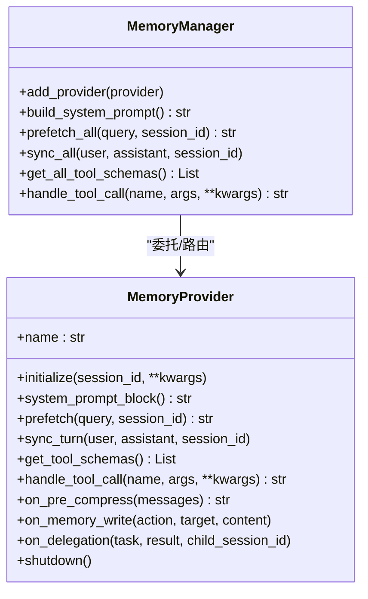
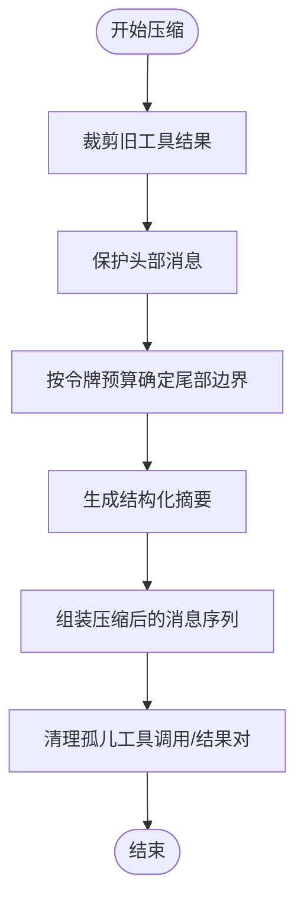
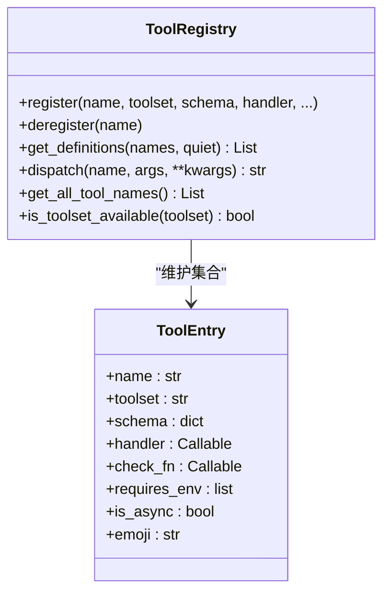
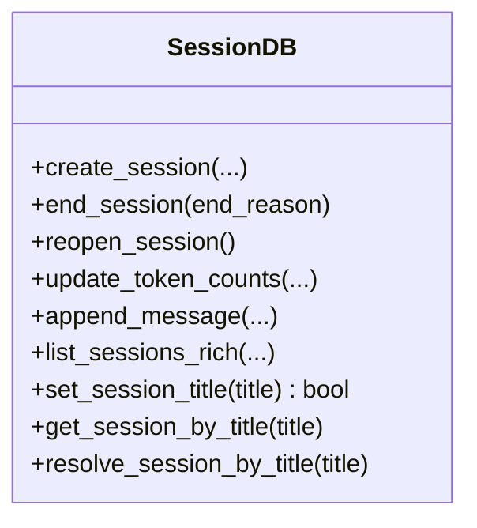
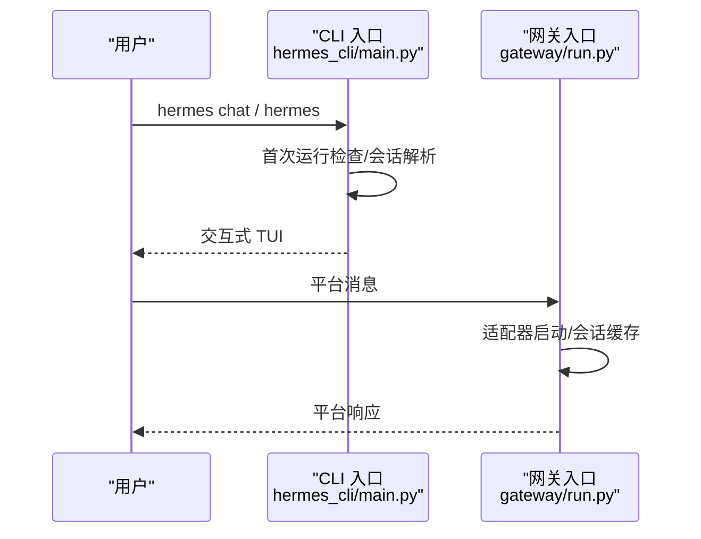
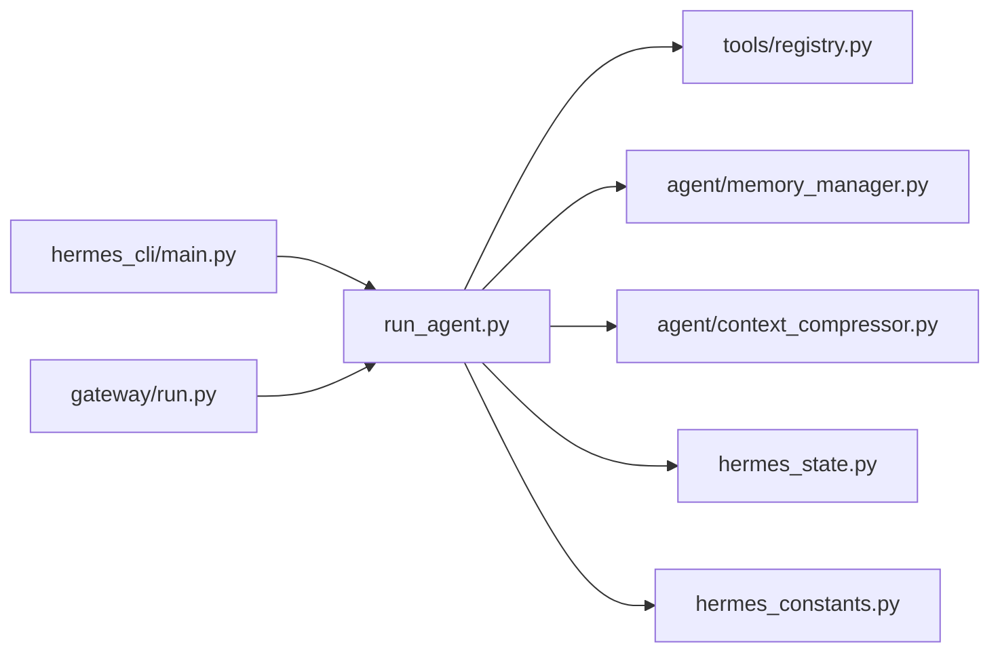

# 项目概述

<cite>
**本文档引用的文件**
- [README.md](file://README.md)
- [AGENTS.md](file://AGENTS.md)
- [hermes_constants.py](file://hermes_constants.py)
- [hermes_state.py](file://hermes_state.py)
- [run_agent.py](file://run_agent.py)
- [agent/memory_manager.py](file://agent/memory_manager.py)
- [agent/context_compressor.py](file://agent/context_compressor.py)
- [hermes_cli/main.py](file://hermes_cli/main.py)
- [gateway/run.py](file://gateway/run.py)
- [tools/registry.py](file://tools/registry.py)
</cite>

## 目录
1. [简介](#简介)
2. [项目结构](#项目结构)
3. [核心组件](#核心组件)
4. [架构总览](#架构总览)
5. [详细组件分析](#详细组件分析)
6. [依赖关系分析](#依赖关系分析)
7. [性能考量](#性能考量)
8. [故障排查指南](#故障排查指南)
9. [结论](#结论)
10. [附录](#附录)

## 简介
Hermes Agent 是由 Nous Research 开发的自改进型 AI 代理系统，其独特之处在于内置了“学习回路”：能够从经验中创建技能、在使用过程中自我改进、主动提示知识持久化、检索过往对话，并在多次会话之间构建对用户的深度认知模型。它既可运行在本地终端，也可部署到云端或无服务器环境（如 VPS、GPU 集群），并通过统一的网关适配器连接 Telegram、Discord、Slack、WhatsApp、Signal 等多平台。

Hermes 的核心价值主张体现在：
- 内置学习回路：自动创建与改进技能，持续优化工具调用与对话质量
- 跨会话记忆与检索：基于 SQLite + FTS5 的会话数据库，支持全文检索与摘要压缩
- 多入口统一体验：CLI 交互与消息网关共享命令体系与上下文
- 可插拔工具系统：通过注册表集中管理工具，支持动态发现与异步执行
- 多平台与多后端：支持本地、Docker、SSH、Modal、Daytona、Singularity 等终端后端

## 项目结构
Hermes 采用模块化分层设计，围绕“代理内核 + 工具系统 + 网关适配 + 配置与状态”的架构组织：

图表来源
- [hermes_cli/main.py:1-120](file://hermes_cli/main.py#L1-L120)
- [gateway/run.py:512-636](file://gateway/run.py#L512-L636)
- [run_agent.py:492-800](file://run_agent.py#L492-L800)
- [agent/memory_manager.py:72-136](file://agent/memory_manager.py#L72-L136)
- [agent/context_compressor.py:60-170](file://agent/context_compressor.py#L60-L170)
- [tools/registry.py:48-110](file://tools/registry.py#L48-L110)
- [hermes_state.py:115-161](file://hermes_state.py#L115-L161)
- [hermes_constants.py:11-35](file://hermes_constants.py#L11-L35)

章节来源
- [README.md:14-26](file://README.md#L14-L26)
- [AGENTS.md:11-64](file://AGENTS.md#L11-L64)

## 核心组件
- AIAgent 主循环：负责对话主循环、工具调用、错误处理与预算控制，支持多种推理模式与流式输出回调
- 内存管理器：统一内置与外部记忆提供方，按需预取、同步与路由工具调用
- 上下文压缩器：基于结构化摘要与尾部保护策略，自动压缩长对话以维持上下文窗口
- 工具注册表：集中管理工具 Schema、处理器与可用性检查，支持异步桥接与结果大小限制
- 会话数据库：基于 SQLite + FTS5 的会话存储与全文检索，支持会话标题、令牌计数与成本追踪
- 常量与路径：统一 HOME 目录解析、容器/WSL/Android 环境探测与网络偏好设置

章节来源
- [run_agent.py:492-800](file://run_agent.py#L492-L800)
- [agent/memory_manager.py:72-136](file://agent/memory_manager.py#L72-L136)
- [agent/context_compressor.py:60-170](file://agent/context_compressor.py#L60-L170)
- [tools/registry.py:48-110](file://tools/registry.py#L48-L110)
- [hermes_state.py:115-161](file://hermes_state.py#L115-L161)
- [hermes_constants.py:11-35](file://hermes_constants.py#L11-L35)

## 架构总览
Hermes 的整体架构强调“统一入口、模块化内核、可插拔工具与持久化状态”。CLI 与网关共享同一套代理内核与工具系统，通过会话数据库实现跨入口的一致体验；内存与上下文管理贯穿整个生命周期，确保长对话与跨会话知识的连续性。

图表来源
- [hermes_cli/main.py:676-784](file://hermes_cli/main.py#L676-L784)
- [gateway/run.py:512-636](file://gateway/run.py#L512-L636)
- [run_agent.py:492-800](file://run_agent.py#L492-L800)
- [agent/memory_manager.py:167-195](file://agent/memory_manager.py#L167-L195)
- [agent/context_compressor.py:666-741](file://agent/context_compressor.py#L666-L741)
- [tools/registry.py:116-143](file://tools/registry.py#L116-L143)
- [hermes_state.py:355-401](file://hermes_state.py#L355-L401)

## 详细组件分析

### AIAgent 类与代理循环
- 设计要点：线程安全的迭代预算、工具批处理并发控制、提示缓存与推理模式兼容、流式回调与状态跟踪
- 关键流程：根据最大迭代次数与令牌预算推进对话，遇到工具调用则执行并追加结果，直至无工具调用或达到终止条件
- 安全与健壮性：管道写入保护、代理内核日志隔离、危险命令检测与中断机制

图表来源
- [run_agent.py:113-122](file://run_agent.py#L113-L122)

章节来源
- [run_agent.py:492-800](file://run_agent.py#L492-L800)
- [AGENTS.md:82-126](file://AGENTS.md#L82-L126)

### 内存管理器与记忆提供方
- 设计要点：内置提供方优先，最多允许一个外部提供方；失败不阻断其他提供方；支持系统提示拼装、预取与同步
- 使用方式：在系统提示构建时合并各提供方提示块；每轮前预取上下文；每轮结束后同步新信息

图表来源
- [agent/memory_manager.py:72-136](file://agent/memory_manager.py#L72-L136)
- [agent/memory_manager.py:146-209](file://agent/memory_manager.py#L146-L209)

章节来源
- [agent/memory_manager.py:1-363](file://agent/memory_manager.py#L1-L363)

### 上下文压缩器与摘要策略
- 设计要点：先裁剪旧工具结果、保护首尾若干消息、基于令牌预算确定尾部保护范围、结构化摘要模板、迭代更新先前摘要
- 算法流程：预裁剪 → 确定边界 → 结构化摘要 → 组装压缩后的消息列表 → 清理孤儿工具调用/结果对

图表来源
- [agent/context_compressor.py:666-741](file://agent/context_compressor.py#L666-L741)
- [agent/context_compressor.py:741-800](file://agent/context_compressor.py#L741-L800)

章节来源
- [agent/context_compressor.py:1-821](file://agent/context_compressor.py#L1-L821)

### 工具注册表与工具系统
- 设计要点：每个工具模块在导入时向注册表登记 Schema、处理器、可用性检查与环境要求；模型工具仅查询可用工具定义
- 运行时：按名称分发工具调用，自动桥接异步处理器，统一错误格式

图表来源
- [tools/registry.py:48-110](file://tools/registry.py#L48-L110)
- [tools/registry.py:116-143](file://tools/registry.py#L116-L143)

章节来源
- [tools/registry.py:1-336](file://tools/registry.py#L1-L336)

### 会话数据库与状态持久化
- 设计要点：WAL 模式支持多读单写；FTS5 全文检索；会话元数据、消息历史、令牌计数与成本追踪；标题唯一性约束与变体解析
- 性能特性：短超时 + 应用级抖动重试避免写锁拥堵；周期性被动检查点降低 WAL 文件膨胀

图表来源
- [hermes_state.py:115-161](file://hermes_state.py#L115-L161)
- [hermes_state.py:355-401](file://hermes_state.py#L355-L401)
- [hermes_state.py:717-785](file://hermes_state.py#L717-L785)

章节来源
- [hermes_state.py:1-800](file://hermes_state.py#L1-L800)

### CLI 与网关入口
- CLI 入口：解析参数、首次运行引导、会话恢复、容器后端路由、SSL 证书与网络偏好设置
- 网关入口：统一平台适配器生命周期、会话缓存与模型覆盖、后台进程通知、内存刷新与重启排空

图表来源
- [hermes_cli/main.py:676-784](file://hermes_cli/main.py#L676-L784)
- [gateway/run.py:512-636](file://gateway/run.py#L512-L636)

章节来源
- [hermes_cli/main.py:1-200](file://hermes_cli/main.py#L1-L200)
- [gateway/run.py:1-120](file://gateway/run.py#L1-L120)

## 依赖关系分析
- 组件耦合：代理内核依赖工具注册表与内存/压缩模块；CLI 与网关均依赖代理内核与会话数据库；工具模块依赖注册表进行集中管理
- 外部依赖：HTTP 客户端（requests/httpx）、SQLite/FTS5、平台 SDK（Telegram/Discord 等）
- 循环依赖规避：注册表无反向依赖工具模块，工具模块仅在导入时登记，避免循环导入

图表来源
- [hermes_cli/main.py:1-120](file://hermes_cli/main.py#L1-L120)
- [gateway/run.py:1-120](file://gateway/run.py#L1-L120)
- [run_agent.py:63-86](file://run_agent.py#L63-L86)
- [tools/registry.py:1-20](file://tools/registry.py#L1-L20)
- [hermes_state.py:1-35](file://hermes_state.py#L1-L35)
- [hermes_constants.py:1-20](file://hermes_constants.py#L1-L20)

章节来源
- [AGENTS.md:68-79](file://AGENTS.md#L68-L79)

## 性能考量
- 写锁与吞吐：通过短超时 + 应用级抖动重试缓解 SQLite 写锁拥堵，定期被动检查点降低 WAL 膨胀
- 提示缓存：针对支持的提供商启用提示缓存，减少重复输入开销
- 工具并发：批处理工具调用时进行路径隔离与互斥检查，避免破坏性命令并发
- 上下文压缩：先裁剪旧工具结果再进行结构化摘要，平衡信息保留与成本控制

## 故障排查指南
- 首次运行引导：若未配置任何提供商，CLI 将提示执行 setup 或显示非交互式指引
- 网络问题：强制 IPv4 解析开关在网络异常时提升连通性
- 会话恢复：通过会话 ID/标题解析与模糊匹配定位历史会话
- 内存刷新：网关在会话重置前触发一次性“记忆刷新”以保存重要信息与可复用工作流

章节来源
- [hermes_cli/main.py:708-734](file://hermes_cli/main.py#L708-L734)
- [hermes_constants.py:253-293](file://hermes_constants.py#L253-L293)
- [gateway/run.py:700-800](file://gateway/run.py#L700-L800)

## 结论
Hermes Agent 通过“内置学习回路 + 统一代理内核 + 可插拔工具 + 持久化状态”的架构，在多入口、多平台与长对话场景下提供了高扩展性与高可用性的智能代理解决方案。其模块化设计便于二次开发与定制，同时保持对初学者友好的易用性与对资深工程师的深度可玩性。

## 附录
- 快速开始与安装：参考项目根目录 README 的安装与入门步骤
- 社区与生态：Discord、Skills Hub、问题与讨论区
- 开发者指南：项目结构、依赖链、测试建议与贡献流程

章节来源
- [README.md:30-66](file://README.md#L30-L66)
- [README.md:164-171](file://README.md#L164-L171)
- [AGENTS.md:459-471](file://AGENTS.md#L459-L471)